# Analysis: INGEST_20250930104957_300_17

## Content Analysis Framework

### A Alone: Mathematical Special Functions Library Opportunities

The content reveals a comprehensive landscape of small, high-impact Rust library opportunities focused on mathematical special functions. Key insights:

**Core Value Proposition**: Sub-300 LOC libraries targeting CPU-intensive mathematical operations with `no_std` compatibility, deterministic behavior, and SIMD acceleration potential.

**Strategic Positioning**: These libraries address gaps in the Rust ecosystem where existing solutions (like `libm` or `statrs`) are either too large, lack `no_std` support, or have suboptimal performance characteristics.

**Market Validation**: Each function includes PMF (Product-Market Fit) probability scores (70-90%), indicating strong research-backed demand validation.

### A in Context of B (L1 File Context)

The L1 context reveals this is part of a larger research document (`Rust30020250815_complete.md`) within a structured ingestion pipeline. Key architectural insights:

**Document Structure**: This represents a curated research output, not raw code, suggesting systematic knowledge extraction from multiple sources.

**Path Analysis**: The deep nesting (`/home/amuldotexe/Desktop/extracted/Ingestion01/pen02Rust300/`) indicates this is part of a larger knowledge arbitrage operation, systematically cataloging opportunities.

**Content Density**: 1580 words in 12KB suggests high information density - this is distilled wisdom, not exploratory content.

### B in Context of C (L2 Architectural Context)

The L2 context positions this within a broader architectural pattern of knowledge extraction and opportunity identification:

**Cross-Module Dependencies**: The reference to external math libraries (Julia, SLEEF, libm) indicates this is mapping the competitive landscape and identifying differentiation opportunities.

**Technology Stack**: Markdown format suggests this is documentation/research output rather than implementation, indicating a research-first approach to library development.

**Architectural Constraints**: The focus on `no_std`, deterministic behavior, and minimal dependencies reveals architectural constraints driven by embedded systems and WebAssembly deployment targets.

### A in Context of B & C (Integrated Strategic Analysis)

## L1-L8 Strategic Extraction

### L1: Idiomatic Patterns & Micro-Optimizations
- **Range Reduction Techniques**: sinpi/cospi use clever range reduction to `[-0.5, 0.5]` followed by polynomial approximation
- **Catastrophic Cancellation Prevention**: Functions like `expm1` and `log1p` specifically designed to maintain precision near zero
- **ULP Error Measurement**: Emphasis on Units in the Last Place (ULP) error as the gold standard for numerical accuracy
- **Edge Case Handling**: Systematic approach to `NaN`, `Inf`, subnormal numbers, and boundary conditions

### L2: Design Patterns & Composition
- **Newtype Pattern for Safety**: Mathematical functions benefit from strong typing (e.g., `UserId(Uuid)` pattern)
- **Trait-Based Abstractions**: Opportunity for generic mathematical function traits across `f32`/`f64`
- **Error Handling Strategy**: Mathematical libraries need structured error types for different failure modes
- **RAII for Resource Management**: Even mathematical functions may need cleanup for allocated lookup tables

### L3: Micro-Library Opportunities
**High-Impact Targets**:
- `erfcx` (90% PMF) - Scaled complementary error function for financial modeling
- Owen's T Function (90% PMF) - Bivariate normal distribution calculations
- Incomplete Gamma/Beta Functions (85% PMF) - Statistical distribution foundations
- `sinpi`/`cospi` (80% PMF) - High-precision trigonometric functions

### L4: Macro-Library & Platform Opportunities
- **Mathematical Function Suite**: Comprehensive `no_std` mathematical library ecosystem
- **WebAssembly Optimization**: High-performance math functions compiled to WASM for web applications
- **Embedded Systems Math**: Resource-constrained mathematical computing platform
- **SIMD-Accelerated Math**: Platform-specific optimizations for x86/ARM SIMD instructions

### L5: Architecture Decisions & Invariants
- **Deterministic Behavior**: All functions must produce identical results across platforms
- **Memory Safety**: `no_std` compatibility requires careful memory management
- **Numerical Stability**: Algorithms must maintain precision across the entire input domain
- **Performance Contracts**: Each function needs measurable performance guarantees

### L6: Domain-Specific Architecture
- **DSP Pipeline Integration**: Functions designed for digital signal processing workflows
- **Financial Computing**: Specialized functions for quantitative finance applications
- **Scientific Computing**: Integration with larger numerical computing ecosystems
- **Graphics/Game Development**: Optimized math functions for real-time applications

### L7: Language Capability Evolution
- **Const Generics**: Mathematical functions could benefit from compile-time specialization
- **SIMD Intrinsics**: Better language support for platform-specific optimizations
- **Numerical Traits**: More sophisticated trait system for numerical computing
- **Compile-Time Function Evaluation**: Const evaluation of mathematical functions

### L8: Meta-Context (Intent Archaeology)
**Historical Context**: This represents knowledge arbitrage from mature mathematical computing ecosystems (MATLAB, Julia, Boost.Math) into Rust.

**Strategic Intent**: Building foundational mathematical computing capabilities to enable Rust's expansion into scientific computing, quantitative finance, and high-performance numerical applications.

**Competitive Positioning**: Addressing the gap between Rust's systems programming strengths and the mathematical computing capabilities needed for AI/ML and scientific applications.

## Strategic Recommendations

### Immediate Opportunities (L1-L3)
1. **Start with `erfcx`** - Highest PMF (90%) and clear differentiation from existing solutions
2. **Target WebAssembly** - Mathematical functions have clear WASM use cases
3. **Focus on `no_std`** - Embedded systems represent underserved market

### Platform Opportunities (L4-L6)
1. **Mathematical Computing Platform** - Build comprehensive ecosystem
2. **SIMD Optimization Framework** - Platform-specific acceleration
3. **Domain-Specific Libraries** - Target DSP, finance, graphics verticals

### Ecosystem Evolution (L7-L8)
1. **Influence Language Development** - Advocate for better numerical computing support
2. **Knowledge Transfer** - Systematically port mathematical computing wisdom to Rust
3. **Community Building** - Establish Rust as credible mathematical computing platform

## Strategic Architecture Visualization

```mermaid
%%{init: {
  "theme": "base",
  "themeVariables": {
    "primaryColor": "#F5F5F5",
    "secondaryColor": "#E0E0E0",
    "lineColor": "#616161",
    "textColor": "#212121",
    "fontSize": "16px",
    "fontFamily": "Helvetica, Arial, sans-serif"
  },
  "flowchart": {
    "nodeSpacing": 70,
    "rankSpacing": 80,
    "wrappingWidth": 160,
    "curve": "basis"
  },
  "useMaxWidth": false
}}%%

flowchart TD
    subgraph "L1-L3: Tactical Implementation"
        direction TB
        A1[Mathematical Special Functions<br/>erfcx, sinpi/cospi, Owen's T] --> A2[Micro-Optimizations<br/>Range Reduction, ULP Error]
        A2 --> A3[Micro-Libraries<br/>Sub-300 LOC, no_std]
    end
    
    subgraph "L4-L6: Strategic Architecture"
        direction TB
        B1[Platform Opportunities<br/>WebAssembly, Embedded] --> B2[Domain Integration<br/>DSP, Finance, Graphics]
        B2 --> B3[SIMD Acceleration<br/>x86/ARM Optimizations]
    end
    
    subgraph "L7-L8: Foundational Evolution"
        direction TB
        C1[Language Evolution<br/>Const Generics, SIMD] --> C2[Ecosystem Positioning<br/>Scientific Computing]
        C2 --> C3[Knowledge Arbitrage<br/>MATLAB → Julia → Rust]
    end
    
    subgraph "Strategic Execution"
        direction TB
        D1{{"Start with erfcx<br/>(90% PMF)"}} --> D2[Build no_std Suite]
        D2 --> D3[Target WebAssembly]
        D3 --> D4[Establish Math Platform]
    end
    
    A3 --> B1
    B3 --> C1
    C3 --> D1
    
    classDef highPriority fill:#FFE0B2,stroke:#FF8F00,stroke-width:3px
    classDef platform fill:#E1F5FE,stroke:#0277BD,stroke-width:2px
    classDef evolution fill:#F3E5F5,stroke:#7B1FA2,stroke-width:2px
    
    class D1,D2 highPriority
    class B1,B2,B3 platform
    class C1,C2,C3 evolution
```

