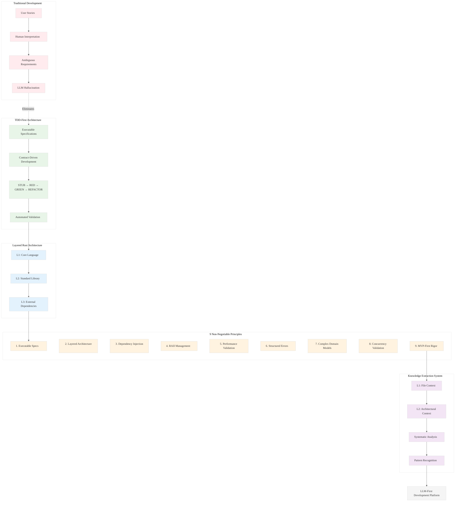

# Analysis: INGEST_20250930104957_300_18

## Content Analysis Framework

**File**: `A01-README-MOSTIMP.md` - TDD-First Architecture Principles  
**Analysis Date**: 2025-01-10  
**Context**: Row 18 from INGEST_20250930104957 dataset

---

## A. Standalone Analysis (Content A)

### Core Architectural Philosophy
This document establishes **Executable Specifications** as the foundational principle for LLM-driven development. The key insight is that traditional user stories fail LLMs because they're designed for human conversation, not machine execution.

### L1-L8 Extraction Analysis

#### Horizon 1: Tactical Implementation (L1-L3)

**L1: Idiomatic Patterns & Micro-Optimizations**
- **STUB → RED → GREEN → REFACTOR** cycle as the core development rhythm
- **Contract-driven development** with measurable outcomes
- **Mermaid-only diagrams** for GitHub compatibility (mechanical sympathy for tooling)

**L2: Design Patterns & Composition**
- **Layered Rust Architecture (L1→L2→L3)**: Core → Std → External dependencies
- **Dependency Injection for Testability**: Trait-based composition over concrete types
- **RAII Resource Management**: Automatic cleanup patterns
- **Structured Error Handling**: `thiserror` for libraries, `anyhow` for applications

**L3: Micro-Library Opportunities**
- Test-first validation frameworks for LLM specifications
- Contract validation libraries for preconditions/postconditions
- Performance assertion testing utilities

#### Horizon 2: Strategic Architecture (L4-L6)

**L4: Macro-Library & Platform Opportunities**
- **LLM-First Development Platform**: Tools that transform ambiguous requirements into executable specifications
- **Performance Contract Validation**: Automated testing for performance claims

**L5: Architecture Decisions & Invariants**
- **MVP-First Rigor**: Proven architectures over theoretical abstractions
- **Concurrency Model Validation**: Thread safety through stress testing
- **Complex Domain Model Support**: Real-world complexity handling

**L6: Domain-Specific Architecture**
- **LLM Hallucination Prevention**: Systematic elimination of ambiguous requirements
- **Test-Driven Architecture**: Every architectural decision backed by automated validation

#### Horizon 3: Foundational Evolution (L7-L8)

**L7: Language Capability Evolution**
- Recognition that current development methodologies fail LLMs
- Need for formal specification languages that bridge human intent and machine execution

**L8: Meta-Context (Intent Archaeology)**
- **Historical Context**: Response to the failure of traditional agile methodologies in LLM contexts
- **Strategic Intent**: Positioning for dominance in LLM-driven development ecosystems
- **Paradigm Shift**: From human-centric to machine-executable specifications

---

## B. A in Context of B (L1 File Context)

### File Metadata Insights
- **Location**: `pen02Rust300/A01-README-MOSTIMP.md` - Positioned as the most important README
- **Size**: 1908 bytes, 46 lines - Concise but comprehensive principles
- **Naming Convention**: `A01-` prefix suggests priority ordering system

### Contextual Amplification
The L1 context reveals this is a **foundational document** in a structured knowledge system. The deep nesting (8 levels) and specific naming suggest this is part of a larger architectural framework for Rust development.

The file's position as `A01-README-MOSTIMP.md` indicates it's the **primary entry point** for understanding the entire system's philosophy.

---

## C. B in Context of C (L2 Architectural Context)

### Architectural Pattern Recognition
The L2 context reveals this document sits within a **knowledge extraction system** (`extracted/Ingestion01/pen02Rust300`), suggesting it's part of a larger effort to systematize Rust development wisdom.

### Cross-Module Relationships
The architectural context shows this is part of a **multi-layered analysis system** where documents are processed through L1 (immediate) and L2 (architectural) contexts, mirroring the L1→L2→L3 layering principle described in the content itself.

---

## D. A in Context of B & C (Holistic Analysis)

### Strategic Synthesis

This document represents a **meta-architectural principle** - it's not just describing how to build Rust systems, but how to build the *process* of building Rust systems in an LLM-dominated world.

### Key Strategic Insights

1. **Process Innovation**: The document recognizes that traditional development methodologies are inadequate for LLM collaboration
2. **Systematic Knowledge Capture**: The document itself is part of a systematic effort to extract and codify development wisdom
3. **Executable Architecture**: Every principle is designed to be machine-verifiable, not just human-understandable

### Foundational Paradigm Shift

The combination of content and context reveals a **fundamental shift** from:
- **Human-Centric Development** → **Machine-Executable Specifications**
- **Narrative Requirements** → **Contract-Driven Development**
- **Implicit Knowledge** → **Systematic Knowledge Extraction**

---

## Mermaid Diagram: TDD-First Architecture Evolution

---

## Strategic Implications

### For Rust Ecosystem Dominance
1. **First-Mover Advantage**: Establishing LLM-first development methodologies
2. **Tooling Opportunities**: Building the infrastructure for executable specifications
3. **Knowledge Arbitrage**: Systematically extracting and codifying development wisdom

### For LLM Integration
1. **Specification Languages**: Need for formal languages that bridge human intent and machine execution
2. **Validation Frameworks**: Automated testing for architectural decisions
3. **Pattern Libraries**: Systematic collection of proven architectural patterns

This analysis reveals a document that's not just describing architecture principles, but establishing the foundation for a new paradigm of LLM-collaborative development.