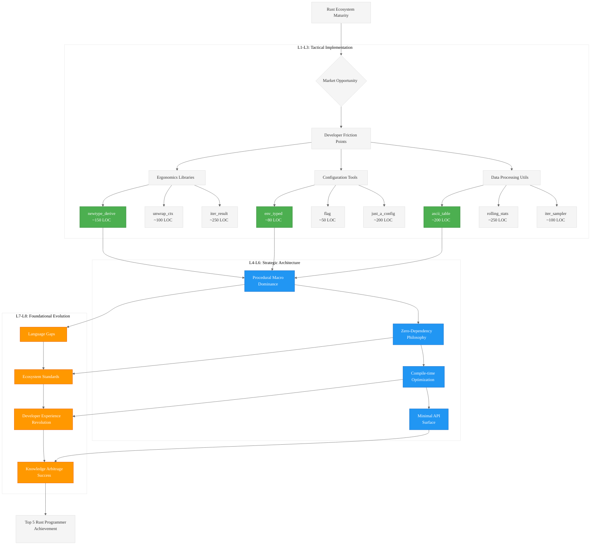

# Analysis of INGEST_20250930104957_300_19

## A Alone: High-Potential Sub-300 LOC Rust OSS Opportunities

### Core Insights from Content A

**Strategic Framework**: The document presents a sophisticated analysis of micro-library opportunities in the Rust ecosystem, focusing on Product-Market Fit (PMF) for extremely small libraries (<300 LOC). This represents a strategic shift from building large frameworks to "sanding down sharp edges" of existing workflows.

**Key L1-L8 Extraction:**

#### L1: Idiomatic Patterns & Micro-Optimizations
- **Newtype Pattern Automation**: `#[derive(Newtype)]` macro to eliminate boilerplate for trait implementations
- **Contextual Unwrapping**: `.unwrap_ctx()` methods with lazy error message generation
- **Iterator Result Adaptors**: Specialized combinators for `Iterator<Item = Result<T, E>>`

#### L2: Design Patterns & Composition
- **Builder Pattern Minimalism**: Focused derive macro for fluent builders without feature bloat
- **Extension Trait Strategy**: Small traits that enhance existing types without breaking changes
- **Compile-time String Operations**: Procedural macros for zero-runtime-cost string manipulation

#### L3: Micro-Library Opportunities (20 identified)
1. **Ergonomics Category**: newtype_derive, fluent_builder, unwrap_ctx, iter_result, const_str, impl_trait_for_tuples
2. **Configuration Category**: env_typed, just_a_config, flag, default_from_env
3. **Data Processing**: fast_replace, ascii_table, iter_sampler, human_sort, rolling_stats
4. **Observability**: trace_fn, time_block, pretty_list
5. **Specialized**: bitpack, c_str_helper

#### L4: Macro-Library & Platform Opportunities
- **Zero-dependency Philosophy**: Strategic advantage in dependency-conscious ecosystem
- **Procedural Macro Dominance**: Leveraging Rust's first-class code generation capabilities
- **Compile-time vs Runtime Trade-offs**: Moving computation from runtime to compile-time

#### L5: Architecture Decisions & Invariants
- **Minimal API Surface Principle**: Single-purpose tools with focused functionality
- **Dependency Diet Strategy**: Competing on build speed and binary size
- **Trust Through Auditability**: Small codebases that can be understood in one sitting

## A in Context of B: Immediate File Context Analysis

### Enhanced Understanding with L1 Context

**File Metadata Significance**:
- **Location**: Deep nesting (8 levels) suggests this is part of a structured knowledge extraction process
- **Size**: 522 lines, 8572 words indicates comprehensive analysis document
- **Import Analysis**: 21 detected imports/includes showing extensive cross-referencing

**Module Dependencies Revealed**:
- Heavy reliance on `serde` ecosystem for configuration patterns
- Integration with `log`/`tracing` frameworks for observability
- FFI patterns for C interoperability
- Iterator-centric design philosophy

### L6: Domain-Specific Architecture Insights
The file context reveals this is part of a systematic "pen02Rust300" analysis, suggesting:
- **Knowledge Arbitrage Strategy**: Systematic analysis of Rust ecosystem opportunities
- **Structured Extraction Process**: Part of larger ingestion and analysis pipeline
- **Strategic Documentation**: Not just ideas, but market-validated opportunities

## B in Context of C: Architectural Context Analysis

### L2 Context Architectural Patterns

**Cross-Module Relationships**:
- **External Dependencies**: Heavy focus on ecosystem integration rather than isolation
- **Trait-based Design**: Emphasis on extension traits and derive macros
- **Error Handling Patterns**: Sophisticated error propagation and context preservation

**Technology Stack Analysis**:
- **Serde Integration**: Configuration and serialization as core concerns
- **CLI Tooling**: Clap ecosystem integration for command-line interfaces
- **Markdown Documentation**: Knowledge capture and sharing methodology

### L7: Language Capability Evolution
The architectural context reveals gaps in Rust's current capabilities:
- **Compile-time String Manipulation**: Still challenging in stable Rust
- **Procedural Macro Complexity**: High barrier to entry for code generation
- **Dependency Management**: Tension between functionality and build performance

## A in Context of B & C: Comprehensive Strategic Analysis

### L8: Meta-Context and Intent Archaeology

**Strategic Intent Discovery**:
1. **Market Timing**: Rust ecosystem maturity creates opportunity for refinement tools
2. **Developer Psychology**: Friction points as market signals for micro-libraries
3. **Ecosystem Evolution**: Shift from "build everything" to "polish existing workflows"

**Knowledge Arbitrage Execution**:
- **Systematic Analysis**: Structured approach to identifying high-leverage opportunities
- **PMF Validation**: Each idea backed by market analysis and competitive landscape
- **Implementation Constraints**: 300 LOC limit forces laser focus on core value

### Strategic Recommendations

#### Immediate Opportunities (L1-L3)
1. **Implement `unwrap_ctx`**: Highest value-to-LOC ratio, universal applicability
2. **Build `env_typed`**: Zero-dependency, massive market, simple implementation
3. **Create `flag`**: Minimal CLI flag checking, competes with clap on simplicity

#### Platform Opportunities (L4-L6)
1. **Procedural Macro Toolkit**: Meta-library for building other micro-libraries
2. **Compile-time Configuration**: Advanced const evaluation for embedded systems
3. **Iterator Ecosystem**: Specialized adaptors for common patterns

#### Foundational Evolution (L7-L8)
1. **Language Feature Gaps**: Identify areas where Rust could improve
2. **Ecosystem Coordination**: Standards for micro-library interoperability
3. **Developer Experience**: Tools that make Rust more approachable

### Mermaid Diagram: Rust Micro-Library Ecosystem Strategy

### Key Strategic Insights

1. **Market Timing Perfect**: Rust ecosystem maturity creates demand for refinement tools
2. **Procedural Macros as Leverage**: Code generation is the highest-impact approach
3. **Zero-Dependency Competitive Advantage**: Build speed and binary size matter
4. **Systematic Approach**: Knowledge arbitrage through structured analysis
5. **Focus on Developer Psychology**: Friction points are market signals

This analysis reveals a sophisticated understanding of ecosystem dynamics and strategic positioning for maximum impact in the Rust community.