# Analysis: INGEST_20250930104957_300_2

## Strategic Analysis Framework

**Content A**: Pre-Development Specification for Minimalist Rust Utilities  
**Content B**: L1 Context (Immediate File Context)  
**Content C**: L2 Context (Architectural Context)  
**Analysis Framework**: RustPatterns20250930.md

---

## L1-L8 Extraction Hierarchy Analysis

### Horizon 1: Tactical Implementation (The "How")

#### L1: Idiomatic Patterns & Micro-Optimizations

**A Alone Insights:**
- **Standardized Framework Approach**: The document establishes a rigorous 3-artifact methodology (PRD, User Journey Map, Architecture Diagrams) for pre-development specification
- **Developer Experience (DX) as Core Philosophy**: "The Ergonomic Advantage" principle drives design decisions, focusing on reducing friction and adding tangible value
- **Performance Benchmarking Requirement**: Each tool must be benchmarked against existing alternatives (sed, jq, etc.) with measurable performance criteria
- **300 LOC Constraint**: Hard line-of-code limit forces architectural discipline and single-responsibility design

**A in Context of B:**
- **File Metadata Reveals Scale**: 750 lines, 5723 words indicates comprehensive specification depth
- **Import Analysis Shows Dependencies**: 10 detected imports reveal reliance on established industry practices and external references
- **Structured Documentation**: Markdown format with extensive heading structure suggests systematic approach to knowledge capture

**B in Context of C:**
- **Architectural Pattern Recognition**: Object-oriented and error handling patterns identified as core concerns
- **Technology Stack**: Serde library dependency indicates JSON processing capabilities
- **Cross-Module Dependencies**: External dependencies on PRD templates and industry best practices

**A in Context of B & C:**
- **Systematic Knowledge Extraction**: The comprehensive specification approach aligns with the broader knowledge arbitrage strategy
- **Industry Standard Integration**: References to established PRD templates and best practices indicate mature development methodology

#### L2: Design Patterns & Composition (Meta-Patterns)

**Key Meta-Patterns Identified:**

1. **Three-Artifact Specification Pattern**: PRD + User Journey Map + Architecture Diagrams for comprehensive pre-development planning
2. **Ergonomic Advantage Pattern**: Prioritizing developer experience over mere functionality
3. **Benchmarking-Driven Development**: Performance validation against existing tools as design requirement
4. **Single-Purpose Utility Pattern**: Each tool solves exactly one well-defined problem under 300 LOC

**Specific Tool Patterns:**
- **subst**: Stream processing with line-by-line transformation
- **json-fmt**: Deserialize-then-serialize pattern with error handling
- **ansi-strip**: State machine pattern for escape sequence parsing
- **StructNew**: Procedural macro pattern for code generation
- **line-count**: File analysis with classification logic

#### L3: Micro-Library Opportunities

**High-Impact Utilities Identified:**
1. **subst**: sed alternative for literal string replacement
2. **json-fmt**: Lightweight JSON formatter (faster than jq)
3. **ansi-strip**: Zero-dependency ANSI escape sequence remover
4. **StructNew**: Derive macro for constructor generation
5. **line-count**: Source code line counter

### Horizon 2: Strategic Architecture (The "What")

#### L4: Macro-Library & Platform Opportunities

**Ecosystem Positioning Strategy:**
- **Performance-First Alternatives**: Targeting existing Unix tools with superior performance (ripgrep, bat, fd pattern)
- **Developer Productivity Tools**: Focusing on common pain points in developer workflows
- **Zero-Dependency Philosophy**: Minimizing external dependencies for reliability and security
- **CLI Tool Ecosystem**: Building complementary utilities that work well in shell pipelines

#### L5: LLD Architecture Decisions & Invariants

**Critical Architectural Invariants:**
- **Stream Processing**: Line-by-line processing for memory efficiency
- **Error Handling Consistency**: Structured error messages to stderr with non-zero exit codes
- **Pipeline Compatibility**: Stdin/stdout design for shell pipeline integration
- **Performance Contracts**: Measurable performance requirements vs existing tools

**Tool-Specific Architectures:**
- **subst**: Simple argument parsing → stream processing → output
- **json-fmt**: Input validation → deserialization → pretty printing
- **ansi-strip**: State machine for escape sequence detection and removal
- **StructNew**: AST parsing → code generation → token stream output

#### L6: Domain-Specific Architecture & Hardware Interaction

**CLI Tool Domain Patterns:**
- **Argument Parsing**: Consistent CLI interface patterns
- **Stream Processing**: Efficient handling of large input streams
- **Error Reporting**: User-friendly error messages with actionable feedback
- **Performance Optimization**: Memory-efficient algorithms for large data processing

### Horizon 3: Foundational Evolution (The "Future" and "Why")

#### L7: Language Capability & Evolution

**Rust Language Features Leveraged:**
- **Procedural Macros**: StructNew demonstrates advanced macro capabilities
- **Zero-Cost Abstractions**: Performance-critical stream processing
- **Memory Safety**: Safe handling of large input streams
- **Error Handling**: Result types for robust error propagation

#### L8: The Meta-Context (The "Why")

**Archaeological Intent Analysis:**
- **Rust Ecosystem Maturation**: Focus on developer productivity tools indicates ecosystem evolution beyond systems programming
- **Performance Culture**: Emphasis on benchmarking reflects Rust community's performance-first mindset
- **Documentation-Driven Development**: Comprehensive pre-development specifications indicate mature engineering practices
- **Open Source Strategy**: Systematic approach to creating valuable ecosystem contributions

---

## Synthesis: Strategic Insights

### 1. The Three-Artifact Methodology as Innovation Framework
The standardized PRD + User Journey + Architecture approach provides a replicable framework for creating high-quality developer tools, reducing the risk of scope creep and unclear requirements.

### 2. Ergonomic Advantage as Competitive Moat
The focus on developer experience over mere functionality creates sustainable competitive advantages, as demonstrated by successful Rust tools like ripgrep and bat.

### 3. Performance Benchmarking as Design Constraint
Making performance validation a requirement (not an afterthought) ensures tools meet the high-performance expectations of the Rust ecosystem.

### 4. 300 LOC Constraint as Quality Driver
The hard line limit forces architectural discipline, preventing feature creep and ensuring maintainable, focused implementations.

### 5. Stream Processing as Universal Pattern
The emphasis on stdin/stdout compatibility and line-by-line processing creates composable tools that work well in Unix-style pipelines.

---

## Mermaid Diagram: Rust CLI Tool Development Framework

```mermaid
%%{init: {
  "theme": "base",
  "themeVariables": {
    "primaryColor": "#F5F5F5",
    "secondaryColor": "#E0E0E0",
    "lineColor": "#616161",
    "textColor": "#212121",
    "fontSize": "16px",
    "fontFamily": "Helvetica, Arial, sans-serif"
  },
  "flowchart": {
    "nodeSpacing": 70,
    "rankSpacing": 80,
    "wrappingWidth": 160,
    "curve": "basis"
  },
  "useMaxWidth": false
}}%%

flowchart TD
    subgraph Planning["📋 Pre-Development Phase"]
        direction TB
        A[PRD<br/>Requirements & Scope] --> B[User Journey Map<br/>Adoption Flow]
        B --> C[Architecture Diagrams<br/>Component/Data/Sequence]
    end
    
    subgraph Tools["🛠️ Tool Categories"]
        direction TB
        D[Text Processing<br/>subst, ansi-strip] --> E[Data Formatting<br/>json-fmt]
        E --> F[Code Generation<br/>StructNew macro]
        F --> G[Analysis Tools<br/>line-count]
    end
    
    subgraph Principles["⚡ Design Principles"]
        direction TB
        H[Ergonomic Advantage<br/>DX over Features] --> I[Performance First<br/>Benchmark vs Existing]
        I --> J[300 LOC Limit<br/>Focused Implementation]
        J --> K[Zero Dependencies<br/>Reliability & Security]
    end
    
    subgraph Architecture["🏗️ Common Patterns"]
        direction TB
        L[Stream Processing<br/>stdin → transform → stdout] --> M[Error Handling<br/>stderr + exit codes]
        M --> N[Pipeline Compatible<br/>Unix philosophy]
        N --> O[State Machines<br/>Parsing & Processing]
    end
    
    subgraph Validation["✅ Quality Gates"]
        direction TB
        P[Performance Benchmarks<br/>vs sed, jq, etc.] --> Q[User Journey Testing<br/>Aha! Moments]
        Q --> R[Documentation<br/>Clear API Examples]
        R --> S[Cross-Platform<br/>Linux, macOS, Windows]
    end
    
    Planning --> Tools
    Principles --> Planning
    Principles --> Tools
    Architecture --> Tools
    Tools --> Validation
    
    classDef planning fill:#E3F2FD
    classDef tools fill:#F3E5F5
    classDef principles fill:#FFF3E0
    classDef architecture fill:#E8F5E8
    classDef validation fill:#FFEBEE
    
    class A,B,C planning
    class D,E,F,G tools
    class H,I,J,K principles
    class L,M,N,O architecture
    class P,Q,R,S validation
```

---

## Tool-Specific Architectural Insights

### 1. subst - Stream Processing Excellence
- **Pattern**: Argument parsing → line-by-line transformation → output
- **Innovation**: Literal string replacement without regex overhead
- **Performance Target**: Match or exceed sed for simple substitutions

### 2. json-fmt - Validation-First Design
- **Pattern**: Input validation → deserialization → pretty printing
- **Innovation**: Faster than jq for formatting-only use cases
- **Error Handling**: Clear JSON parsing error messages

### 3. ansi-strip - State Machine Efficiency
- **Pattern**: Character-by-character state machine processing
- **Innovation**: Zero-dependency ANSI escape sequence removal
- **Use Case**: Log file sanitization and plain text display

### 4. StructNew - Macro-Driven Productivity
- **Pattern**: AST parsing → code generation → token stream
- **Innovation**: Automatic constructor generation for structs
- **Developer Experience**: Reduces boilerplate for common patterns

### 5. line-count - Classification Logic
- **Pattern**: File reading → line classification → summary output
- **Innovation**: Simple alternative to complex tools like tokei
- **Focus**: Clear, human-readable output format

---

## Actionable Recommendations

1. **Adopt Three-Artifact Methodology**: Use PRD + User Journey + Architecture for all new tool development
2. **Prioritize Ergonomic Advantage**: Focus on developer experience improvements over feature completeness
3. **Implement Performance Benchmarking**: Make performance validation a requirement, not optional
4. **Enforce 300 LOC Constraint**: Use line limits to drive architectural discipline
5. **Design for Pipeline Compatibility**: Ensure all tools work well in Unix-style command pipelines
6. **Document User Journeys**: Map the "Aha!" moments that drive tool adoption
7. **Leverage State Machine Patterns**: Use state machines for efficient text processing tasks