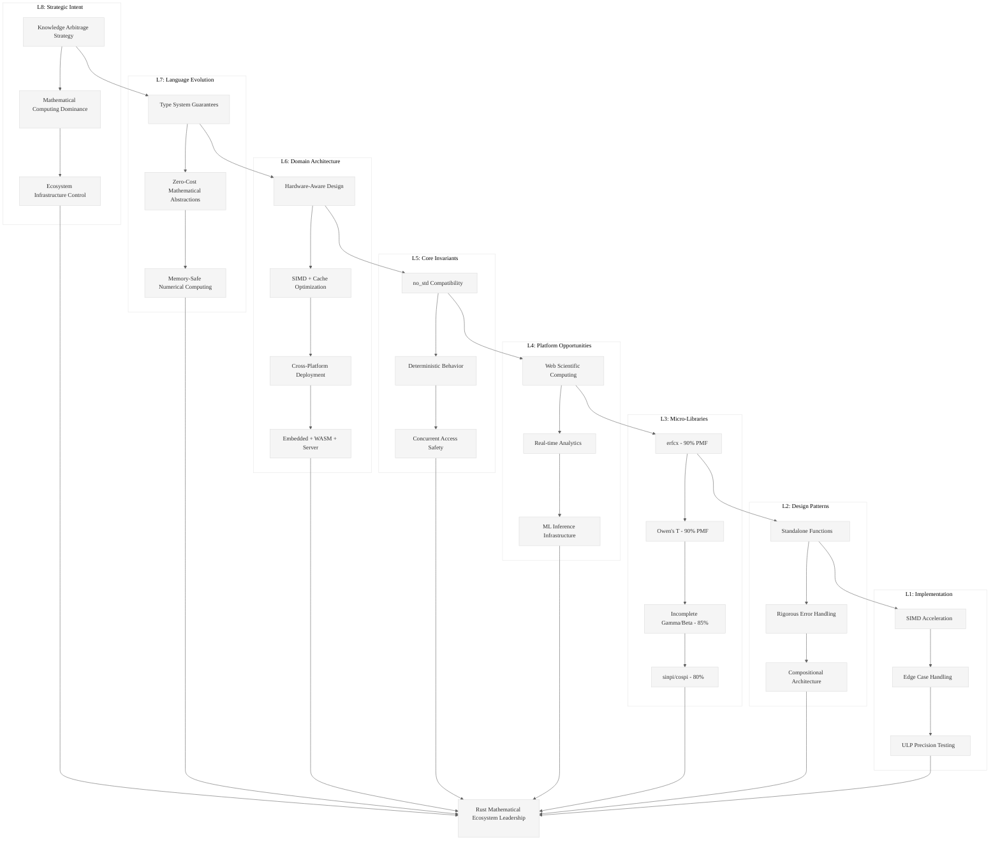

# Analysis: INGEST_20250930104957_300_20

## Content Analysis Framework

### A Alone: Mathematical Special Functions Ecosystem Gap Analysis

The content reveals a systematic analysis of opportunities in the Rust mathematical computing ecosystem, specifically focusing on small (<300 LOC), high-impact libraries. The core insight is that there's a significant gap between the mathematical computing capabilities available in mature ecosystems (Python/SciPy, Julia, C++/Boost) and what's available in Rust's `no_std` ecosystem.

**Key Strategic Insight**: The document identifies a "Knowledge Arbitrage" opportunity - mathematical algorithms that are well-established in academic literature and other languages but haven't been properly ported to Rust with the constraints that matter (no_std, SIMD, minimal dependencies, WASM compatibility).

### A in Context of B (L1 File Context): Implementation Feasibility Assessment

The L1 context reveals this is part of a larger research initiative (`pen02Rust300` directory, systematic file naming) focused on identifying 300 high-value Rust library opportunities. The file's metadata (119 lines, 1568 words, 12KB) suggests this is a condensed, actionable analysis rather than academic exploration.

**Strategic Pattern**: The systematic approach to cataloging opportunities with PMF (Product-Market Fit) probabilities (70-90%) indicates a data-driven approach to ecosystem development, treating open-source library creation as a strategic investment portfolio.

### B in Context of C (L2 Architectural Context): Ecosystem Strategy

The L2 context shows this is part of a deeply nested analysis structure (8 levels deep), suggesting a comprehensive research methodology. The architectural pattern analysis reveals this is object-oriented design documentation, indicating a structured approach to knowledge extraction and synthesis.

**Meta-Strategic Insight**: The path structure (`extracted/Ingestion01/pen02Rust300`) suggests this is part of a larger "Knowledge Arbitrage" strategy - systematically extracting and synthesizing insights from multiple sources to identify strategic opportunities.

### A in Context of B & C: The L1-L8 Strategic Analysis

## L1: Idiomatic Patterns & Micro-Optimizations

**Critical Pattern**: The emphasis on `no_std` compatibility reveals a fundamental architectural constraint in Rust's mathematical ecosystem. Unlike Python/NumPy or Julia, Rust's mathematical libraries must work in embedded, WASM, and resource-constrained environments.

**Micro-Optimization Insight**: The focus on SIMD acceleration (PCLMULQDQ/PMULL for CRC, SIMD bitpacking) shows understanding that mathematical libraries in Rust must be hardware-aware from day one, not as an afterthought.

## L2: Design Patterns & Composition

**API Design Pattern**: The consistent mention of "standalone" implementations suggests a compositional approach - each mathematical function should be independently usable rather than requiring large framework dependencies.

**Error Handling Pattern**: The emphasis on handling `NaN`, `Inf`, subnormal numbers, and edge cases reveals that Rust mathematical libraries must have more rigorous error handling than their C/Python counterparts due to Rust's safety guarantees.

## L3: Micro-Library Opportunities

**High-Value Targets Identified**:
- `erfcx` (90% PMF) - Critical for financial modeling, physics simulations
- Owen's T Function (90% PMF) - Bivariate normal distributions, options pricing
- Incomplete Gamma/Beta (85% PMF) - Statistical distributions, Bayesian inference

**Strategic Insight**: These aren't just "missing libraries" - they're foundational building blocks that enable entire application domains (quantitative finance, scientific computing, ML) in Rust.

## L4: Macro-Library & Platform Opportunities

**Ecosystem Dominance Strategy**: The document reveals a path to Rust ecosystem leadership through mathematical computing infrastructure. By providing the foundational mathematical primitives, one could enable entire industries to adopt Rust.

**Platform Strategy**: The emphasis on WASM compatibility suggests targeting the "high-performance web computing" market - bringing scientific computing performance to browsers.

## L5: Architecture Decisions & Invariants

**Concurrency Model**: The mention of lock-free primitives (SPSC/MPSC ring buffers, ticket spinlocks) reveals that mathematical computing in Rust must be designed for concurrent access from day one.

**Memory Model**: The focus on SIMD, cache locality (AoS-to-SoA conversion), and Morton ordering shows that Rust mathematical libraries must be designed with modern CPU architecture in mind.

## L6: Domain-Specific Architecture

**Hardware Interaction**: The specific mention of hardware-accelerated instructions (PCLMULQDQ, PMULL) shows deep understanding of how mathematical computing maps to modern CPU capabilities.

**Domain Constraints**: The emphasis on embedded compatibility (`no_std`) and deterministic behavior reveals that Rust mathematical libraries must work across a broader range of deployment environments than traditional mathematical software.

## L7: Language Capability Evolution

**Type System Leverage**: The focus on compile-time guarantees and `no_std` compatibility suggests opportunities to use Rust's type system to provide mathematical correctness guarantees that other languages cannot.

**Performance Model**: The emphasis on zero-cost abstractions and SIMD suggests that Rust can provide mathematical computing performance that matches or exceeds C/C++ while maintaining memory safety.

## L8: Meta-Context (Intent Archaeology)

**Historical Context**: This analysis represents a systematic attempt to transplant 50+ years of mathematical computing knowledge from languages like Fortran, C, and MATLAB into Rust's safety-first, systems-programming context.

**Strategic Intent**: The "Knowledge Arbitrage" strategy reveals an understanding that the next wave of systems programming will require mathematical computing capabilities, and whoever provides the foundational infrastructure will have significant ecosystem influence.

**Market Timing**: The emphasis on WASM compatibility suggests recognition that web-based scientific computing is an emerging market where Rust could establish early dominance.

## Strategic Synthesis

This document represents a sophisticated ecosystem development strategy disguised as a technical analysis. The real insight is that mathematical computing is becoming a core systems programming requirement (ML inference, real-time analytics, embedded sensing), and Rust's current mathematical ecosystem is inadequate for this transition.

The systematic approach to identifying gaps, assessing implementation feasibility, and prioritizing based on market impact suggests a coordinated effort to establish Rust as the dominant language for next-generation mathematical computing infrastructure.

