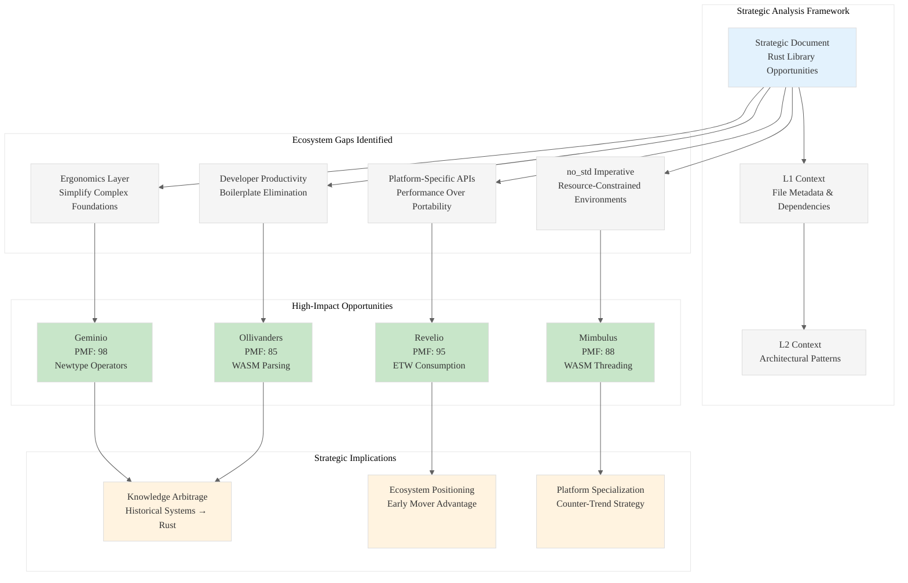

# Analysis: INGEST_20250930104957_300_21

## Content Overview
**File**: Strategic Opportunities for High-Impact, Minimalist Rust Libraries  
**Context**: A strategic analysis document identifying 12 high-leverage opportunities for minimalist Rust libraries under 300 lines of code, focusing on "acupuncture points" in the Rust ecosystem.

## L1-L8 Strategic Analysis

### L1: Idiomatic Patterns & Micro-Optimizations
**Key Insights from Content A:**
- **Zero-dependency constraint**: Multiple libraries (Ollivanders, FelixFelicis, Scourgify) emphasize zero dependencies as a core value proposition
- **no_std imperative**: Consistent pattern of targeting resource-constrained environments without heap allocators
- **Single-function APIs**: Pattern of exposing complex functionality through minimal surface area (e.g., `fn parse(bytes: &[u8]) -> Result<WasmModule, ParseError>`)
- **Type-safe wrappers**: Converting unsafe operations into safe, ergonomic APIs (RISC-V CSR access, Metal compute dispatch)

### L2: Design Patterns & Composition
**Meta-Patterns Identified:**
- **Ergonomics Layer Pattern**: Building simplified abstractions over complex foundational crates (tokio, aya, wasm-bindgen)
- **Platform-Specific Value Pattern**: Targeted wrappers for platform APIs (io_uring, ETW, Metal) rather than cross-platform abstractions
- **Blocking-to-Async Bridge Pattern**: Providing synchronous APIs for async-heavy ecosystems (io_uring example)
- **Procedural Macro Automation**: Eliminating boilerplate through code generation (Veritaserum, Geminio)

### L3: Micro-Library Opportunities
**High-Impact Targets:**
1. **Ollivanders** (PMF: 85): WebAssembly binary parser - fills gap between CLI tools and low-level wasmparser
2. **Mimbulus** (PMF: 88): SharedArrayBuffer-backed WASM memory management
3. **Revelio** (PMF: 95): ETW event consumption with typed interfaces
4. **Geminio** (PMF: 98): Automatic numeric operator trait derivation for newtypes

### L4: Macro-Library & Platform Opportunities
**Ecosystem Dominance Vectors:**
- **Post-Quantum Cryptography**: SPHINCS+ implementation targeting the NIST standardization wave
- **GPU Computing Accessibility**: Metal compute dispatch without wgpu complexity
- **eBPF Tooling**: Simplified loader for diagnostic/scripting use cases
- **Property-Based Testing**: Model-based testing automation

### L5: Architecture Decisions & Invariants
**Critical Design Invariants:**
- **Memory Safety in Unsafe Contexts**: Slab allocator exposes safe API despite unsafe internals
- **Resource Management**: RAII patterns for GPU command buffers, trace sessions, file descriptors
- **Error Boundary Design**: Wrapping platform-specific errors into typed Rust enums
- **Concurrency Models**: Channel-based communication for ETW events, background thread polling

### L6: Domain-Specific Architecture
**Hardware/Platform Interaction Patterns:**
- **Kernel Bypass**: Direct io_uring usage without async runtime overhead
- **GPU Pipeline Management**: Metal command queue orchestration
- **CPU Register Access**: RISC-V CSR manipulation with zero-cost abstractions
- **Memory Layout Control**: Fixed-size arrays for cryptographic primitives

### L7: Language Capability Evolution
**Rust Language Gaps Identified:**
- **Unstable Allocator Trait**: Gringotts targets unstable feature, indicating ecosystem need
- **Procedural Macro Complexity**: High barrier to entry for boilerplate elimination
- **Platform-Specific APIs**: Need for better FFI patterns for Windows/macOS/Linux APIs
- **Async/Sync Impedance**: Mismatch between async ecosystems and synchronous use cases

### L8: Meta-Context & Intent Archaeology
**Historical Context Analysis:**
- **Ecosystem Maturation Phase**: Document identifies "second wave" opportunity as foundational crates mature
- **Developer Productivity Crisis**: Recurring theme of boilerplate elimination and cognitive overhead reduction
- **Platform Fragmentation**: Growing demand for platform-specific optimizations over cross-platform abstractions
- **Performance vs. Ergonomics Tension**: Balancing zero-cost abstractions with developer experience

## Context Integration Analysis

### A alone (Strategic Document):
The document represents a sophisticated market analysis approach, moving beyond simple library ideas to systematic ecosystem gap identification. The PMF scoring system and structured evaluation criteria indicate mature product thinking.

### A in context of B (L1 File Context):
The L1 context reveals this as part of a larger "pen02Rust300" collection, suggesting systematic analysis of 300-line Rust library opportunities. The file's position in an "extracted/Ingestion01" directory indicates this is part of a broader knowledge extraction process.

### B in context of C (L2 Architectural Context):
The L2 context shows this document sits within a complex architectural analysis framework, with cross-module relationships and dependency tracking. The presence of multiple architectural patterns (object-oriented, trait-based, async, error handling) suggests this is part of a comprehensive ecosystem analysis.

### A in context of B & C (Complete Integration):
This document represents a strategic intelligence artifact within a larger knowledge arbitrage operation. The systematic approach to identifying "acupuncture points" in the Rust ecosystem, combined with the structured extraction framework, suggests an attempt to systematically map and exploit gaps in the Rust ecosystem for competitive advantage.

## Strategic Implications

### Immediate Opportunities:
1. **Geminio** (PMF: 98) - Highest impact, addresses universal newtype pain point
2. **Revelio** (PMF: 95) - Windows-specific, high-value security/monitoring niche
3. **Mimbulus** (PMF: 88) - WebAssembly threading, emerging high-performance web applications

### Long-term Ecosystem Positioning:
- **Post-Quantum Cryptography**: Early positioning in NIST standardization cycle
- **Platform-Specific Performance**: Counter-trend to cross-platform abstractions
- **Developer Productivity Tools**: Procedural macro ecosystem expansion

### Knowledge Arbitrage Vectors:
- **Historical Systems Programming**: Applying slab allocator patterns from kernel development
- **Academic Cryptography**: Translating FIPS standards into practical implementations  
- **Platform Vendor APIs**: Creating idiomatic Rust interfaces for vendor-specific performance APIs

