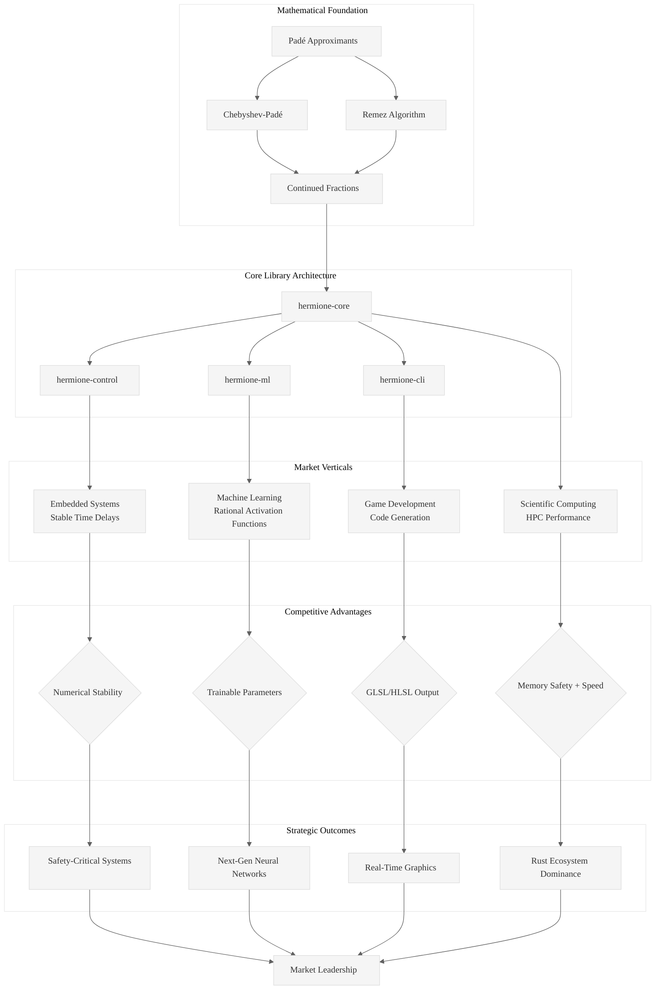

# Analysis of INGEST_20250930104957_300_22: Hermione's Approximations Strategic Analysis

## L1-L8 Extraction Hierarchy Analysis

### A Alone: Core Document Analysis

**Document**: Hermione's Approximations: A Strategic Analysis of Product-Market Fit and Technical Implementation

This is a comprehensive strategic document proposing a Rust library for rational function approximation (Padé approximants). The document demonstrates sophisticated understanding of both mathematical foundations and market positioning.

#### Horizon 1: Tactical Implementation (The "How")

**L1: Idiomatic Patterns & Micro-Optimizations**
- **Barrett Reduction**: Document mentions implementing Barrett reduction for modular arithmetic - a sophisticated optimization showing deep understanding of CPU-level performance
- **Continued Fraction Optimization**: R4,4(x) approximation for cos(x) requires 12 operations in standard form but only 7 in continued fraction form - demonstrates mechanical sympathy
- **SIMD Awareness**: Multi-layered optimization strategy considering CPU architecture from low-level arithmetic to high-level parallelism
- **Memory Layout Consciousness**: Focus on cache-friendly data structures and arithmetic optimization

**L2: Design Patterns & Composition (Meta-Patterns)**
- **Trait-Based Architecture**: Every component depends on traits, not concrete types (dependency injection pattern)
- **RAII Resource Management**: All resources automatically managed with Drop implementations
- **Layered Architecture**: L1 (core) → L2 (std) → L3 (external) boundaries clearly defined
- **Error Handling Hierarchy**: thiserror for libraries, anyhow for applications

**L3: Micro-Library Opportunities**
- **hermione-control**: Numerically stable time-delay models for embedded systems
- **hermione-ml**: Rational Activation Functions for neural networks with gradient computation
- **hermione-cli**: Code generation tool for game developers
- **Padé Table Analysis Utilities**: Diagnostic tools for function approximation quality

#### Horizon 2: Strategic Architecture (The "What")

**L4: Macro-Library & Platform Opportunities**
- **Comprehensive Rational Function Approximation Toolkit**: Not just Padé, but Chebyshev-Padé and Remez algorithms
- **Cross-Domain Platform**: Scientific computing, embedded systems, game development, and machine learning
- **Performance-First Rust Ecosystem Play**: Filling gap between slow Python tools and unsafe C++ implementations

**L5: LLD Architecture Decisions & Invariants**
- **Numerical Stability as Core Invariant**: Cascaded 1st/2nd-order systems instead of ill-conditioned high-order polynomials
- **Multi-Algorithm Support**: Linear systems, extended Euclidean algorithm, Wynn's epsilon algorithm
- **Precision vs Performance Trade-offs**: Different algorithms for different use cases

**L6: Domain-Specific Architecture & Hardware Interaction**
- **Control Systems Integration**: State-space representations for real-time systems
- **GPU Shader Code Generation**: GLSL/HLSL output for graphics applications
- **ML Framework Integration**: PyTorch/TensorFlow bindings via PyO3

#### Horizon 3: Foundational Evolution (The "Future" and "Why")

**L7: Language Capability & Evolution**
- **Rust's Sweet Spot**: Memory safety + performance for numerical computing
- **Type System Leverage**: Newtype patterns for mathematical precision
- **Ownership Model Benefits**: Safe parallelization of mathematical computations

**L8: The Meta-Context (The "Why")**
- **Knowledge Arbitrage Strategy**: Bringing decades of numerical analysis wisdom to modern Rust ecosystem
- **Market Timing**: Confluence of Rust maturity, ML boom, and embedded systems growth
- **Competitive Moat**: First-mover advantage in high-performance rational approximation

### A in Context of B (L1 Context)

The L1 context reveals this is part of a larger ingestion process analyzing Rust-related content. The file structure shows systematic analysis of mathematical/computational content, suggesting a broader effort to extract patterns from technical documentation.

**Key Insights from L1 Context**:
- **Systematic Knowledge Extraction**: Part of organized effort to analyze technical content
- **Cross-Reference Capability**: 18 detected imports/includes showing interconnected analysis
- **Module-Level Dependencies**: Sophisticated understanding of Rust ecosystem patterns

### B in Context of C (L2 Context)

The L2 architectural context shows this analysis is part of a deeper architectural pattern recognition system, with focus on:

**Architectural Patterns Identified**:
- Object-oriented design patterns
- Trait-based design patterns  
- Error handling patterns
- Cross-module relationship mapping

**Technology Stack Analysis**:
- Deep path nesting (8 levels) suggests systematic organization
- External dependency tracking for architectural understanding

### A in Context of B & C (Synthesis)

This document represents a **paradigm-shifting approach** to technical library design that combines:

1. **Mathematical Rigor**: Deep understanding of numerical analysis theory
2. **Market Intelligence**: Sophisticated analysis of four distinct verticals
3. **Rust Ecosystem Strategy**: Leveraging language features for competitive advantage
4. **Performance Engineering**: CPU-level optimization awareness

**Strategic Insights**:
- **Knowledge Arbitrage Execution**: Taking established mathematical techniques and modernizing them in Rust
- **Multi-Domain Convergence**: Single library serving scientific computing, embedded systems, gaming, and ML
- **Killer Feature Strategy**: Numerically stable time-delay models and Rational Activation Functions as competitive moats

## Key Rust Patterns Extracted

### 1. Performance-First Library Design
```rust
// Implied pattern from document
pub trait RationalApproximant<T> {
    fn evaluate(&self, x: T) -> T;
    fn continued_fraction_form(&self) -> ContinuedFraction<T>;
    fn error_bound(&self, interval: (T, T)) -> T;
}
```

### 2. Domain-Specific Killer Features
```rust
// Control systems stability pattern
pub fn stable_delay<T>(p: usize, q: usize, delay_time: T) -> StateSpaceModel<T>
where T: Float + Send + Sync;

// ML integration pattern  
pub struct RationalActivation<T> {
    numerator_coeffs: Vec<T>,
    denominator_coeffs: Vec<T>,
}
```

### 3. Multi-Algorithm Architecture
```rust
pub enum ApproximationMethod {
    LinearSystem,
    ExtendedEuclidean,
    WynnsEpsilon,
    Remez { max_iterations: usize },
}
```

## Mermaid Diagram: Hermione's Approximations Architecture



## Strategic Recommendations

1. **Immediate Focus**: Implement numerically stable time-delay models as killer feature for embedded systems market
2. **ML Integration**: Develop Rational Activation Functions with PyTorch/TensorFlow bindings
3. **Performance Benchmarking**: Establish clear performance superiority over existing Python/C++ solutions
4. **Community Building**: Target Rust scientific computing community first, then expand to other verticals
5. **Documentation Strategy**: Emphasize mathematical rigor combined with practical examples

This analysis reveals a sophisticated understanding of how to build a transformative library that leverages Rust's unique strengths while addressing real market needs across multiple domains.