```mermaid
%%{init: {
  "theme": "base",
  "themeVariables": {
    "primaryColor": "#F5F5F5",
    "secondaryColor": "#E0E0E0",
    "lineColor": "#616161",
    "textColor": "#212121",
    "fontSize": "16px",
    "fontFamily": "Helvetica, Arial, sans-serif"
  },
  "flowchart": {
    "nodeSpacing": 70,
    "rankSpacing": 80,
    "wrappingWidth": 160,
    "curve": "basis"
  },
  "useMaxWidth": false
}}%%

flowchart TD
    subgraph H1["🎯 Horizon 1: Tactical Implementation"]
        direction TB
        L1["L1: Performance Contracts<br/>~0.4ms/file, 1-11μs queries"]
        L2["L2: Entity Name Specificity<br/>ServerCommandHandler > Handler"]
        L3["L3: Micro-Library Opportunity<br/>Performance Contract Crate"]
        L1 --> L2 --> L3
    end
    
    subgraph H2["🏗️ Horizon 2: Strategic Architecture"]
        direction TB
        L4["L4: Tool Discovery Platform<br/>Systematic Exploration Framework"]
        L5["L5: Validation-First Architecture<br/>100% Success Rate Invariant"]
        L6["L6: Codebase Analysis Domain<br/>Linear Scaling Guarantee"]
        L4 --> L5 --> L6
    end
    
    subgraph H3["🚀 Horizon 3: Foundational Evolution"]
        direction TB
        L7["L7: Performance Contract Types<br/>Timing Bounds in Type System"]
        L8["L8: Meta-Context Archaeology<br/>Unknown → Production Ready"]
        L7 --> L8
    end
    
    subgraph CONTEXT["📊 Context Integration"]
        direction TB
        A["A: Project Excellence<br/>22 Documents, 100% Success"]
        B["B: File Structure<br/>8-Level Deep Organization"]
        C["C: Architectural Patterns<br/>OOP + Trait-Based Design"]
        A --> B --> C
    end
    
    subgraph INSIGHTS["💡 Strategic Insights"]
        direction TB
        I1["Systematic > Ad-hoc<br/>Structured Protocols Win"]
        I2["AI Integration Multiplier<br/>JSON + AI = 10x Value"]
        I3["Community Validation<br/>External Testing Required"]
        I1 --> I2 --> I3
    end
    
    H1 --> H2
    H2 --> H3
    CONTEXT --> INSIGHTS
    H3 --> INSIGHTS
    
    classDef horizon fill:#E3F2FD,stroke:#1976D2,stroke-width:2px
    classDef context fill:#F3E5F5,stroke:#7B1FA2,stroke-width:2px
    classDef insights fill:#E8F5E8,stroke:#388E3C,stroke-width:2px
    
    class H1,H2,H3 horizon
    class CONTEXT context
    class INSIGHTS insights
```

# Analysis of INGEST_20250930104957_300_23: Parseltongue Best Practices Final Deliverables

## Content Analysis Framework

**File A (Core Content)**: `FINAL_DELIVERABLES_SUMMARY.md` - Comprehensive project completion summary for Parseltongue tool exploration
**File B (L1 Context)**: Immediate file context with metadata and structural analysis  
**File C (L2 Context)**: Architectural context showing package structure and patterns

---

## L1-L8 Strategic Analysis

### Horizon 1: Tactical Implementation (The "How")

#### L1: Idiomatic Patterns & Micro-Optimizations
**Performance Metrics as First-Class Citizens**
- **Pattern**: Quantified performance claims with specific measurements
  - Ingestion: ~0.4ms per file
  - Queries: 1-11 microseconds  
  - Visualization: ~7ms for 2700+ nodes
- **Rust Insight**: This demonstrates the importance of benchmarking culture in Rust tooling
- **Optimization Opportunity**: Performance contracts should be embedded in type system (const generics for timing bounds)

**Entity Name Specificity Pattern**
- **Anti-Pattern Identified**: Generic names (`Handler`, `Client`) fail
- **Success Pattern**: Domain-specific names (`ServerCommandHandler`, `IggyClient`)
- **Rust Application**: This maps to Rust's newtype pattern and semantic typing philosophy

#### L2: Design Patterns & Composition (Meta-Patterns)
**Systematic Exploration Framework**
- **Pattern**: Structured protocols over ad-hoc experimentation
- **Meta-Pattern**: Experimental framework templates for tool discovery
- **Rust Insight**: This reflects Rust's emphasis on systematic approaches (ownership rules, explicit error handling)

**AI Integration Multiplier Effect**
- **Pattern**: JSON context generation for structured AI analysis
- **Composition Strategy**: Raw tool output + AI interpretation = exponential value
- **Rust Opportunity**: Structured serialization (serde) as AI interface layer

#### L3: Micro-Library Opportunities
**Performance Measurement Crate**
- **Opportunity**: Sub-2000 LOC library for embedding performance contracts in Rust code
- **Features**: Compile-time performance bounds, runtime validation, benchmark integration
- **Market Gap**: Current benchmarking tools are separate from production code

### Horizon 2: Strategic Architecture (The "What")

#### L4: Macro-Library & Platform Opportunities
**Tool Discovery Platform**
- **Ecosystem Gap**: No systematic framework for exploring new development tools
- **Platform Opportunity**: Rust-based tool exploration framework with:
  - Capability mapping protocols
  - Performance characterization
  - Validation frameworks
  - Community testing infrastructure

#### L5: LLD Architecture Decisions & Invariants
**Validation-First Architecture**
- **Invariant**: 100% success rate requirement drives architectural decisions
- **Concurrency Model**: External validation system with statistical analysis
- **State Management**: Documentation as executable specifications

**Linear Scaling Guarantee**
- **Architectural Constraint**: Tool must scale linearly with codebase size
- **Rust Advantage**: Zero-cost abstractions enable predictable performance scaling

#### L6: Domain-Specific Architecture & Hardware Interaction
**Codebase Analysis Domain**
- **Domain Constraints**: 
  - Sub-second ingestion for interactive use
  - Microsecond queries for real-time analysis
  - Memory efficiency for large codebases (8.1MB handled)
- **Hardware Interaction**: File system optimization, memory mapping for large code dumps

### Horizon 3: Foundational Evolution (The "Future" and "Why")

#### L7: Language Capability & Evolution
**Performance Contract Types**
- **Language Gap**: Rust lacks built-in performance contract system
- **Evolution Opportunity**: Const generics for timing bounds, compile-time performance validation
- **Type System Extension**: Performance as part of function signatures

**Systematic Tool Integration**
- **Current Limitation**: Tools exist in isolation without systematic integration patterns
- **Language Evolution**: Better macro system for tool composition and workflow generation

#### L8: The Meta-Context (The "Why")
**Intent Archaeology: From Unknown to Production-Ready**
- **Historical Context**: Project started with "I have parseltongue but don't know what it can do"
- **Transformation Process**: Systematic exploration → capability mapping → workflow development → validation
- **Meta-Insight**: This represents a general pattern for tool adoption in the Rust ecosystem

**Community Validation as Architectural Requirement**
- **Why This Matters**: Creator bias prevention through external validation
- **Historical Precedent**: Rust's own RFC process and community-driven development
- **Future Implication**: All Rust tooling should include community validation frameworks

---

## Context Integration Analysis

### A Alone: Project Completion Excellence
The core document demonstrates exceptional project management and documentation practices. The systematic approach to tool exploration, with quantified metrics and validation frameworks, represents a gold standard for technical project delivery.

### A in Context of B (L1): File Structure Insights
The deep nesting (8 levels) and specific naming (`pen02Rust300`) suggests this is part of a larger systematic analysis project. The markdown format with extensive linking indicates a documentation-first approach to knowledge management.

### B in Context of C (L2): Architectural Patterns
The L2 context reveals object-oriented and trait-based design patterns, suggesting the project applies Rust architectural principles even to documentation and project management. The lack of cross-module dependencies indicates clean separation of concerns.

### A in Context of B & C: Strategic Knowledge Management
The combination reveals a sophisticated knowledge management system:
- Systematic file organization (B)
- Architectural pattern application (C)  
- Comprehensive documentation and validation (A)

This represents a meta-framework for technical knowledge acquisition and validation that could be applied to any domain.

---

## Strategic Recommendations

### Immediate Rust Ecosystem Opportunities
1. **Performance Contract Crate**: Embed timing guarantees in type system
2. **Tool Discovery Framework**: Systematic exploration protocols for new tools
3. **Validation-as-Code**: Community validation frameworks for all tooling

### Long-term Ecosystem Evolution
1. **Language Extension**: Performance contracts in function signatures
2. **Tooling Integration**: Systematic composition patterns for development tools
3. **Community Standards**: Validation frameworks as requirement for tool adoption

### Knowledge Arbitrage Insights
This project demonstrates how systematic exploration and documentation can transform unknown tools into production-ready systems. The methodology itself is more valuable than the specific tool being explored.

---

