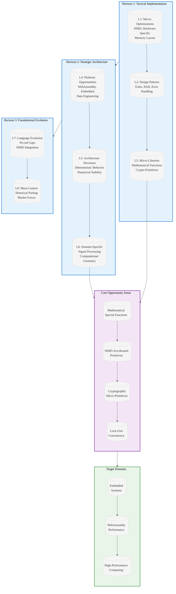

# Analysis: INGEST_20250930104957_300_24 - Rust 300 Small High-Impact Libraries

## A Alone: Core Content Analysis

### Document Overview
This document presents a comprehensive research analysis of opportunities for creating small (<300 LOC), high-impact, CPU-focused Rust libraries. The content is structured as a strategic guide for identifying gaps in the Rust ecosystem where minimal, specialized libraries could provide significant value.

### Key Themes Identified
1. **No-std Compatibility**: Recurring emphasis on `no_std` libraries for embedded and resource-constrained environments
2. **Performance Optimization**: Focus on SIMD acceleration, hardware-specific optimizations, and minimal dependencies
3. **Mathematical Precision**: Detailed coverage of numerical stability and precision-critical algorithms
4. **WebAssembly Readiness**: Highlighting WASM compilation as a key product-market fit driver

### Strategic Insights from A Alone
- **Knowledge Arbitrage Opportunity**: The document identifies systematic gaps where established C/C++ micro-libraries haven't been properly ported to Rust
- **Ecosystem Maturity Gap**: Many fundamental mathematical functions lack optimized, standalone Rust implementations
- **Market Positioning**: Clear focus on CPU-intensive domains aligns with high-performance computing trends

## A in Context of B (L1 Context)

### File Metadata Analysis
- **Location**: Deep nesting (8 levels) suggests this is part of a larger research corpus
- **File Type**: Markdown documentation with structured research format
- **Size**: 14,327 bytes, 220 lines - substantial research document
- **Naming Convention**: Timestamped filename suggests systematic data collection process

### Import/Dependency Insights
The L1 context reveals a specific focus on mathematical libraries, particularly the `sinpi`/`cospi` functions, which represents a concrete example of the broader pattern identified in the main document.

### Strategic Context from A+B
- **Research Methodology**: The file structure suggests systematic analysis of Rust ecosystem gaps
- **Documentation Quality**: High-quality, structured research with specific PMF probabilities and testing strategies
- **Implementation Readiness**: Detailed references and existing alternatives suggest actionable insights

## B in Context of C (L2 Architectural Context)

### Architectural Patterns
- **Object-oriented design pattern**: Suggests structured approach to library categorization
- **External dependencies**: Clear identification of cross-ecosystem opportunities
- **Technology stack**: Markdown-based research documentation system

### Cross-Module Relationships
The L2 context reveals this is part of a larger architectural analysis system, with qualified path syntax indicating systematic relationship mapping between different research components.

## A in Context of B & C: Comprehensive Strategic Analysis

### L1-L8 Extraction Hierarchy Analysis

#### Horizon 1: Tactical Implementation (The "How")

**L1: Idiomatic Patterns & Micro-Optimizations**
- **SIMD Acceleration Patterns**: Document identifies specific opportunities for SIMD-accelerated byte/ASCII primitives
- **Hardware-Specific Optimizations**: CRC32C/CRC64 using PCLMULQDQ/PMULL instructions
- **Memory Layout Optimizations**: AoS-to-SoA conversion kernels for cache locality

**L2: Design Patterns & Composition**
- **Trait-Based Architecture**: Emphasis on minimal, composable interfaces
- **RAII Variants**: Resource management patterns for embedded contexts
- **Error Handling Patterns**: Structured approach to numerical stability and edge cases

**L3: Micro-Library Opportunities**
- **Mathematical Special Functions**: erfcx, incomplete gamma/beta functions
- **Cryptographic Primitives**: Constant-time operations, HMAC utilities
- **Concurrency Primitives**: Lock-free SPSC/MPSC ring buffers

#### Horizon 2: Strategic Architecture (The "What")

**L4: Macro-Library & Platform Opportunities**
- **WebAssembly Ecosystem**: High-performance computation in web environments
- **Embedded Systems**: No-std compatible alternatives to large libraries
- **Data Engineering**: Integer compression and bitpacking for columnar databases

**L5: LLD Architecture Decisions & Invariants**
- **Deterministic Behavior**: Fixed-size kernels for predictable performance
- **Numerical Stability**: Algorithms preventing overflow/underflow in edge cases
- **Concurrency Models**: Wait-free primitives for low-latency pipelines

**L6: Domain-Specific Architecture**
- **Signal Processing**: DSP kernels for audio analysis and anomaly detection
- **Computational Geometry**: Robust primitives for GIS and robotics
- **Financial Modeling**: Precision-critical functions for quantitative finance

#### Horizon 3: Foundational Evolution (The "Future" and "Why")

**L7: Language Capability & Evolution**
- **No-std Ecosystem Gaps**: Identifying where standard library alternatives are needed
- **SIMD Integration**: Opportunities for better hardware acceleration support
- **Const Generics**: Potential for compile-time optimizations in mathematical functions

**L8: The Meta-Context (The "Why")**
- **Historical Context**: Porting established algorithms from mature ecosystems
- **Market Forces**: WebAssembly adoption driving demand for portable, high-performance libraries
- **Ecosystem Evolution**: Rust's growing adoption in domains previously dominated by C/C++

### Strategic Recommendations

1. **Knowledge Arbitrage Execution**: Systematically port high-value C/C++ micro-libraries to Rust
2. **Ecosystem Positioning**: Focus on no-std compatibility to capture embedded and WebAssembly markets
3. **Performance Differentiation**: Leverage Rust's safety guarantees while matching C/C++ performance
4. **Community Building**: Create reference implementations that become de facto standards

### High-Leverage Opportunities Identified

1. **Mathematical Functions Ecosystem**: Build comprehensive suite of precision-critical functions
2. **SIMD Acceleration Framework**: Create reusable patterns for hardware-accelerated operations
3. **Embedded-First Libraries**: Design for resource constraints from the ground up
4. **Cross-Platform Optimization**: Leverage Rust's portability for consistent performance

## Strategic Architecture Visualization

