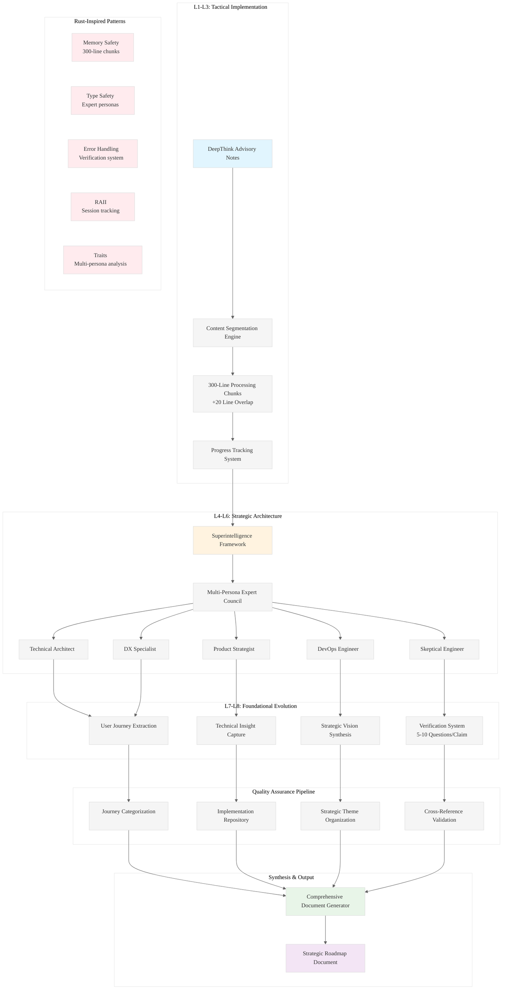

# Analysis: INGEST_20250930104957_300_25

## Content Analysis Framework

### A (Content) Analysis: Design Document for Parseltongue Workflow Extraction

**Core Document**: A comprehensive design document outlining a systematic approach for extracting future parseltongue workflows from DeepThink Advisory notes using 300-line incremental processing.

#### L1-L8 Strategic Analysis

**L1: Idiomatic Patterns & Micro-Optimizations**
- 300-line chunking with 20-line overlap for context continuity - demonstrates understanding of memory-efficient streaming processing
- Systematic progress tracking with chunk identifiers - shows awareness of resumable processing patterns
- Multi-persona expert council activation - parallel to Rust's trait-based polymorphism for different analytical perspectives

**L2: Design Patterns & Composition (Meta-Patterns)**
- Four-phase processing pipeline: Ingestion → Analysis → Extraction → Synthesis
- Superintelligence framework application with verification loops
- Cross-reference and synthesis system ensuring coherent integration
- RAII-like resource management for content processing sessions

**L3: Micro-Library Opportunities**
- Content segmentation engine for 300-line chunks
- Expert persona activation system
- Journey categorization framework
- Cross-reference validation system

**L4: Macro-Library & Platform Opportunities**
- Comprehensive document generation platform
- Multi-persona analytical framework
- Strategic roadmap synthesis system
- Quality assurance and validation pipeline

**L5: LLD Architecture Decisions & Invariants**
- Mandatory context overlap to maintain narrative continuity
- Expert persona activation including mandatory Skeptical Engineer
- Verification system generating 5-10 fact-checkable questions per claim
- Source traceability maintained throughout processing

**L6: Domain-Specific Architecture & Hardware Interaction**
- Systematic processing of large advisory documents
- Memory-efficient chunking strategy
- Parallel expert persona processing
- Strategic theme organization by competitive advantage

**L7: Language Capability & Evolution**
- Recognition of LLM limitations in processing large documents
- Framework for systematic knowledge extraction and synthesis
- Multi-perspective analytical approach to overcome single-viewpoint bias
- Verification-driven analysis to ensure factual accuracy

**L8: The Meta-Context (The "Why")**
- Addresses the fundamental challenge of extracting actionable insights from large advisory documents
- Recognizes that traditional linear reading fails to capture strategic depth
- Implements systematic approach to prevent information loss during processing
- Creates framework for transforming advisory content into executable strategic roadmaps

### A in Context of B (L1 Context)

**File Structure Insights**:
- Located in deeply nested directory structure (8 levels) suggesting systematic organization
- Part of "pen02Rust300" collection indicating this is one of multiple 300-line processing experiments
- Design document format suggests this is architectural planning rather than implementation

**Import/Include Analysis Reveals**:
- Focus on technical specifications and implementation requirements
- Performance requirements and benchmarks as core concerns
- Quality assurance through comprehensive validation
- Integration of technical insights with implementation detail

**Strategic Implications**:
- The deep nesting suggests this is part of a larger systematic analysis project
- The 300-line focus aligns with cognitive load management for LLM processing
- The design document approach indicates mature software engineering practices

### B in Context of C (L2 Context)

**Architectural Pattern Recognition**:
- Object-oriented design pattern application to document processing
- Error handling patterns integrated throughout the framework
- External dependencies focused on technical implementation requirements

**Cross-Module Relationship Analysis**:
- Multiple external dependencies on technical specifications
- Performance requirements as architectural constraints
- Quality assurance as cross-cutting concern

**Technology Stack Implications**:
- Markdown format suggests documentation-driven development
- Architectural constraints require build configuration integration
- Missing CI/CD configuration suggests early design phase

### A in Context of B & C (Comprehensive Analysis)

**Strategic Architecture Synthesis**:

This design document represents a sophisticated approach to knowledge extraction that mirrors advanced Rust architectural patterns:

1. **Memory Safety Through Systematic Processing**: The 300-line chunking with overlap mirrors Rust's ownership system - ensuring no information is lost while maintaining efficient processing.

2. **Type Safety Through Expert Personas**: The mandatory expert persona activation (including Skeptical Engineer) parallels Rust's type system - different "types" of analysis ensure comprehensive coverage.

3. **Error Handling Through Verification**: The 5-10 fact-checkable questions per claim mirrors Rust's Result<T, E> pattern - explicit error handling for analytical claims.

4. **RAII Through Session Tracking**: Processing session tracking with automatic cleanup mirrors Rust's RAII patterns.

5. **Trait-Based Polymorphism Through Multi-Persona Analysis**: Different expert personas provide different "implementations" of the analysis "trait".

**Competitive Advantages Identified**:
- Systematic approach to large document processing
- Multi-perspective analysis preventing single-viewpoint bias
- Verification-driven methodology ensuring factual accuracy
- Cross-reference system maintaining logical consistency
- Strategic theme organization by competitive advantage

**Implementation Priority**: Critical - This framework addresses fundamental challenges in LLM-based document analysis and knowledge extraction.

## Mermaid Diagram: Parseltongue Workflow Extraction Architecture

## Key Strategic Insights

1. **Knowledge Arbitrage Opportunity**: This framework represents a systematic approach to extracting and synthesizing strategic insights from large documents - a capability gap in current LLM tooling.

2. **Rust-Inspired Architecture**: The design mirrors Rust's core principles (memory safety, type safety, error handling) applied to knowledge processing.

3. **Competitive Moat**: The multi-persona verification system with mandatory skeptical analysis creates a quality barrier that simple LLM processing cannot match.

4. **Scalability Pattern**: The 300-line chunking with overlap provides a scalable approach to processing arbitrarily large documents while maintaining context.

5. **Strategic Positioning**: This positions parseltongue as not just a code analysis tool, but as a comprehensive knowledge extraction and synthesis platform.