# Analysis: INGEST_20250930104957_300_27 - Mermaid Diagram Generation Strategy

## L1-L8 Extraction Hierarchy Analysis

### Content A Analysis (Standalone)
**Core Content**: A comprehensive JSON document detailing an advanced LLM prompt engineering strategy for generating high-quality, squarish Mermaid diagrams.

**L1: Idiomatic Patterns & Micro-Optimizations**
- **Self-Repair Loop Pattern**: Iterative validation using `mermaid.parse()` with error feedback
- **Minimal Change Principle**: Target specific parsing errors rather than regenerating entire diagrams
- **Conservative Feature Set**: Restrict to proven syntax patterns to reduce failure modes
- **Strict Output Contract**: Enforce machine-readable format (single fenced code block only)

**L2: Design Patterns & Composition**
- **Multi-Phase Prompt Architecture**: Input ingestion → Syntactic perfection → Visual styling
- **Conditional Security Model**: Trigger-based interactivity enabling with explicit security level management
- **Template-Driven Generation**: Structured prompt templates for different diagram types
- **Validation Toolchain Pattern**: API-based (`mermaid.parse()`) + CLI-based (`mmdc`) validation

**L3: Micro-Library Opportunities**
- **LLM Diagram Validator**: ~500 LOC library wrapping `mermaid.parse()` with structured error handling
- **Prompt Template Engine**: Dynamic prompt generation based on diagram type inference
- **Aspect Ratio Controller**: CSS/SVG manipulation for enforcing squarish layouts

### Content A in Context of B (L1 Context)

**L4: Macro-Library & Platform Opportunities**
- **Universal Diagram Generation Platform**: Ecosystem for LLM-powered technical documentation
- **Prompt Engineering Framework**: Reusable patterns for constraint-driven LLM outputs
- **Multi-Modal Validation Pipeline**: Combining syntax, rendering, and accessibility validation

**L5: LLD Architecture Decisions & Invariants**
- **Security-First Design**: Default to `sandbox` mode, explicit opt-in for interactivity
- **Error Recovery Architecture**: Structured error propagation with machine-readable feedback
- **Layout Engine Abstraction**: Support for multiple renderers (Dagre, ELK) with consistent APIs

### Content B in Context of C (L2 Context)

**L6: Domain-Specific Architecture & Hardware Interaction**
- **Browser-Based Validation**: Headless browser integration for pixel-perfect rendering validation
- **Accessibility-First Architecture**: WCAG compliance built into the generation pipeline
- **Performance-Constrained Generation**: Optimized for weak LLMs with limited context windows

### Content A in Context of B & C (Full Context)

**L7: Language Capability & Evolution**
- **LLM Constraint Programming**: Using structured prompts as a form of constraint satisfaction
- **Prompt as Code**: Treating prompt engineering with the same rigor as software architecture
- **Multi-Model Orchestration**: Coordinating different LLM capabilities for complex diagram generation

**L8: The Meta-Context (Archaeological Intent)**
- **Historical Problem**: Traditional documentation tools fail to scale with modern software complexity
- **Paradigm Shift**: From manual diagram creation to AI-assisted visual communication
- **Strategic Vision**: Democratizing high-quality technical visualization through LLM accessibility
- **Knowledge Arbitrage**: Leveraging LLM capabilities to solve previously intractable UX problems

## Key Strategic Insights

### 1. **Executable Specifications Over Narratives**
The document demonstrates a shift from ambiguous user stories to formal, testable contracts. This mirrors Rust's type system philosophy - making invalid states unrepresentable.

### 2. **Self-Healing Systems Architecture**
The iterative repair loop represents a breakthrough in LLM reliability - transforming probabilistic outputs into deterministic results through systematic error correction.

### 3. **Security-by-Design for AI Systems**
The conditional interactivity model shows how to build secure AI systems that default to safe behavior while allowing explicit opt-in for advanced features.

### 4. **Performance Democratization**
The weak LLM optimization strategies reveal how to make advanced capabilities accessible across different computational constraints - a key principle for widespread adoption.

## Rust Ecosystem Applications

### 1. **Prompt Engineering Crate**
```rust
pub struct DiagramGenerator<T: LLMProvider> {
    llm: T,
    validator: MermaidValidator,
    repair_loop: RepairLoop,
}

impl<T: LLMProvider> DiagramGenerator<T> {
    pub async fn generate_with_repair(&self, prompt: &DiagramPrompt) -> Result<ValidDiagram, GenerationError> {
        // Implement self-repair loop with structured error handling
    }
}
```

### 2. **Validation Pipeline Architecture**
```rust
pub trait DiagramValidator {
    async fn validate(&self, code: &str) -> ValidationResult;
    fn parse_error(&self, error: &str) -> StructuredError;
}

pub struct MermaidValidator {
    parser: MermaidParser,
    renderer: Option<HeadlessRenderer>,
}
```

### 3. **Template System with Type Safety**
```rust
#[derive(Debug, Clone)]
pub enum DiagramType {
    Flowchart { direction: Direction },
    Sequence { participants: Vec<String> },
    Class { entities: Vec<ClassEntity> },
    // ... other types
}

pub struct PromptTemplate {
    diagram_type: DiagramType,
    template: &'static str,
    constraints: Vec<Constraint>,
}
```

## Strategic Recommendations

### 1. **Build the Missing Infrastructure**
The Rust ecosystem lacks sophisticated prompt engineering tools. This represents a high-leverage opportunity to create the foundational libraries for AI-assisted development.

### 2. **Focus on Reliability Over Features**
The self-repair loop pattern should be generalized beyond diagram generation to any LLM-powered code generation task.

### 3. **Security-First AI Integration**
The conditional security model provides a blueprint for safely integrating AI capabilities into production systems.

### 4. **Performance-Inclusive Design**
Optimizing for weak LLMs ensures broader accessibility and reduces computational costs at scale.

## Strategic Architecture Visualization

```mermaid
%%{init: {
  "theme": "base",
  "themeVariables": {
    "primaryColor": "#F5F5F5",
    "secondaryColor": "#E0E0E0",
    "lineColor": "#616161",
    "textColor": "#212121",
    "fontSize": "16px",
    "fontFamily": "Helvetica, Arial, sans-serif"
  },
  "flowchart": {
    "nodeSpacing": 70,
    "rankSpacing": 80,
    "wrappingWidth": 160,
    "curve": "basis"
  },
  "useMaxWidth": false
}}%%

flowchart TD
    subgraph "L1-L3: Tactical Implementation"
        A[Self-Repair Loop Pattern] --> B[Minimal Change Principle]
        B --> C[Conservative Feature Set]
        C --> D[Micro-Library Opportunities]
    end
    
    subgraph "L4-L6: Strategic Architecture"
        E[Universal Diagram Platform] --> F[Security-First Design]
        F --> G[Multi-Modal Validation]
        G --> H[Browser-Based Rendering]
    end
    
    subgraph "L7-L8: Foundational Evolution"
        I[LLM Constraint Programming] --> J[Prompt as Code]
        J --> K[Multi-Model Orchestration]
        K --> L[Knowledge Arbitrage Strategy]
    end
    
    subgraph "Rust Ecosystem Integration"
        M[DiagramGenerator Crate] --> N[Validation Pipeline]
        N --> O[Template System]
        O --> P[Type-Safe Prompts]
    end
    
    subgraph "Strategic Outcomes"
        Q{Executable Specifications} --> R[Deterministic AI Outputs]
        R --> S[Performance Democratization]
        S --> T[Ecosystem Dominance]
    end
    
    D --> E
    H --> I
    L --> M
    P --> Q
    
    classDef tactical fill:#E3F2FD
    classDef strategic fill:#F3E5F5
    classDef foundational fill:#E8F5E8
    classDef rust fill:#FFF3E0
    classDef outcome fill:#FFEBEE
    
    class A,B,C,D tactical
    class E,F,G,H strategic
    class I,J,K,L foundational
    class M,N,O,P rust
    class Q,R,S,T outcome
```

