# Analysis: INGEST_20250930104957_300_28

## Content Analysis Framework

### A (Content) Analysis: Constitutional Flowcharts LLM Strategy Report

**Core Document**: A comprehensive strategic report on creating visual decision flows for the Constitution of India using Large Language Models. The document reveals that the primary goal has already been achieved by an existing project (`before-i-go/law-diagrams`) with 39 complete Mermaid diagrams covering the entire Constitution.

**Key Strategic Insights**:
- **Discovery of Existing Asset**: The `before-i-go/law-diagrams` repository contains 100% coverage of all 395+ Articles, 22 Parts, and 12 Schedules
- **Legal Compliance Gap**: Missing LICENSE file and government copyright issues create reuse barriers
- **Tool Validation**: Mermaid.js proven viable, but D2 offers superior LLM-friendliness
- **Automation Opportunity**: Manual workflow can be automated with two-step LLM prompt chain (JSON → Diagram)
- **RAG vs Long-Context**: RAG approach more effective than long-context LLMs for legal applications

### A in Context of B (L1 Context): File Structure and Dependencies

**Enhanced Understanding**: The L1 context reveals this is a deeply nested file (8 levels) within an extraction workflow (`pen02Rust300`). The extensive import/include analysis shows 17 detected dependencies, indicating a highly interconnected analysis framework.

**Architectural Patterns Identified**:
- **Systematic Chunking Strategy**: 20,115 lines divided into 202 manageable tasks
- **Multi-layered Analysis**: Content → L1 → L2 context progression
- **Reference-Heavy Documentation**: Extensive citation system with numbered references
- **Modular Workflow Design**: Clear separation between extraction, analysis, and output phases

### B in Context of C (L2 Context): Architectural Patterns

**Architectural Context Enhancement**: The L2 context reveals object-oriented design patterns and error handling patterns within the broader architectural framework. The cross-module relationships show extensive external dependencies focused on legal compliance, tool selection, and automation strategies.

**Technology Stack Analysis**:
- **Language**: Markdown (`.md`) for documentation-driven development
- **Path Depth**: 8 levels indicating sophisticated organizational hierarchy
- **External Dependencies**: Heavy reliance on legal frameworks, diagramming tools, and LLM integration patterns

### A in Context of B & C: Comprehensive Strategic Analysis

**Synthesis of All Contexts**: This document represents a sophisticated strategic analysis framework that combines:

1. **Content Strategy** (A): Comprehensive legal-tech analysis with actionable recommendations
2. **Structural Organization** (B): Systematic file organization and dependency management
3. **Architectural Patterns** (C): Object-oriented design with robust error handling

**Strategic Implications for Rust Development**:

## L1-L8 Extraction Hierarchy Analysis

### Horizon 1: Tactical Implementation (The "How")

**L1: Idiomatic Patterns & Micro-Optimizations**:
- **Text Processing Efficiency**: 20,115 lines processed through systematic chunking
- **Memory Management**: RAG approach over long-context for better resource utilization
- **Performance Contracts**: Emphasis on measurable outcomes and validation

**L2: Design Patterns & Composition**:
- **Two-Step Pipeline Pattern**: JSON extraction → Diagram generation decoupling
- **Chain-of-Verification Pattern**: Self-critique and error recovery mechanisms
- **Template-Driven Generation**: Standardized prompt templates for consistency

**L3: Micro-Library Opportunities**:
- **Legal Text Parser**: Specialized parser for constitutional text with citation tracking
- **Diagram Validation Engine**: Syntactic and semantic validation for generated diagrams
- **RAG Chunking Library**: Hybrid structural/recursive chunking for legal documents

### Horizon 2: Strategic Architecture (The "What")

**L4: Macro-Library & Platform Opportunities**:
- **Legal-Tech Automation Platform**: End-to-end pipeline from PDF to interactive diagrams
- **LLM Prompt Engineering Framework**: Reusable patterns for legal document processing
- **Compliance Management System**: Automated copyright and licensing validation

**L5: LLD Architecture Decisions & Invariants**:
- **Immutable Source Truth**: Single authoritative text file as foundation
- **Separation of Concerns**: Logic extraction decoupled from visualization
- **Quality Gates**: Automated validation at each pipeline stage

**L6: Domain-Specific Architecture**:
- **Legal Informatics Integration**: LegalRuleML standards compliance
- **DMN Engine Integration**: Executable legal rules through Decision Model and Notation
- **Government Data Integration**: Monitoring official sources for amendments

### Horizon 3: Foundational Evolution (The "Future" and "Why")

**L7: Language Capability & Evolution**:
- **LLM Integration Patterns**: Sophisticated prompt engineering for legal domain
- **Error Recovery Mechanisms**: Self-correcting LLM workflows
- **Multi-Modal Processing**: Text → JSON → Diagram → Interactive visualization

**L8: The Meta-Context (The "Why")**:
- **Knowledge Arbitrage Strategy**: Leveraging existing assets rather than rebuilding
- **Legal-Tech Convergence**: Intersection of legal compliance and technical innovation
- **Automation vs Manual Labor**: 200+ hour manual process → automated pipeline

## Strategic Rust Applications

**High-Leverage Opportunities**:
1. **Legal Document Processing Engine**: Rust-based parser with performance guarantees
2. **Diagram Generation Pipeline**: Memory-safe, concurrent processing of large legal texts
3. **Compliance Validation Framework**: Type-safe legal rule modeling
4. **Interactive Visualization Backend**: High-performance graph processing for constitutional navigation

**Paradigm-Market Fit Insights**:
- **Safety-Critical Legal Processing**: Rust's memory safety crucial for legal applications
- **Performance-Sensitive Text Processing**: Large document processing benefits from Rust's zero-cost abstractions
- **Concurrent Pipeline Processing**: Rust's ownership model ideal for multi-stage document processing

```mermaid
%%{init: {
  "theme": "base",
  "themeVariables": {
    "primaryColor": "#F5F5F5",
    "secondaryColor": "#E0E0E0",
    "lineColor": "#616161",
    "textColor": "#212121",
    "fontSize": "16px",
    "fontFamily": "Helvetica, Arial, sans-serif"
  },
  "flowchart": {
    "nodeSpacing": 70,
    "rankSpacing": 80,
    "wrappingWidth": 160,
    "curve": "basis"
  },
  "useMaxWidth": false
}}%%

flowchart TD
    subgraph "Strategic Discovery"
        A[Constitutional Flowcharts Goal] --> B{Existing Asset Found}
        B --> C[before-i-go/law-diagrams<br/>39 Complete Diagrams]
        C --> D[100% Coverage Achieved]
    end
    
    subgraph "Legal Compliance Layer"
        E[Missing LICENSE File] --> F[Government Copyright Issues]
        F --> G[Commentary-Plus Model Required]
        G --> H[Attribution & Disclaimers]
    end
    
    subgraph "Technical Architecture"
        I[Manual Workflow Identified] --> J[Two-Step LLM Pipeline]
        J --> K[JSON Schema Extraction]
        K --> L[Diagram Code Generation]
        L --> M[Automated Validation]
    end
    
    subgraph "Tool Evolution"
        N[Mermaid.js Proven] --> O[D2 Alternative Analysis]
        O --> P[DMN for Executable Rules]
        P --> Q[Cytoscape.js for Interactivity]
    end
    
    subgraph "Rust Opportunities"
        R[Legal Document Parser] --> S[Memory-Safe Processing]
        S --> T[Concurrent Pipeline Engine]
        T --> U[Type-Safe Rule Modeling]
        U --> V[Performance-Critical Text Processing]
    end
    
    D --> E
    H --> I
    M --> N
    Q --> R
    
    classDef discovery fill:#E8F5E8,stroke:#4CAF50
    classDef legal fill:#FFF3E0,stroke:#FF9800
    classDef technical fill:#E3F2FD,stroke:#2196F3
    classDef tools fill:#F3E5F5,stroke:#9C27B0
    classDef rust fill:#FFEBEE,stroke:#F44336
    
    class A,B,C,D discovery
    class E,F,G,H legal
    class I,J,K,L,M technical
    class N,O,P,Q tools
    class R,S,T,U,V rust
```

