# Analysis: INGEST_20250930104957_300_29

## Content Analysis Framework

**File A (Primary)**: `.wipToBeDeletedFolder/INGEST_20250930104957_300_29_Content.txt`
**File B (L1 Context)**: `.wipToBeDeletedFolder/INGEST_20250930104957_300_29_Content_L1.txt`  
**File C (L2 Context)**: `.wipToBeDeletedFolder/INGEST_20250930104957_300_29_Content_L2.txt`

---

## L1-L8 Strategic Analysis

### Horizon 1: Tactical Implementation (The "How")

#### L1: Idiomatic Patterns & Micro-Optimizations

**A Alone**: The content reveals sophisticated Rust patterns focused on error handling ergonomics and procedural macro design. Key micro-optimizations include:

- **Tagged Dispatch via Trait Specialization Emulation**: Uses method resolution order to achieve compile-time polymorphism without unstable features
- **Thin Pointer Optimization**: `anyhow::Error` uses manual trait object implementation for null-pointer optimization
- **Zero-allocation Iterator Patterns**: Forward-only iterators with optional reverse iteration support

**A in Context of B**: The L1 context shows this is part of a comprehensive pattern collection (689 lines, 13995 words). The import analysis reveals heavy focus on error handling patterns across multiple crates (`anyhow`, `thiserror`, `syn`, `quote`).

#### L2: Design Patterns & Composition (Meta-Patterns)

**B in Context of C**: The architectural context reveals this is part of a systematic knowledge extraction process. The patterns demonstrate:

- **Separation of Concerns in Proc Macros**: Custom AST → Validation → Code Generation pipeline
- **Ergonomic API Design**: Type aliases with default generic parameters (`Result<T, E = MyError>`)
- **Fallback Implementation Strategy**: Generating minimal impls to prevent cascading compiler errors

**A in Context B & C**: This represents a meta-pattern of "Knowledge Arbitrage" - systematically extracting and cataloging high-value patterns from mature codebases for strategic advantage.

#### L3: Micro-Library Opportunities

- **Structured Proc Macro Framework**: The validation + fallback pattern could be extracted into a ~1000 LOC library
- **Tagged Dispatch Utilities**: The trait specialization emulation could become a general-purpose library
- **Error Chain Iterator**: The allocation-free, bidirectional error cause iterator is highly reusable

### Horizon 2: Strategic Architecture (The "What")

#### L4: Macro-Library & Platform Opportunities

The content reveals ecosystem-level opportunities:

- **Next-Gen Error Handling Framework**: Combining `anyhow`'s ergonomics with `thiserror`'s structure
- **Proc Macro Development Platform**: Standardized patterns for robust macro development
- **Compile-Time Optimization Suite**: Tools for achieving zero-cost abstractions

#### L5: LLD Architecture Decisions & Invariants

Critical architectural insights:

- **Error Boundary Design**: Clear separation between library errors (structured) and application errors (contextual)
- **Macro Hygiene Invariants**: Preventing name collisions through systematic identifier generation
- **Memory Layout Guarantees**: Thin pointers enabling C-compatible APIs

#### L6: Domain-Specific Architecture & Hardware Interaction

- **Embedded Async Patterns**: Static allocation strategies for `no_std` environments
- **Parallel Processing Abstractions**: Work-stealing schedulers with compile-time safety
- **Real-time System Guarantees**: Priority ceiling protocols for deadlock prevention

### Horizon 3: Foundational Evolution (The "Future" and "Why")

#### L7: Language Capability & Evolution

The patterns reveal Rust language limitations:

- **Missing Trait Specialization**: Requiring complex workarounds for compile-time dispatch
- **Proc Macro Complexity**: Need for better metaprogramming primitives
- **Error Handling Fragmentation**: Split between structured and contextual approaches

#### L8: The Meta-Context (The "Why")

**Intent Archaeology**: This document represents a systematic attempt to extract and synthesize decades of systems programming wisdom. The patterns chosen reflect:

- **Ergonomics Over Performance**: Prioritizing developer experience while maintaining zero-cost abstractions
- **Compile-Time Safety**: Moving runtime checks to compile-time through sophisticated type system usage
- **Ecosystem Coherence**: Creating consistent patterns across the Rust ecosystem

---

## Strategic Insights

### High-Leverage Bottlenecks

1. **Proc Macro Development Friction**: Current tooling requires significant boilerplate and expertise
2. **Error Handling Fragmentation**: Ecosystem split between multiple approaches
3. **Metaprogramming Limitations**: Missing language features forcing complex workarounds

### 10x Improvement Opportunities

1. **Unified Error Handling Framework**: Combining structured and contextual approaches
2. **Declarative Proc Macro DSL**: Reducing macro development complexity by 90%
3. **Compile-Time Optimization Engine**: Automated zero-cost abstraction verification

### Non-Obvious Foundational Insights

1. **Knowledge Arbitrage Strategy**: Systematic extraction of patterns from mature codebases provides competitive advantage
2. **Paradigm-Market Fit**: Architectural philosophies matter more than individual libraries
3. **Meta-Pattern Recognition**: The ability to identify and systematize patterns is itself a strategic capability

---

## Mermaid Diagram: Rust Pattern Evolution Strategy

```mermaid
%%{init: {
  "theme": "base",
  "themeVariables": {
    "primaryColor": "#F5F5F5",
    "secondaryColor": "#E0E0E0",
    "lineColor": "#616161",
    "textColor": "#212121",
    "fontSize": "16px",
    "fontFamily": "Helvetica, Arial, sans-serif"
  },
  "flowchart": {
    "nodeSpacing": 70,
    "rankSpacing": 80,
    "wrappingWidth": 160,
    "curve": "basis"
  },
  "useMaxWidth": false
}}%%

flowchart TD
    subgraph H1 ["🎯 Horizon 1: Tactical Implementation"]
        direction TB
        L1["L1: Idiomatic Patterns<br/>• Tagged Dispatch<br/>• Thin Pointers<br/>• Zero-alloc Iterators"]
        L2["L2: Meta-Patterns<br/>• Proc Macro Pipeline<br/>• Ergonomic APIs<br/>• Fallback Strategies"]
        L3["L3: Micro-Libraries<br/>• Structured Macros<br/>• Dispatch Utils<br/>• Error Iterators"]
        
        L1 --> L2
        L2 --> L3
    end
    
    subgraph H2 ["🏗️ Horizon 2: Strategic Architecture"]
        direction TB
        L4["L4: Platform Opportunities<br/>• Error Framework<br/>• Macro Platform<br/>• Optimization Suite"]
        L5["L5: Architecture Invariants<br/>• Error Boundaries<br/>• Macro Hygiene<br/>• Memory Layout"]
        L6["L6: Domain Architecture<br/>• Embedded Async<br/>• Parallel Processing<br/>• Real-time Systems"]
        
        L4 --> L5
        L5 --> L6
    end
    
    subgraph H3 ["🚀 Horizon 3: Foundational Evolution"]
        direction TB
        L7["L7: Language Evolution<br/>• Trait Specialization<br/>• Metaprogramming<br/>• Error Unification"]
        L8["L8: Meta-Context<br/>• Knowledge Arbitrage<br/>• Paradigm-Market Fit<br/>• Strategic Capability"]
        
        L7 --> L8
    end
    
    subgraph INSIGHTS ["💡 Strategic Insights"]
        direction TB
        BOTTLENECK["High-Leverage Bottlenecks<br/>• Proc Macro Friction<br/>• Error Fragmentation<br/>• Metaprogramming Limits"]
        TENX["10x Opportunities<br/>• Unified Error Framework<br/>• Declarative Macro DSL<br/>• Compile-time Engine"]
        NONOBVIOUS["Non-Obvious Insights<br/>• Knowledge Arbitrage<br/>• Paradigm > Libraries<br/>• Meta-Pattern Recognition"]
        
        BOTTLENECK --> TENX
        TENX --> NONOBVIOUS
    end
    
    H1 --> H2
    H2 --> H3
    H3 --> INSIGHTS
    
    classDef horizonStyle fill:#E3F2FD,stroke:#1976D2,stroke-width:2px
    classDef insightStyle fill:#FFF3E0,stroke:#F57C00,stroke-width:2px
    
    class H1,H2,H3 horizonStyle
    class INSIGHTS insightStyle
```

---

## Conclusion

This analysis reveals a sophisticated knowledge extraction strategy focused on identifying high-leverage patterns in Rust ecosystem development. The content represents not just technical patterns, but a meta-strategy for achieving dominance through systematic knowledge arbitrage and paradigm recognition.

The patterns identified here form the foundation for next-generation Rust tooling and could provide significant competitive advantages in the LLM and systems programming domains.