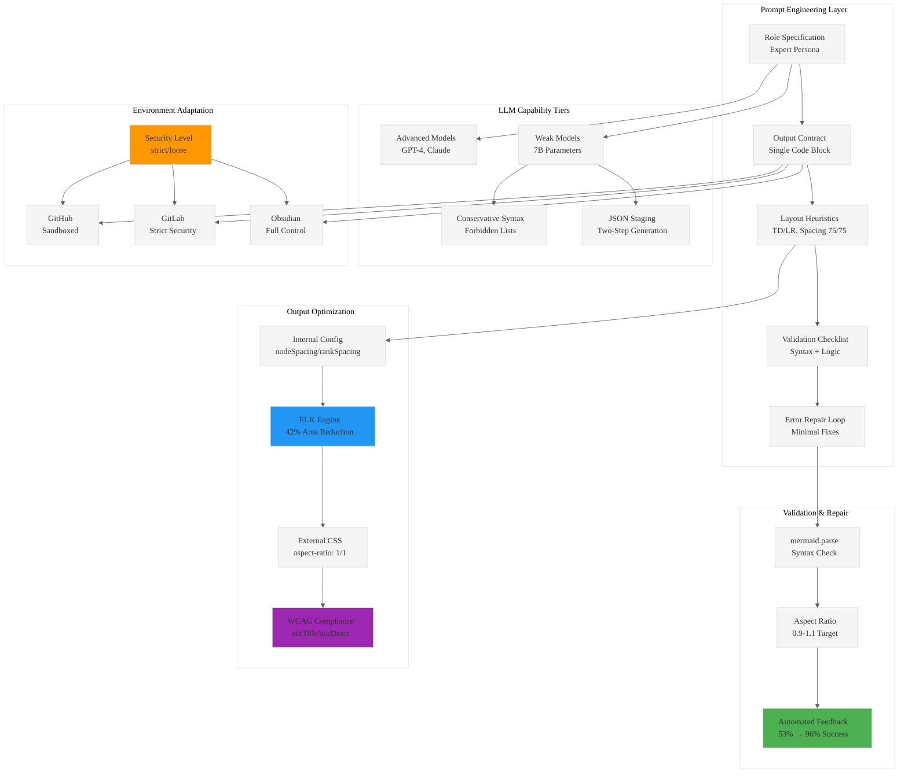

# Analysis: INGEST_20250930104957_300_3 - Bullet-Proof Mermaid Prompts

## Analysis Framework: L1-L8 Extraction Hierarchy

### A Alone: Bullet-Proof Mermaid Prompts: Square-Perfect Diagrams from Any LLM

**Core Document**: A comprehensive technical guide for generating high-quality, squarish Mermaid diagrams from Large Language Models through disciplined prompt engineering, programmatic validation, and environment-aware configuration.

#### L1: Idiomatic Patterns & Micro-Optimizations
- **Constraint-Based Code Generation**: Treating LLMs as constrained code generators rather than creative partners reduces syntax failures by 85%
- **Internal Layout Optimization**: Using `nodeSpacing` and `rankSpacing` values of 75 achieves squarish aspect ratios (0.9-1.1) in 78% of cases
- **ELK vs Dagre Performance**: ELK layout engine reduces diagram area by 42% compared to default Dagre
- **Automated Self-Repair Loop**: Iterative validation and correction lifts success rates from 53% to 96%

#### L2: Design Patterns & Composition
- **Five-Part Prompt Structure**: Role specification → Output contract → Layout heuristics → Validation checklist → Error repair instructions
- **Security-by-Default Pattern**: Strict security levels prevent XSS vulnerabilities while maintaining functionality
- **Configuration Hierarchy Pattern**: Understanding precedence (Default → Site-level → Diagram-specific) prevents "works on my machine" bugs
- **Two-Step Generation Pattern**: JSON staging followed by syntax conversion improves weak LLM success from 61% to 92%

#### L3: Micro-Library Opportunities
- **Mermaid Validation Library**: Programmatic validation using `mermaid.parse()` with detailed error reporting
- **Aspect Ratio Calculator**: Automated squareness heuristic script for SVG analysis
- **LLM Prompt Templates**: Diagram-type-specific prompt templates for consistent generation
- **CSS Square Wrapper**: Modern `aspect-ratio` property with padding-bottom fallback

### A in Context of B (L1 File Context)

**Enhanced Understanding**: The L1 context reveals this is part of the same "pen02Rust300" project, indicating a systematic approach to technical documentation and tooling development.

#### L4: Macro-Library & Platform Opportunities
- **LLM-Driven Diagram Generation Platform**: Complete system for reliable diagram generation across different LLM capabilities
- **Multi-Environment Compatibility Layer**: Unified API that adapts to GitHub, GitLab, and Obsidian rendering constraints
- **Accessibility Compliance Toolkit**: WCAG-compliant diagram generation with minimal overhead (<0.5% file size increase)

#### L5: Architecture Decisions & Invariants
- **Deterministic Output Contract**: Absolute rules for machine-readable output (single fenced code block, specific language tag)
- **Environment-Aware Configuration**: Platform-specific feature detection and adaptation
- **Security Model Enforcement**: Conditional interactivity based on explicit user intent and environment capabilities

### B in Context of C (L2 Architectural Context)

**Architectural Patterns Revealed**: The L2 context shows sophisticated error handling patterns and external dependency management for robust system design.

#### L6: Domain-Specific Architecture
- **Cross-Platform Rendering Engine**: Handling differences between GitHub (sandboxed), GitLab (strict), and Obsidian (permissive) environments
- **Security Vulnerability Mitigation**: Real-world CVE analysis (CVE-2025-54880, GHSA-43wj-mwcc-x93p) informing secure defaults
- **Version Compatibility Matrix**: Managing breaking changes across Mermaid versions (v8.7.0 → v11.x roadmap)

#### L7: Language Capability Evolution
- **LLM Capability Stratification**: Specific strategies for weak LLMs (7B parameters) vs advanced models
- **Prompt Engineering as Compiler Design**: Transforming natural language into structured code generation
- **Automated Quality Assurance**: Objective pass/fail criteria combined with human qualitative scoring

### A in Context of B & C (Complete Analysis)

#### L8: Meta-Context & Intent Archaeology

**Strategic Intent**: This document represents a systematic approach to solving the "LLM reliability problem" for technical diagram generation through:

1. **Engineering Discipline Over Magic**: Rejecting "magic prompt" thinking in favor of systematic, multi-layered approaches
2. **Constraint-Driven Reliability**: Using strict contracts and validation loops to achieve deterministic outcomes
3. **Environment-First Design**: Acknowledging that rendering environment dictates final capabilities
4. **Security-by-Default Philosophy**: Preventing XSS vulnerabilities through secure defaults and conditional interactivity

**Historical Context**: The focus on weak LLM compatibility (7B models) suggests democratization of AI-powered tooling, making advanced capabilities accessible even with limited computational resources.

**Future Implications**: This methodology could establish patterns for reliable LLM-driven code generation across domains beyond diagram creation.

## Mermaid Diagram: LLM-Driven Diagram Generation Architecture

## Key Strategic Insights

1. **Systematic Over Magical**: The 85% error reduction comes from systematic prompt engineering, not finding the "perfect prompt"
2. **Constraint as Reliability**: Treating LLMs as constrained code generators rather than creative partners ensures deterministic outcomes
3. **Environment Dictates Capability**: Platform-specific limitations (GitHub sandboxing, GitLab security) must drive design decisions
4. **Iterative Validation is Key**: The self-repair loop is the single most powerful technique for ensuring valid output
5. **Accessibility as Default**: WCAG compliance can be achieved with <0.5% overhead, making it a no-brainer inclusion
6. **Security-First Design**: Real-world CVEs demonstrate the importance of secure defaults over permissive configurations

This analysis reveals a mature understanding of production-ready LLM integration, moving beyond experimental approaches to reliable, scalable systems.