# Analysis of INGEST_20250930104957 Row 30

## A Alone: Core Content Analysis

**File Type**: JSON document containing comprehensive Tokio idiomatic patterns analysis
**Content Focus**: L3 (external library) idiomatic patterns for Tokio async runtime
**Key Domain**: Asynchronous systems programming, cooperative scheduling, and runtime management

### Primary Insights from A:

**L1 Idiomatic Patterns & Micro-Optimizations:**
- `#[tokio::main]` as the canonical runtime initialization pattern - "batteries included" approach preventing driver misconfiguration bugs
- `spawn_blocking` for CPU-intensive work - critical pattern to prevent runtime thread starvation
- Bounded channels for backpressure - prevents memory exhaustion in producer-consumer scenarios
- Buffer reuse in UDP loops - eliminates per-packet allocation overhead

**L2 Design Patterns & Composition:**
- `JoinSet` with automatic task abortion on Drop - structured concurrency preventing orphan tasks
- `select!` macro for cancellation-aware concurrency - races operations with timeouts/shutdown signals
- Stream splitting (`into_split()`) for full-duplex I/O - enables concurrent read/write operations
- `CancellationToken` for coordinated shutdown - broadcast cancellation across task hierarchies

**L3 Micro-Library Opportunities:**
- Robust line-based parsing with `LinesCodec::new_with_max_length()` - prevents DoS via unbounded buffers
- Feature flag minimalism - explicit dependency selection over `full` feature bloat

**L4 Macro-Library & Platform Opportunities:**
- `tokio-console` as runtime introspection tool - real-time task debugging and profiling
- Runtime dump capabilities for post-mortem analysis - analogous to Java thread dumps

**L5 Architecture Decisions & Invariants:**
- Cooperative scheduling model requiring voluntary yielding - fundamental constraint shaping all patterns
- Multi-thread scheduler with work-stealing as default - optimized for I/O-heavy workloads
- Separation of async worker threads from blocking thread pool - prevents runtime contamination

## A in Context of B: Immediate File Context

**File Location**: `/home/amuldotexe/Desktop/extracted/Ingestion01/pen02Rust300/trun_c928898c8ef7483e86b41b8fea65209e.json`
**File Characteristics**: 11,978 lines, 160,720 words, 1.35MB JSON document

### Enhanced Insights with B Context:

The file represents a comprehensive analysis of the Tokio repository, specifically targeting idiomatic patterns that lead to low bugs and high efficiency. The massive scale (11K+ lines) indicates this is a thorough extraction from the entire Tokio codebase, not just documentation.

**L6 Domain-Specific Architecture:**
- The analysis methodology follows a layered approach (L1-L3) that mirrors the Rust ecosystem structure
- Focus on "20% of patterns that enable 99% of code" - Pareto principle applied to language idioms
- Emphasis on compile-time error prevention as Rust's unique value proposition

**L8 Meta-Context (Intent Archaeology):**
- The document represents systematic knowledge extraction from a mature async ecosystem
- Goal is creating LLM-friendly reference documentation - bridging human expertise with AI consumption
- Recognition that idiomatic patterns emerge organically from usage, not language design

## B in Context of C: Architectural Context

**Path Depth**: 8 levels deep in extraction hierarchy
**Architectural Patterns**: Object-oriented, trait-based, asynchronous programming, error handling

### Enhanced Insights with C Context:

**L7 Language Capability & Evolution:**
- The document structure reveals systematic categorization of Tokio patterns across multiple domains:
  - Runtime and scheduler patterns
  - Task management and scheduling
  - Blocking work integration
  - Asynchronous I/O patterns
  - Stream framing and codec patterns

**Cross-Module Relationships Analysis:**
- Heavy emphasis on external dependencies and module dependencies
- Pattern of pairing high-level abstractions with low-level control mechanisms
- Consistent theme of preventing common anti-patterns through idiomatic alternatives

## A in Context of B & C: Comprehensive Analysis

### Strategic Synthesis:

**L4 Macro-Library & Platform Opportunities:**
This document represents a **Knowledge Arbitrage** opportunity - systematic extraction of battle-tested patterns from Tokio for broader ecosystem application. The comprehensive nature suggests potential for:

1. **Pattern Codification Library**: A crate that encodes these patterns as compile-time enforced abstractions
2. **Tokio Training Dataset**: High-quality examples for LLM training on async Rust patterns
3. **Anti-Pattern Detection Tools**: Static analysis tools that flag the documented anti-patterns

**L5 LLD Architecture Decisions & Invariants:**
The analysis reveals Tokio's fundamental architectural invariants:
- Cooperative scheduling as the foundational constraint
- Clear separation between async and blocking execution contexts
- Structured concurrency as the solution to task lifecycle management
- Backpressure as the mechanism for system stability

**L6 Domain-Specific Architecture & Hardware Interaction:**
- Work-stealing scheduler optimized for multi-core systems
- Thread pool sizing aligned with CPU core count
- Memory allocation patterns optimized for high-throughput scenarios

**L8 The Meta-Context (Intent Archaeology):**
This document represents a **paradigm shift** in how we approach async systems programming education and tooling. Rather than learning patterns through trial and error, it provides a comprehensive map of the solution space.

The systematic categorization (idiom vs anti-pattern, low-bug vs high-efficiency) suggests this could be the foundation for:
- Automated code review systems
- IDE plugins for pattern suggestion
- Compiler lints for anti-pattern detection
- Training curricula for async Rust programming

### Key Leverage Points:

1. **Runtime Initialization Patterns**: The emphasis on `#[tokio::main]` vs manual `Builder` configuration represents a critical decision point affecting application reliability
2. **Task Lifecycle Management**: `JoinSet` and `CancellationToken` patterns address the fundamental challenge of coordinated shutdown in distributed systems
3. **Performance Optimization**: The detailed coverage of blocking work integration and I/O patterns provides a roadmap for high-performance async applications

This analysis represents **foundational knowledge** for the next generation of Rust async programming - moving beyond ad-hoc pattern discovery to systematic pattern application.

```mermaid
%%{init: {
  "theme": "base",
  "themeVariables": {
    "primaryColor": "#F5F5F5",
    "secondaryColor": "#E0E0E0",
    "lineColor": "#616161",
    "textColor": "#212121",
    "fontSize": "16px",
    "fontFamily": "Helvetica, Arial, sans-serif"
  },
  "flowchart": {
    "nodeSpacing": 70,
    "rankSpacing": 80,
    "wrappingWidth": 160,
    "curve": "basis"
  },
  "useMaxWidth": false
}}%%

flowchart TD
    subgraph L1["L1: Tactical Implementation"]
        direction TB
        A1["#[tokio::main]<br/>Runtime Init"] --> A2["spawn_blocking<br/>CPU Work"]
        A2 --> A3["Bounded Channels<br/>Backpressure"]
        A3 --> A4["Buffer Reuse<br/>UDP Optimization"]
    end
    
    subgraph L2["L2: Design Patterns"]
        direction TB
        B1["JoinSet<br/>Structured Concurrency"] --> B2["select!<br/>Cancellation Logic"]
        B2 --> B3["Stream Splitting<br/>Full-Duplex I/O"]
        B3 --> B4["CancellationToken<br/>Coordinated Shutdown"]
    end
    
    subgraph L3["L3: Micro-Libraries"]
        direction TB
        C1["LinesCodec<br/>DoS Prevention"] --> C2["Feature Minimalism<br/>Dependency Control"]
    end
    
    subgraph L4["L4: Platform Opportunities"]
        direction TB
        D1["tokio-console<br/>Runtime Introspection"] --> D2["Pattern Codification<br/>Library"]
        D2 --> D3["Anti-Pattern Detection<br/>Tools"]
    end
    
    subgraph L5["L5: Architecture Invariants"]
        direction TB
        E1["Cooperative Scheduling<br/>Fundamental Constraint"] --> E2["Thread Pool Separation<br/>Async vs Blocking"]
        E2 --> E3["Work-Stealing Scheduler<br/>Multi-Core Optimization"]
    end
    
    subgraph L8["L8: Meta-Context"]
        direction TB
        F1["Knowledge Arbitrage<br/>Pattern Extraction"] --> F2["LLM Training Dataset<br/>Async Rust Patterns"]
        F2 --> F3["Paradigm Shift<br/>Systematic Learning"]
    end
    
    L1 --> L2
    L2 --> L3
    L3 --> L4
    L4 --> L5
    L5 --> L8
    
    classDef tactical fill:#E3F2FD
    classDef design fill:#F3E5F5
    classDef micro fill:#E8F5E8
    classDef platform fill:#FFF3E0
    classDef arch fill:#FFEBEE
    classDef meta fill:#F1F8E9
    
    class L1,A1,A2,A3,A4 tactical
    class L2,B1,B2,B3,B4 design
    class L3,C1,C2 micro
    class L4,D1,D2,D3 platform
    class L5,E1,E2,E3 arch
    class L8,F1,F2,F3 meta
```

