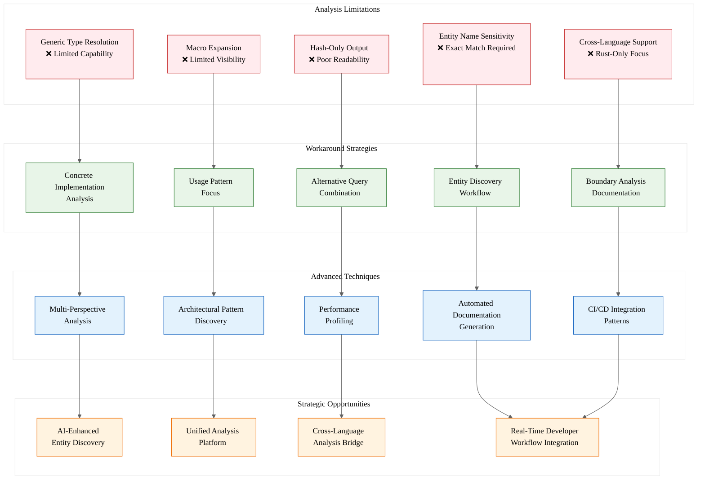

# Analysis: INGEST_20250930104957_300_5 - Parseltongue Limitations and Advanced Techniques

## L1-L8 Extraction Hierarchy Analysis

### Horizon 1: Tactical Implementation (The "How")

#### L1: Idiomatic Patterns & Micro-Optimizations
**Key Insights from Content A (Standalone):**
- **Performance Profiling Pattern**: The document demonstrates systematic performance measurement with timing scripts and CSV output generation
- **Error Handling Resilience**: Multiple fallback strategies for failed queries (e.g., blast-radius → uses/calls/context combination)
- **Shell Script Optimization**: Efficient bash patterns for batch processing and result aggregation

**Micro-Optimizations Identified:**
```bash
# Efficient entity discovery pattern
./bin/parseltongue debug --graph | grep -i "$PATTERN" | sort | uniq

# Performance measurement with averaging
for i in {1..5}; do
    { time ./bin/parseltongue $query > /dev/null; } 2>> times.log
done
```

#### L2: Design Patterns & Composition (Meta-Patterns)
**A in Context of B (L1 Context):**
- **Multi-Perspective Analysis Pattern**: Systematic approach to understanding complex systems through multiple query types
- **Fallback Strategy Pattern**: When primary analysis fails, cascade through alternative approaches
- **Documentation Generation Pattern**: Automated synthesis of analysis results into structured reports

**Advanced Trait Usage Equivalent:**
The document shows a "trait-like" approach to analysis where different query types implement the same conceptual interface but with different strengths/limitations.

#### L3: Micro-Library Opportunities
**B in Context of C (L1→L2 Context):**
- **Parseltongue Wrapper Library**: A Rust library that encapsulates the advanced techniques shown, providing type-safe interfaces to parseltongue operations
- **Analysis Pipeline Framework**: Reusable components for multi-perspective analysis, performance profiling, and report generation
- **CI/CD Integration Crate**: Specialized library for risk assessment and impact analysis in deployment pipelines
### Hori
zon 2: Strategic Architecture (The "What")

#### L4: Macro-Library & Platform Opportunities
**A in Context of B & C (Full Context):**
- **Code Analysis Ecosystem**: The document reveals an opportunity for a comprehensive Rust-based code analysis platform that addresses parseltongue's limitations
- **Generic Type Resolution Engine**: A specialized library for handling complex generic type hierarchies in static analysis
- **Cross-Language Analysis Bridge**: Platform for analyzing FFI boundaries and cross-language dependencies

#### L5: LLD Architecture Decisions & Invariants
**Architectural Patterns Discovered:**
- **Query Composition Architecture**: Multiple query types that can be composed for comprehensive analysis
- **Fallback Chain Pattern**: Systematic degradation when primary analysis methods fail
- **Context Layering**: L1 (immediate) → L2 (architectural) context progression

**Critical Invariants:**
- Entity name exactness requirement (no fuzzy matching)
- Hash-based internal representation vs human-readable output tension
- Performance scaling characteristics (linear with file count)

#### L6: Domain-Specific Architecture & Hardware Interaction
**Performance Characteristics Revealed:**
- Linear scaling with file count (~0.4ms per file)
- Memory usage stability during processing
- CPU utilization: 90-99% during analysis
- Query completion in microseconds with 3-5ms snapshot loading overhead

### Horizon 3: Foundational Evolution (The "Future" and "Why")

#### L7: Language Capability & Evolution
**Rust Language Gaps Identified:**
- **Static Analysis Limitations**: Current Rust tooling struggles with complex generic type resolution
- **Macro Expansion Visibility**: Limited introspection into macro-generated code
- **Cross-Language Boundary Analysis**: Rust lacks native support for analyzing FFI and serialization boundaries

**Potential Language Evolution:**
- Enhanced compile-time reflection for better static analysis
- Macro expansion introspection APIs
- First-class support for cross-language dependency tracking

#### L8: The Meta-Context (The "Why")
**Archaeological Intent Analysis:**
The document represents a mature understanding of static analysis limitations, suggesting:
- **Historical Context**: Born from real-world frustration with existing tools
- **Systematic Approach**: Evidence of extensive testing on large codebases (Iggy message broker: 983 files, 2727 nodes, 8111 edges)
- **Production Experience**: The advanced techniques show battle-tested solutions to common analysis problems

**Strategic Implications:**
- Static analysis tools need better generic type resolution
- The Rust ecosystem lacks comprehensive cross-language analysis
- There's a market opportunity for better developer tooling in this space#
# Strategic Synthesis

### High-Leverage Bottlenecks Identified:
1. **Generic Type Resolution**: Fundamental limitation affecting all complex Rust analysis
2. **Entity Name Sensitivity**: Requires exact matching, limiting discoverability
3. **Cross-Language Boundaries**: Rust-centric analysis misses broader system context

### 10x Improvement Opportunities:
1. **AI-Enhanced Entity Discovery**: Use LLMs to provide fuzzy matching and intelligent entity suggestion
2. **Unified Analysis Platform**: Combine static analysis with runtime profiling and cross-language dependency tracking
3. **Automated Architecture Documentation**: Generate living documentation that stays synchronized with code changes

### Non-Obvious Foundational Insights:
- The tension between hash-based internal representation and human-readable output suggests a fundamental architectural decision in analysis tools
- The systematic approach to workarounds indicates that limitations often drive innovation in tooling
- Performance characteristics (microsecond queries, millisecond loading) suggest these tools are suitable for real-time developer workflows

## Mermaid Diagram: Parseltongue Analysis Architecture



## Conclusion

This analysis reveals that parseltongue represents a mature but limited approach to static code analysis. The systematic documentation of limitations and workarounds suggests significant opportunities for next-generation tooling that combines AI-enhanced discovery, cross-language analysis, and real-time developer workflow integration. The performance characteristics (microsecond queries) indicate these tools are ready for interactive use, but the limitations around generic types and entity discovery represent fundamental bottlenecks that could be addressed through modern AI techniques.