# Analysis: INGEST_20250930104957_300_5 - Parseltongue Limitations and Advanced Techniques

## L1-L8 Strategic Analysis

### Horizon 1: Tactical Implementation (The "How")

#### L1: Idiomatic Patterns & Micro-Optimizations
- **Shell Script Performance Patterns**: The document demonstrates sophisticated bash scripting with performance-conscious patterns:
  - Parallel processing with background jobs (`for i in {1..5}; do { time ./bin/parseltongue $query > /dev/null; } 2>> "$OUTPUT_DIR/query_${query_name}.times" done`)
  - Efficient text processing using `grep`, `awk`, `sed` pipelines
  - Memory-conscious file handling with streaming operations
- **Query Optimization Strategies**: Multi-perspective analysis combining different query types to avoid expensive operations
- **Caching Patterns**: Explicit recommendations for caching frequently used contexts and targeted dumps

#### L2: Design Patterns & Composition (Meta-Patterns)
- **Workaround Pattern Architecture**: Systematic approach to handling tool limitations through alternative query combinations
- **Multi-Perspective Analysis Pattern**: Combining usage, call, implementation, context, and dependency analysis for comprehensive understanding
- **Fuzzy Search Pattern**: Implementing approximate matching when exact entity names fail
- **Synthesis Report Pattern**: Automated generation of insights from multiple data sources

#### L3: Micro-Library Opportunities
- **Generic Pattern Discovery Engine**: The `discover_generic_patterns.sh` script could be extracted into a reusable analysis tool
- **Architectural Pattern Discovery Framework**: The pattern discovery system could become a standalone library for codebase analysis
- **Performance Profiling Toolkit**: The performance profiling scripts represent a micro-library opportunity for tool benchmarking

### Horizon 2: Strategic Architecture (The "What")

#### L4: Macro-Library & Platform Opportunities
- **Code Analysis Platform**: The combination of parseltongue with these advanced techniques suggests an opportunity for a comprehensive code analysis platform
- **CI/CD Integration Framework**: The risk assessment and impact analysis patterns could form the basis of a CI/CD integration platform
- **Automated Documentation Generation System**: The documentation generation approach represents a significant platform opportunity

#### L5: LLD Architecture Decisions & Invariants
- **Tool Limitation Compensation Architecture**: The document reveals a meta-architecture for working around tool limitations through systematic workarounds
- **Multi-Query Synthesis Architecture**: The approach of combining multiple imperfect queries to achieve comprehensive analysis
- **Risk-Based Analysis Architecture**: The CI/CD integration demonstrates risk stratification based on impact metrics

#### L6: Domain-Specific Architecture & Hardware Interaction
- **Performance Profiling Architecture**: Linear scaling analysis (~0.4ms per file) with memory stability constraints
- **Large Codebase Optimization**: Module-specific dumps and caching strategies for handling enterprise-scale codebases
- **Interactive Analysis Architecture**: Microsecond query performance enabling real-time workflows

### Horizon 3: Foundational Evolution (The "Future" and "Why")

#### L7: Language Capability & Evolution
- **Generic Type Resolution Limitations**: Reveals fundamental challenges in static analysis of Rust's complex type system
- **Macro Expansion Visibility**: Highlights the ongoing challenge of analyzing macro-generated code in Rust tooling
- **Cross-Language Boundary Analysis**: Identifies the need for better FFI and serialization boundary analysis

#### L8: The Meta-Context (The "Why")
- **Tool Evolution Archaeology**: This document represents the evolution of code analysis from simple queries to sophisticated multi-perspective synthesis
- **Limitation-Driven Innovation**: The systematic approach to workarounds reveals how tool limitations drive architectural innovation
- **Knowledge Arbitrage in Practice**: The document demonstrates knowledge arbitrage by combining multiple imperfect tools to achieve superior analysis

## Key Strategic Insights

### 1. Limitation-Driven Architecture Excellence
The most profound insight is how systematic analysis of tool limitations leads to superior architectural patterns. The workarounds are often more valuable than the original tool capabilities.

### 2. Multi-Perspective Synthesis as Core Competency
The ability to combine multiple imperfect data sources into comprehensive insights represents a fundamental skill for advanced systems analysis.

### 3. Performance-Conscious Tooling Design
The emphasis on microsecond query performance and linear scaling reveals the importance of performance-first design in developer tooling.

### 4. Risk-Stratified Analysis
The CI/CD integration patterns demonstrate sophisticated risk assessment based on quantitative impact metrics, moving beyond simple binary pass/fail.

## Contextual Analysis

### A alone (Content): 
The core document reveals a mature understanding of parseltongue's limitations and sophisticated workaround strategies. It represents advanced tooling expertise.

### A in context of B (L1): 
The L1 context shows this is part of a larger Rust analysis project (`pen02Rust300`), indicating systematic knowledge extraction from Rust codebases.

### B in context of C (L2): 
The L2 context reveals architectural patterns including trait-based design and error handling, suggesting this analysis is part of a broader architectural study.

### A in context of B & C: 
Combined, these contexts reveal a systematic approach to extracting architectural wisdom from Rust codebases, with this document representing advanced tooling methodology within that larger knowledge arbitrage strategy.

## Strategic Architecture Visualization

```mermaid
%%{init: {
  "theme": "base",
  "themeVariables": {
    "primaryColor": "#F5F5F5",
    "secondaryColor": "#E0E0E0",
    "lineColor": "#616161",
    "textColor": "#212121",
    "fontSize": "16px",
    "fontFamily": "Helvetica, Arial, sans-serif"
  },
  "flowchart": {
    "nodeSpacing": 70,
    "rankSpacing": 80,
    "wrappingWidth": 160,
    "curve": "basis"
  },
  "useMaxWidth": false
}}%%

flowchart TD
    subgraph H1 ["Horizon 1: Tactical Implementation"]
        direction TB
        L1[("L1: Idiomatic Patterns<br/>Shell Performance<br/>Query Optimization")]
        L2[("L2: Design Patterns<br/>Workaround Architecture<br/>Multi-Perspective Analysis")]
        L3[("L3: Micro-Libraries<br/>Pattern Discovery Engine<br/>Profiling Toolkit")]
        L1 --> L2 --> L3
    end
    
    subgraph H2 ["Horizon 2: Strategic Architecture"]
        direction TB
        L4[("L4: Platform Opportunities<br/>Code Analysis Platform<br/>CI/CD Integration")]
        L5[("L5: LLD Architecture<br/>Limitation Compensation<br/>Risk-Based Analysis")]
        L6[("L6: Domain-Specific<br/>Performance Profiling<br/>Large Codebase Optimization")]
        L4 --> L5 --> L6
    end
    
    subgraph H3 ["Horizon 3: Foundational Evolution"]
        direction TB
        L7[("L7: Language Evolution<br/>Generic Type Resolution<br/>Macro Expansion Limits")]
        L8[("L8: Meta-Context<br/>Tool Evolution Archaeology<br/>Knowledge Arbitrage")]
        L7 --> L8
    end
    
    subgraph INSIGHTS ["Strategic Insights"]
        direction TB
        I1{"Limitation-Driven<br/>Architecture Excellence"}
        I2{"Multi-Perspective<br/>Synthesis Competency"}
        I3{"Performance-Conscious<br/>Tooling Design"}
        I4{"Risk-Stratified<br/>Analysis Framework"}
        I1 --> I2 --> I3 --> I4
    end
    
    subgraph CONTEXT ["Contextual Synthesis"]
        direction TB
        CA["A: Advanced Tooling<br/>Methodology"]
        CB["B: Rust Analysis<br/>Project Context"]
        CC["C: Architectural<br/>Pattern Study"]
        COMBINED["Combined: Knowledge<br/>Arbitrage Strategy"]
        CA --> CB --> CC --> COMBINED
    end
    
    H1 --> H2
    H2 --> H3
    H3 --> INSIGHTS
    INSIGHTS --> CONTEXT
    
    classDef horizonStyle fill:#E3F2FD,stroke:#1976D2,stroke-width:2px
    classDef insightStyle fill:#FFF3E0,stroke:#F57C00,stroke-width:2px
    classDef contextStyle fill:#E8F5E8,stroke:#388E3C,stroke-width:2px
    
    class H1,H2,H3 horizonStyle
    class INSIGHTS insightStyle
    class CONTEXT contextStyle
```

