# Analysis: Fearless & Fast - 40+ Proven Rayon Idioms

## L1-L8 Strategic Analysis

### Horizon 1: Tactical Implementation (The "How")

#### L1: Idiomatic Patterns & Micro-Optimizations
**Key Insight**: The `.par_iter()` swap represents the ultimate mechanical sympathy pattern - minimal code change for maximum CPU utilization.

**Critical Patterns Identified**:
- **Work-Stealing Scheduler Optimization**: Rayon's dynamic load balancing automatically distributes work across cores without manual thread management
- **Lock-Free Aggregation**: The `fold().reduce()` pattern eliminates `Arc<Mutex<T>>` contention - a 10x performance multiplier for parallel aggregation
- **Sequential Threshold Pattern**: Using `SEQUENTIAL_THRESHOLD` constants to prevent over-parallelization overhead on small datasets
- **Cache-Aware Data Layout**: Z-order curve traversal in matrix multiplication demonstrates data layout as important as parallelism

**Performance Contracts**:
- Parallel iterators only beneficial for CPU-bound tasks on "sufficiently large" collections
- Floating-point `.sum()` creates non-deterministic results due to associativity violations
- `rayon::scope` enables stack borrowing without `'static` lifetime requirements

#### L2: Design Patterns & Composition (Meta-Patterns)
**Architectural Philosophy**: "Fearless Concurrency" through compile-time data race prevention

**Meta-Patterns**:
- **Iterator Trait Unification**: `par_iter()`, `par_iter_mut()`, `into_par_iter()` mirror standard library patterns
- **Fallible Computation Chains**: `try_for_each`, `try_fold`, `try_reduce` for early-exit error handling
- **Structured Parallelism**: `rayon::scope` provides fork-join guarantees for lifetime safety
- **Deterministic vs Non-Deterministic APIs**: `find_first` vs `find_any` - explicit control over ordering guarantees

#### L3: Micro-Library Opportunities
**High-Utility Components** (~2000 LOC):
- **Parallel Histogram Builder**: Lock-free frequency counting using `fold().reduce()` pattern
- **Deterministic Parallel Testing Framework**: Custom thread pools with reproducible scheduling
- **WASM Parallel Bridge**: `wasm-bindgen-rayon` adapter for browser Web Workers
- **Cache-Optimized Matrix Operations**: Z-order curve implementations for spatial locality

### Horizon 2: Strategic Architecture (The "What")

#### L4: Macro-Library & Platform Opportunities
**Ecosystem Dominance Opportunities**:
- **Parallel ML Training Pipeline**: Rayon-based data preprocessing for LLM training datasets
- **High-Performance Analytics Engine**: Lock-free aggregation patterns for real-time data processing
- **Parallel Compiler Infrastructure**: Work-stealing for syntax tree processing and code generation

#### L5: LLD Architecture Decisions & Invariants
**Core Architectural Invariants**:
- **Work-Stealing Scheduler**: Dynamic load balancing without manual thread coordination
- **Compile-Time Safety**: Rust's borrow checker prevents data races in parallel contexts
- **Fork-Join Model**: Structured parallelism with guaranteed task completion
- **Associative Operation Requirements**: Mathematical constraints for correct parallel reductions

**Concurrency Model**:
- Thread-local accumulation followed by lock-free merging
- Potential parallelism through lazy task scheduling
- Stack-safe borrowing through lifetime guarantees

#### L6: Domain-Specific Architecture & Hardware Interaction
**Hardware Optimization Strategies**:
- **CPU Cache Awareness**: Z-order curve traversal for spatial locality
- **NUMA Considerations**: Work-stealing across CPU cores and memory hierarchies
- **SIMD Integration**: Parallel iterators can leverage vectorization
- **Memory Bandwidth Optimization**: Chunked processing to maximize cache utilization

### Horizon 3: Foundational Evolution (The "Future" and "Why")

#### L7: Language Capability & Evolution
**Rust Language Limitations Exposed**:
- **Lifetime Complexity**: `rayon::scope` needed to work around `'static` requirements
- **Associativity Constraints**: Type system cannot enforce mathematical properties for parallel reductions
- **Error Propagation**: Separate `try_*` methods needed for fallible parallel operations
- **Generic Constraints**: Complex trait bounds for parallel iterator implementations

**Future Language Features Needed**:
- Mathematical property annotations (associativity, commutativity)
- Better lifetime inference for parallel contexts
- Built-in work-stealing primitives

#### L8: The Meta-Context (The "Why")
**Archaeological Intent Analysis**:

**Historical Context**: Rayon emerged from the need to make parallel programming accessible to systems programmers without sacrificing safety. The design philosophy reflects lessons learned from:
- **C++ OpenMP**: Directive-based parallelism with hidden complexity
- **Java Fork/Join**: Explicit task management with high cognitive overhead
- **Erlang Actor Model**: Message-passing concurrency with different performance characteristics

**Design Constraints That Shaped Rayon**:
1. **Rust's Ownership Model**: Leveraged for compile-time data race prevention
2. **Zero-Cost Abstractions**: Parallel iterators must not impose runtime overhead
3. **Incremental Adoption**: `.iter()` to `.par_iter()` swap for easy migration
4. **Deterministic Testing**: Separate APIs for deterministic vs performance-optimized operations

**Strategic Implications**:
- Rayon represents the convergence of functional programming (map-reduce) with systems programming (zero-cost abstractions)
- The work-stealing scheduler embodies the principle of "potential parallelism" - tasks are created optimistically but executed only when resources are available
- The emphasis on associative operations reveals the mathematical foundations required for correct parallel programming

## Synthesis: The Rayon Paradigm

Rayon represents a **Paradigm-Market Fit** achievement: it successfully bridges the gap between high-level parallel programming abstractions and low-level performance requirements. The key insight is that **mathematical constraints** (associativity, commutativity) become **architectural constraints** in parallel systems.

The document reveals that effective parallel programming requires:
1. **Mechanical Sympathy**: Understanding work-stealing schedulers and cache hierarchies
2. **Mathematical Rigor**: Respecting associative and commutative properties
3. **Safety Guarantees**: Leveraging type systems for compile-time correctness
4. **Performance Contracts**: Explicit thresholds and deterministic vs non-deterministic APIs

This analysis suggests that the next evolution in parallel programming will involve **mathematically-aware type systems** that can enforce correctness properties at compile time, potentially through dependent types or effect systems.

```mermaid
%%{init: {
  "theme": "base",
  "themeVariables": {
    "primaryColor": "#F5F5F5",
    "secondaryColor": "#E0E0E0",
    "lineColor": "#616161",
    "textColor": "#212121",
    "fontSize": "16px",
    "fontFamily": "Helvetica, Arial, sans-serif"
  },
  "flowchart": {
    "nodeSpacing": 70,
    "rankSpacing": 80,
    "wrappingWidth": 160,
    "curve": "basis"
  },
  "useMaxWidth": false
}}%%

flowchart TD
    subgraph H1 ["🎯 Horizon 1: Tactical Implementation"]
        direction TB
        L1["🔧 L1: Micro-Optimizations<br/>• .par_iter() swap<br/>• Work-stealing scheduler<br/>• Lock-free aggregation"]
        L2["🏗️ L2: Design Patterns<br/>• Iterator trait unification<br/>• Structured parallelism<br/>• Fallible computation chains"]
        L3["📦 L3: Micro-Libraries<br/>• Parallel histogram builder<br/>• Deterministic testing framework<br/>• WASM parallel bridge"]
        L1 --> L2 --> L3
    end

    subgraph H2 ["🎯 Horizon 2: Strategic Architecture"]
        direction TB
        L4["🏢 L4: Platform Opportunities<br/>• ML training pipelines<br/>• Analytics engines<br/>• Compiler infrastructure"]
        L5["⚙️ L5: Core Invariants<br/>• Fork-join model<br/>• Compile-time safety<br/>• Associative operations"]
        L6["🖥️ L6: Hardware Interaction<br/>• CPU cache awareness<br/>• NUMA optimization<br/>• SIMD integration"]
        L4 --> L5 --> L6
    end

    subgraph H3 ["🎯 Horizon 3: Foundational Evolution"]
        direction TB
        L7["🔮 L7: Language Evolution<br/>• Mathematical properties<br/>• Lifetime inference<br/>• Built-in work-stealing"]
        L8["🏛️ L8: Meta-Context<br/>• Historical constraints<br/>• Design philosophy<br/>• Paradigm-market fit"]
        L7 --> L8
    end

    subgraph CORE ["💎 Core Rayon Paradigm"]
        direction TB
        MATH["📐 Mathematical Constraints<br/>Associativity & Commutativity"]
        SAFETY["🛡️ Compile-Time Safety<br/>Borrow Checker Integration"]
        PERF["⚡ Performance Contracts<br/>Sequential Thresholds"]
        
        MATH --> SAFETY --> PERF
    end

    H1 --> H2 --> H3
    H2 --> CORE
    
    classDef horizonStyle fill:#E3F2FD,stroke:#1976D2,stroke-width:2px
    classDef coreStyle fill:#FFF3E0,stroke:#F57C00,stroke-width:3px
    
    class H1,H2,H3 horizonStyle
    class CORE coreStyle
```

