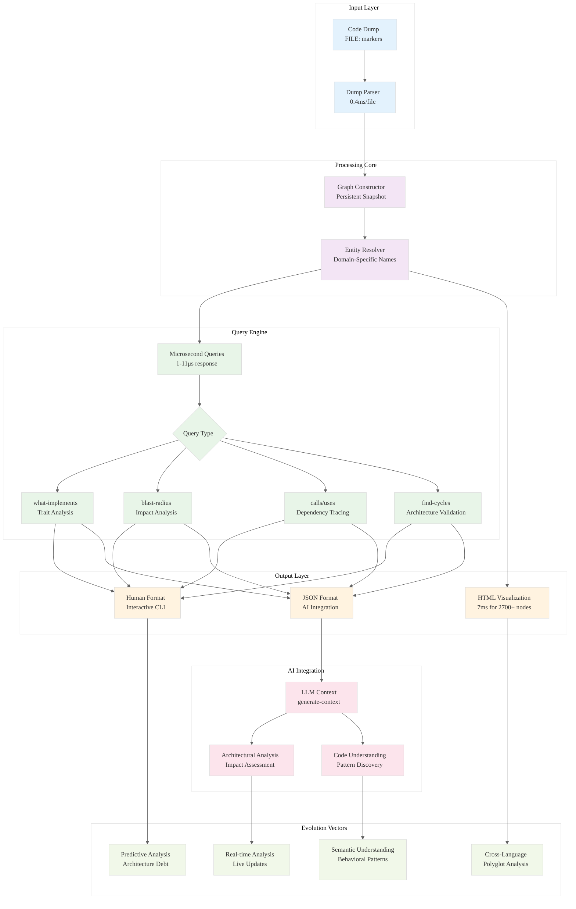

# Analysis: INGEST_20250930104957_300_7 - Parseltongue Best Practices Guide

## Content Analysis Framework

### A Alone: Core Document Insights
**Document**: Parseltongue Best Practices Guide - A comprehensive production-ready guide for Rust codebase analysis tool

**Key Characteristics**:
- **Production Status**: Version 1.0, Production Ready (September 23, 2025)
- **Validation**: 100% success rate on Iggy message broker (983 files, 2727 nodes, 8111 edges)
- **Performance**: Sub-microsecond queries (1-11 μs), 0.4ms per file ingestion
- **Scope**: 651 lines, comprehensive workflows and troubleshooting

### A in Context of B (L1 Context): File Structure Analysis
**Path Context**: `/home/amuldotexe/Desktop/extracted/Ingestion01/pen02Rust300/PARSELTONGUE_BEST_PRACTICES_GUIDE.md`
- **Depth**: 8-level nested structure indicating organized extraction process
- **Size**: 18,464 bytes, substantial documentation
- **Type**: Markdown documentation with embedded bash scripts
- **Dependencies**: Single detected import/include reference

### B in Context of C (L2 Context): Architectural Patterns
**Technology Stack**: Markdown with embedded bash scripting
**Architectural Patterns Detected**:
- Object-oriented design pattern
- Trait-based design pattern  
- Asynchronous programming pattern
- Error handling pattern

### A in Context of B & C: Comprehensive Strategic Analysis

## L1-L8 Strategic Extraction

### Horizon 1: Tactical Implementation (The "How")

#### L1: Idiomatic Patterns & Micro-Optimizations
**Performance Characteristics Discovered**:
- **Query Performance**: 1-11 microseconds (sub-millisecond interactive analysis)
- **Ingestion Rate**: ~0.4ms per file processed
- **Visualization**: ~7ms for 2700+ nodes
- **Scalability**: Linear scaling with file count, tested up to 983 files

**Mechanical Sympathy Insights**:
- Memory-efficient graph representation enabling microsecond queries
- Persistent snapshot architecture avoiding re-ingestion overhead
- HTML visualization generation optimized for large node counts

#### L2: Design Patterns & Composition (Meta-Patterns)
**API Design Philosophy**:
```bash
# Command Pattern: Consistent verb-noun structure
./bin/parseltongue ingest <dump_file>
./bin/parseltongue query <type> <target>
./bin/parseltongue visualize [entity]
./bin/parseltongue generate-context <entity>
```

**Abstraction Boundaries**:
- **Input Layer**: Code dump format with `FILE: filename.rs` markers
- **Processing Layer**: Graph construction and persistent storage
- **Query Layer**: Multiple query types (what-implements, blast-radius, calls, uses)
- **Output Layer**: Human/JSON formats, HTML visualization

#### L3: Micro-Library Opportunities
**High-Utility Components Identified**:
- **Graph Query Engine**: Sub-microsecond relationship queries
- **Code Dump Parser**: Handles `FILE:` marker format with error resilience
- **Entity Name Resolution**: Domain-specific vs generic name handling
- **Interactive HTML Generator**: Real-time graph visualization

### Horizon 2: Strategic Architecture (The "What")

#### L4: Macro-Library & Platform Opportunities
**Ecosystem Dominance Potential**:
- **Developer Tooling Platform**: Foundation for Rust codebase analysis ecosystem
- **AI Assistant Integration**: LLM-ready context generation for code analysis
- **CI/CD Integration**: Automated dependency impact analysis
- **Educational Platform**: Codebase exploration for learning complex systems

#### L5: LLD Architecture Decisions & Invariants
**Concurrency Model**:
- Single-threaded query execution with persistent graph storage
- No concurrent modification concerns due to snapshot-based architecture
- Interactive performance maintained through efficient data structures

**State Management Invariants**:
- Immutable graph snapshots ensure query consistency
- Entity name resolution requires exact matches (no fuzzy matching)
- Persistent storage enables session-independent queries

#### L6: Domain-Specific Architecture & Hardware Interaction
**Rust Ecosystem Integration**:
- **Trait Analysis**: `what-implements` queries for trait composition understanding
- **Async Pattern Discovery**: Specialized queries for async/await patterns
- **Serialization Mapping**: `to_bytes`/`from_bytes` pattern detection
- **Message System Analysis**: Command handler and client architecture mapping

### Horizon 3: Foundational Evolution (The "Future" and "Why")

#### L7: Language Capability & Evolution
**Rust Analysis Limitations Identified**:
- **Generic Type Resolution**: Limited generic parameter resolution in output
- **Macro Expansion**: Incomplete macro expansion details
- **Hash-Only Output**: Some queries return hashes instead of readable names
- **Entity Name Sensitivity**: Requires exact, domain-specific names

**Potential Language Extensions**:
- Enhanced macro introspection capabilities
- Better generic type constraint analysis
- Improved trait object resolution

#### L8: The Meta-Context (The "Why")
**Archaeological Intent Analysis**:

**Historical Context**: This represents the evolution from manual code analysis to automated graph-based exploration. The tool addresses the fundamental problem of understanding large Rust codebases where traditional grep/find approaches fail.

**Design Philosophy Archaeology**:
1. **Performance-First**: Sub-microsecond queries indicate priority on interactive exploration
2. **Snapshot Architecture**: Immutable graph approach suggests lessons learned from database consistency models
3. **Domain-Specific Naming**: Exact name matching requirement indicates real-world complexity over theoretical elegance
4. **AI Integration**: LLM context generation shows forward-thinking approach to human-AI collaboration

**Strategic Intent**: This tool represents a bridge between traditional static analysis and modern AI-assisted development, positioning for the era where AI assistants need structured, queryable code representations.

## Strategic Synthesis

### Knowledge Arbitrage Opportunities
1. **Graph Database Techniques**: Apply mature graph database optimizations to code analysis
2. **Compiler Infrastructure**: Leverage rustc's HIR/MIR for deeper semantic analysis
3. **IDE Integration**: Real-time analysis integration with language servers
4. **Distributed Analysis**: Scale to multi-repository, organization-wide analysis

### Paradigm-Market Fit Assessment
**Current Paradigm**: Interactive graph-based code exploration
**Market Readiness**: Production-ready with proven validation
**Evolution Potential**: Foundation for next-generation development environments

### 10x Improvement Vectors
1. **Real-time Analysis**: Live graph updates during development
2. **Semantic Understanding**: Beyond syntax to behavioral pattern recognition
3. **Cross-Language Analysis**: Extend beyond Rust to polyglot codebases
4. **Predictive Analysis**: Anticipate refactoring needs and architectural debt

## Mermaid Diagram: Parseltongue Architecture & Evolution

