# Analysis of INGEST_20250930104957_300_8

## Content Analysis Framework

**File A (Content.txt)**: Comprehensive analysis of Rust ecosystem opportunities for micro-libraries (<300 LOC)
**File B (Content_L1.txt)**: Immediate file context and import/include analysis  
**File C (Content_L2.txt)**: Architectural context and cross-module relationships

## L1-L8 Strategic Analysis

### Horizon 1: Tactical Implementation (The "How")

#### L1: Idiomatic Patterns & Micro-Optimizations

**A alone insights:**
- **Bit-twiddling primitives gap**: The unmaintained `bitintr` crate creates a vacuum for PDEP/PEXT operations
- **Performance-first design**: Focus on `no_std` and WASM compatibility drives architectural decisions
- **Exhaustive testing feasibility**: For f32 operations, 2^32 bit patterns can be tested completely

**A in context of B:**
- **Import pattern analysis**: Heavy reliance on external trait definitions and API contracts
- **Modular design approach**: Each micro-library opportunity is self-contained with minimal dependencies
- **Testing infrastructure**: Property-based testing with `proptest` and hardware cross-verification

#### L2: Design Patterns & Composition (Meta-Patterns)

**B in context of C:**
- **Trait-based architecture**: BitTwiddle trait pattern for primitive integer types
- **RAII resource management**: Drop implementations for cleanup in concurrent contexts
- **Error boundary design**: Option<T> returns for fallible operations like matrix inversion

**A in context B & C:**
- **Layered dependency strategy**: L1 (core) → L2 (std) → L3 (external) boundaries respected
- **API surface minimization**: Deliberate constraint to essential operations only
- **Cross-platform portability**: Pure Rust fallbacks ensure universal compatibility

#### L3: Micro-Library Opportunities

**High-impact opportunities identified:**
1. **Modern bit-twiddling microcrate** (PMF: 85/100) - PDEP/PEXT, Morton coding
2. **Minimal RNG primitives** (PMF: 8/10) - PCG32/Xoshiro128++ for embedded/WASM
3. **Ziggurat sampler** (PMF: 0.8/1.0) - Normal/exponential distribution sampling
4. **Micro float formatting** (PMF: High) - f32-only shortest roundtrip

### Horizon 2: Strategic Architecture (The "What")

#### L4: Macro-Library & Platform Opportunities

**Ecosystem gap analysis:**
- **Portable SIMD helpers**: Horizontal reductions and swizzle operations missing
- **CPU feature detection**: Minimal cross-platform alternative to heavy crates
- **Fixed-point math**: Deterministic arithmetic for embedded/DSP contexts

#### L5: LLD Architecture Decisions & Invariants

**Concurrency model insights:**
- **SPSC ring buffer design**: Atomics-only, no-alloc approach with Loom verification
- **Lock-free data structures**: Single-responsibility locking to avoid coordination complexity
- **Backoff strategies**: Efficient busy-waiting patterns for concurrent programming

#### L6: Domain-Specific Architecture & Hardware Interaction

**Hardware-aware optimizations:**
- **SIMD primitive gaps**: Portable-simd project limitations in horizontal operations
- **Branchless operations**: Constant-time primitives for cryptographic contexts
- **Memory layout validation**: Compile-time size/alignment verification

### Horizon 3: Foundational Evolution (The "Future" and "Why")

#### L7: Language Capability & Evolution

**Rust ecosystem evolution patterns:**
- **Const evaluation expansion**: Matrix operations as `const fn` for compile-time computation
- **No-std ecosystem growth**: Embedded and WASM driving minimal dependency requirements
- **Performance contract testing**: Automated verification of timing/memory constraints

#### L8: The Meta-Context (The "Why")

**Archaeological insights:**
- **Knowledge arbitrage opportunity**: Porting battle-tested C/C++ single-file utilities
- **Ecosystem maturation gaps**: High-quality algorithms exist but lack modern Rust implementations
- **Market timing**: WASM and embedded growth creating demand for minimal, portable libraries

## Strategic Synthesis

### Core Pattern: Minimal Viable Primitives

The analysis reveals a consistent pattern: **high-value, minimal-dependency primitives** that fill specific ecosystem gaps. Success factors:

1. **Size constraint as feature**: <300 LOC forces focus on essential functionality
2. **Universal compatibility**: `no_std` + WASM support maximizes addressable market
3. **Performance contracts**: Measurable guarantees backed by automated tests
4. **Battle-tested algorithms**: Porting proven implementations rather than inventing new ones

### Architectural Philosophy

**MVP-First Rigor Pattern**: Proven architectures over theoretical abstractions, with:
- Simulation-driven design before implementation
- Performance contracts with automated verification
- Incremental complexity from proven patterns

```mermaid
%%{init: {
  "theme": "base",
  "themeVariables": {
    "primaryColor": "#F5F5F5",
    "secondaryColor": "#E0E0E0",
    "lineColor": "#616161",
    "textColor": "#212121",
    "fontSize": "16px",
    "fontFamily": "Helvetica, Arial, sans-serif"
  },
  "flowchart": {
    "nodeSpacing": 70,
    "rankSpacing": 80,
    "wrappingWidth": 160,
    "curve": "basis"
  },
  "useMaxWidth": false
}}%%

flowchart TD
    subgraph H1["Horizon 1: Tactical Implementation"]
        direction TB
        L1["L1: Idiomatic Patterns<br/>• Bit-twiddling primitives<br/>• WASM/no_std compatibility<br/>• Exhaustive testing"]
        L2["L2: Design Patterns<br/>• Trait-based architecture<br/>• RAII resource management<br/>• Error boundary design"]
        L3["L3: Micro-Libraries<br/>• BitTwiddle microcrate<br/>• Minimal RNG primitives<br/>• Ziggurat sampler"]
        L1 --> L2 --> L3
    end
    
    subgraph H2["Horizon 2: Strategic Architecture"]
        direction TB
        L4["L4: Platform Opportunities<br/>• Portable SIMD helpers<br/>• CPU feature detection<br/>• Fixed-point math"]
        L5["L5: Architecture Decisions<br/>• SPSC ring buffers<br/>• Lock-free structures<br/>• Backoff strategies"]
        L6["L6: Hardware Interaction<br/>• SIMD primitives<br/>• Branchless operations<br/>• Memory layout validation"]
        L4 --> L5 --> L6
    end
    
    subgraph H3["Horizon 3: Foundational Evolution"]
        direction TB
        L7["L7: Language Evolution<br/>• Const evaluation<br/>• No-std ecosystem<br/>• Performance contracts"]
        L8["L8: Meta-Context<br/>• Knowledge arbitrage<br/>• Ecosystem gaps<br/>• Market timing"]
        L7 --> L8
    end
    
    H1 --> H2 --> H3
    
    subgraph SYNTHESIS["Strategic Synthesis"]
        direction TB
        MVP["MVP-First Rigor Pattern<br/>• Proven architectures<br/>• Performance contracts<br/>• Incremental complexity"]
        PATTERN["Minimal Viable Primitives<br/>• <300 LOC constraint<br/>• Universal compatibility<br/>• Battle-tested algorithms"]
        MVP --> PATTERN
    end
    
    H3 --> SYNTHESIS
    
    classDef horizonStyle fill:#E3F2FD,stroke:#1976D2,stroke-width:2px
    classDef synthesisStyle fill:#F3E5F5,stroke:#7B1FA2,stroke-width:2px
    
    class H1,H2,H3 horizonStyle
    class SYNTHESIS synthesisStyle
```

## Key Takeaways

1. **Ecosystem Arbitrage**: Systematic gaps exist where proven algorithms lack modern Rust implementations
2. **Constraint-Driven Design**: The 300 LOC limit forces architectural clarity and essential functionality focus  
3. **Universal Compatibility**: `no_std` + WASM support creates maximum market reach
4. **Performance Verification**: Automated testing of performance contracts prevents regression
5. **Knowledge Transfer**: Porting battle-tested C/C++ utilities provides immediate value with safety improvements

The analysis reveals that the Rust ecosystem is ripe for high-impact micro-libraries that bridge the gap between proven algorithms and modern systems programming needs.