# Analysis of INGEST_20250930104957_300_8

## Content Analysis Framework

**File A (Content.txt)**: Comprehensive analysis of Rust ecosystem opportunities for <300 LOC libraries
**File B (Content_L1.txt)**: Immediate file context and import/include analysis  
**File C (Content_L2.txt)**: Architectural context and cross-module relationships

## L1-L8 Strategic Analysis

### L1: Idiomatic Patterns & Micro-Optimizations

**A Alone Insights:**
- **Bit-twiddling primitives** emerge as highest-value opportunity (85/100 PMF score)
- **PDEP/PEXT operations** represent critical gap in Rust ecosystem (bitintr crate abandoned)
- **Branchless operations** for constant-time cryptographic primitives
- **SWAR (SIMD Within A Register)** techniques for fast decimal parsing

**Key Pattern**: The content reveals a systematic approach to identifying micro-optimization opportunities through "Knowledge Arbitrage" - porting battle-tested C/C++ algorithms to Rust with safety guarantees.

### L2: Design Patterns & Composition

**A in Context of B:**
- **Trait-based API design** for bit manipulation: `BitTwiddle` trait implemented across primitive types
- **Zero-dependency architecture** for `no_std` and WASM compatibility
- **Const-evaluable operations** for compile-time computation (matrix operations)
- **RAII resource management** patterns for deterministic cleanup

**Meta-Pattern Discovery**: The analysis shows a preference for "microcrate architecture" - single-responsibility libraries that compose well rather than monolithic solutions.

### L3: Micro-Library Opportunities

**B in Context of C:**
- **20 distinct opportunities** identified across domains: RNG, float formatting, matrix math, CRC, base encoding
- **Ziggurat sampling** for statistical distributions (N(0,1), Exp(1))
- **Reservoir sampling** algorithms for streaming data
- **Fast inverse square root** ports from classic algorithms

**Strategic Insight**: The architectural context reveals these aren't random opportunities but systematic gaps where Rust's safety model can improve upon existing C/C++ implementations.

### L4: Macro-Library & Platform Opportunities

**A in Context B & C:**
- **Portable SIMD helpers** to complement rust-lang/portable-simd gaps
- **CPU feature detection** abstraction across platforms (x86 CPUID, ARM, WASM)
- **Lock-free SPSC queues** with Loom-verified correctness
- **Polynomial approximation** libraries for embedded/WASM math

**Ecosystem Dominance Strategy**: Focus on infrastructure primitives that enable higher-level libraries rather than end-user applications.

### L5: LLD Architecture Decisions & Invariants

**Concurrency Model Analysis:**
- **Single-producer, single-consumer** patterns dominate high-performance scenarios
- **Atomics-only designs** preferred over mutex-based approaches for minimal overhead
- **Loom testing framework** essential for concurrent correctness verification
- **Backoff strategies** critical for efficient busy-waiting

**State Management Invariants:**
- **Const-evaluable operations** enable compile-time verification
- **Option<T> error handling** for fallible operations (matrix inversion)
- **Pure functions** with deterministic outputs for testing

### L6: Domain-Specific Architecture & Hardware Interaction

**Hardware Optimization Patterns:**
- **Morton codes** for spatial data structures (graphics/games)
- **PDEP/PEXT** for GPU buffer packing/unpacking
- **Branch-free algorithms** for timing attack resistance
- **SIMD horizontal reductions** for DSP and scientific computing

**Platform Abstraction Strategy:**
- **Software fallbacks** ensure universal compatibility
- **Feature gates** for target-specific optimizations
- **WASM-first design** as lowest common denominator

### L7: Language Capability & Evolution

**Rust Language Gaps Identified:**
- **Stable SIMD intrinsics** still evolving (portable-simd project)
- **Const float operations** limitations for compile-time math
- **Hardware intrinsic portability** across architectures
- **Zero-cost abstractions** for bit manipulation

**Evolution Opportunities:**
- **Const trait implementations** for compile-time computation
- **SIMD trait abstractions** for portable high-performance code
- **Hardware capability detection** at compile time

### L8: Meta-Context (Intent Archaeology)

**Historical Context Analysis:**
The content reveals a sophisticated understanding of computational history:

- **1960s-present algorithm archaeology**: Mining decades of CS research for Rust opportunities
- **Cross-ecosystem knowledge transfer**: Systematic analysis of mature C/C++ codebases
- **Performance culture evolution**: From "premature optimization" to "mechanical sympathy"
- **Safety-performance synthesis**: Rust's unique position to improve upon unsafe C implementations

**Strategic Intent:**
The analysis represents a "Knowledge Arbitrage" strategy - using LLM capabilities to systematically identify where decades of systems programming wisdom hasn't yet been properly translated to Rust's safety model.

**Paradigm-Market Fit Discovery:**
Moving beyond simple library gaps to identifying architectural philosophies that will define next-generation systems programming.

## Mermaid Diagram: Rust Ecosystem Opportunity Hierarchy

```mermaid
%%{init: {
  "theme": "base",
  "themeVariables": {
    "primaryColor": "#F5F5F5",
    "secondaryColor": "#E0E0E0",
    "lineColor": "#616161",
    "textColor": "#212121",
    "fontSize": "16px",
    "fontFamily": "Helvetica, Arial, sans-serif"
  },
  "flowchart": {
    "nodeSpacing": 70,
    "rankSpacing": 80,
    "wrappingWidth": 160,
    "curve": "basis"
  },
  "useMaxWidth": false
}}%%

flowchart TD
    subgraph H1 ["🎯 Tactical Implementation (The How)"]
        direction TB
        L1["L1: Micro-Optimizations<br/>• Bit-twiddling (PDEP/PEXT)<br/>• Branchless operations<br/>• SWAR techniques"]
        L2["L2: Design Patterns<br/>• Trait-based APIs<br/>• Zero-dependency arch<br/>• Const-evaluable ops"]
        L3["L3: Micro-Libraries<br/>• RNG primitives<br/>• Float formatting<br/>• Matrix math"]
        
        L1 --> L2
        L2 --> L3
    end
    
    subgraph H2 ["🏗️ Strategic Architecture (The What)"]
        direction TB
        L4["L4: Platform Opportunities<br/>• Portable SIMD helpers<br/>• CPU feature detection<br/>• Lock-free queues"]
        L5["L5: Architecture Decisions<br/>• SPSC patterns<br/>• Atomics-only design<br/>• Loom verification"]
        L6["L6: Hardware Interaction<br/>• Morton codes<br/>• GPU buffer packing<br/>• Branch-free algorithms"]
        
        L4 --> L5
        L5 --> L6
    end
    
    subgraph H3 ["🚀 Foundational Evolution (The Future)"]
        direction TB
        L7["L7: Language Evolution<br/>• Stable SIMD intrinsics<br/>• Const float operations<br/>• Hardware portability"]
        L8["L8: Intent Archaeology<br/>• Knowledge Arbitrage<br/>• Cross-ecosystem transfer<br/>• Paradigm-Market Fit"]
        
        L7 --> L8
    end
    
    subgraph OPPS ["💎 High-Value Opportunities"]
        direction TB
        BIT["Bit-Twiddling Microcrate<br/>PMF: 85/100<br/>Test: 95/100"]
        RNG["Minimal RNG (PCG32)<br/>PMF: 8/10<br/>Test: 9/10"]
        FLOAT["f32 Formatting<br/>PMF: High<br/>Test: Medium-High"]
        SIMD["SIMD Helpers<br/>PMF: High<br/>Test: High"]
        
        BIT -.-> RNG
        RNG -.-> FLOAT
        FLOAT -.-> SIMD
    end
    
    H1 --> H2
    H2 --> H3
    H3 --> OPPS
    
    classDef horizon1 fill:#E3F2FD,stroke:#1976D2,stroke-width:2px
    classDef horizon2 fill:#F3E5F5,stroke:#7B1FA2,stroke-width:2px  
    classDef horizon3 fill:#E8F5E8,stroke:#388E3C,stroke-width:2px
    classDef opportunity fill:#FFF3E0,stroke:#F57C00,stroke-width:3px
    
    class H1,L1,L2,L3 horizon1
    class H2,L4,L5,L6 horizon2
    class H3,L7,L8 horizon3
    class OPPS,BIT,RNG,FLOAT,SIMD opportunity
```

## Strategic Synthesis

This analysis reveals a sophisticated "Knowledge Arbitrage" strategy for Rust ecosystem development. The content demonstrates how systematic analysis of computational history (1960s-present) combined with LLM capabilities can identify high-leverage opportunities where Rust's safety model can improve upon decades of unsafe C/C++ implementations.

The hierarchical analysis (L1-L8) shows progression from tactical micro-optimizations to foundational paradigm shifts, with the ultimate goal of achieving "Paradigm-Market Fit" - not just filling library gaps, but defining the architectural philosophies that will shape next-generation systems programming.

Key insight: The most valuable opportunities lie at the intersection of proven algorithms, hardware optimization, and Rust's unique safety guarantees - creating a new category of "safe systems programming" that maintains performance while eliminating entire classes of bugs.