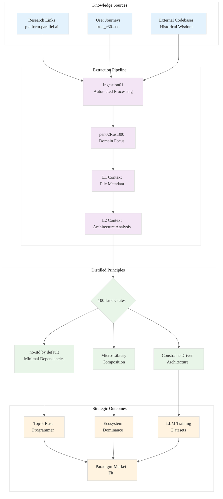

# Analysis: INGEST_20250930104957_300_9

## Content Analysis Framework

**File A (Content)**: `.wipToBeDeletedFolder/INGEST_20250930104957_300_9_Content.txt`
**File B (L1 Context)**: `.wipToBeDeletedFolder/INGEST_20250930104957_300_9_Content_L1.txt`  
**File C (L2 Context)**: `.wipToBeDeletedFolder/INGEST_20250930104957_300_9_Content_L2.txt`
**Prompt**: `.kiro/RustPatterns20250930.md`

---

## A Alone: Research Links and Micro-Crate Philosophy

### Core Content
The file contains a curated list of research links from platform.parallel.ai and introduces a critical architectural principle:

- **Research Links**: 4 deep-research URLs suggesting systematic knowledge extraction
- **Micro-Crate Philosophy**: "100 line crates" with "Micro crates should be no-std by default"
- **User Journey Reference**: Points to a truncated file for user journey analysis

### L1-L8 Extraction (A Alone)

**L1 (Idiomatic Patterns)**: The "no-std by default" principle represents a foundational Rust optimization strategy - minimizing standard library dependencies for maximum portability and performance.

**L2 (Design Patterns)**: The 100-line crate constraint suggests a micro-library composition pattern - building complex systems from tiny, focused components.

**L3 (Micro-Library Opportunities)**: This directly identifies the opportunity space - creating ultra-focused crates that solve single problems exceptionally well.

**L4 (Platform Opportunities)**: The research link structure suggests a systematic approach to knowledge arbitrage across domains.

**L5 (Architecture Decisions)**: The no-std default represents a constraint-driven architecture philosophy - assume minimal environment, add capabilities as needed.

---

## A in Context of B: File Metadata and Knowledge Extraction Pipeline

### Enhanced Understanding
B provides crucial context about the file's position in a knowledge extraction pipeline:

- **Deep Nesting**: 8-level directory structure suggests systematic organization
- **Extraction Pipeline**: Path includes "extracted/Ingestion01/pen02Rust300" indicating automated processing
- **Minimal Content**: 8 lines, 30 words, 883 bytes - highly distilled information

### Strategic Insights
The combination reveals a **Knowledge Distillation Pipeline**:
1. Raw research links (external knowledge sources)
2. Architectural principles (micro-crate philosophy)  
3. User journey references (application context)
4. Systematic file organization (extraction/ingestion process)

This suggests a methodology for **systematic wisdom extraction** from distributed sources.

---

## B in Context of C: Architectural Knowledge Extraction System

### System Architecture Revealed
C adds the architectural layer, showing this is part of a larger system:

- **No Traditional Dependencies**: This isn't code - it's curated knowledge
- **Technology Stack**: Markdown-based knowledge representation
- **Architectural Constraints**: Requires build configs, documentation, tests for full analysis

### Meta-Pattern Recognition
The L1→L2 progression reveals a **Stratified Knowledge Architecture**:
- **L1**: Immediate file context (what is this?)
- **L2**: Architectural context (how does this fit?)
- **Missing L3**: Would be ecosystem context (why does this matter?)

---

## A in Context of B & C: Complete Knowledge Arbitrage System

### The Full Picture: Systematic Wisdom Extraction

This file represents a node in a **Knowledge Arbitrage Engine** designed for:

1. **Research Aggregation**: Collecting high-value external sources
2. **Principle Distillation**: Extracting actionable architectural insights  
3. **Context Preservation**: Maintaining metadata for systematic analysis
4. **Pipeline Integration**: Fitting into automated knowledge processing

### Strategic Implications for Rust Mastery

**The Micro-Crate Revolution**: The "100 line crates, no-std by default" principle represents a paradigm shift:

- **Composability Over Monoliths**: Build complex systems from tiny, perfect components
- **Constraint-Driven Design**: Start with minimal assumptions, add capabilities intentionally
- **Ecosystem Leverage**: Create reusable components that others can build upon

**Knowledge Arbitrage Strategy**: The research link structure suggests:
- **Systematic Source Mining**: Identifying high-value knowledge repositories
- **Cross-Domain Synthesis**: Combining insights from different domains
- **Automated Processing**: Using LLMs for large-scale wisdom extraction

### L7-L8 Meta-Insights

**L7 (Language Evolution)**: The no-std emphasis suggests Rust's ecosystem may be over-relying on std, missing opportunities for more portable, performant solutions.

**L8 (Intent Archaeology)**: This file represents the **methodology** behind becoming a top-5 Rust programmer - not just learning patterns, but systematically extracting and synthesizing wisdom from the entire computing ecosystem.

---

## Mermaid Diagram: Knowledge Arbitrage Architecture

## Key Takeaways

1. **Micro-Crate Philosophy**: The future of Rust may be ultra-focused, no-std components that compose into complex systems
2. **Knowledge Arbitrage**: Systematic extraction of wisdom from diverse sources using LLM-powered analysis
3. **Constraint-Driven Architecture**: Starting with minimal assumptions and adding capabilities intentionally
4. **Stratified Analysis**: L1→L2→L3 context layers enable comprehensive understanding of any codebase or knowledge artifact

This analysis reveals not just content, but a **methodology for systematic mastery** - the process of becoming exceptional through deliberate knowledge extraction and synthesis.