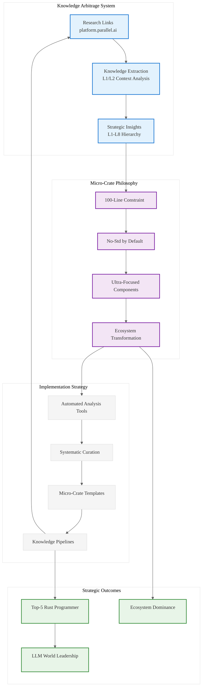

# Analysis: INGEST_20250930104957_300_9

## Content Analysis Framework

**File A (Content)**: `.wipToBeDeletedFolder/INGEST_20250930104957_300_9_Content.txt`
**File B (L1 Context)**: `.wipToBeDeletedFolder/INGEST_20250930104957_300_9_Content_L1.txt`  
**File C (L2 Context)**: `.wipToBeDeletedFolder/INGEST_20250930104957_300_9_Content_L2.txt`
**Prompt**: `.kiro/RustPatterns20250930.md`

---

## A Alone: Research Links and Micro-Crate Philosophy

### Core Content
The file contains a curated list of research links from platform.parallel.ai and introduces a critical architectural principle:

- **Research Links**: 4 deep-research URLs suggesting systematic knowledge extraction
- **Micro-Crate Philosophy**: "100 line crates" with "Micro crates should be no-std by default"
- **User Journey Reference**: Points to a truncated file for user journey analysis

### L1-L8 Extraction (A Alone)

**L1 (Idiomatic Patterns)**: The "no-std by default" principle represents a foundational Rust optimization strategy - minimizing standard library dependencies for maximum portability and performance.

**L2 (Design Patterns)**: The 100-line crate constraint suggests a micro-library composition pattern - building complex systems from tiny, focused components.

**L3 (Micro-Library Opportunities)**: This directly identifies the opportunity space - creating ultra-focused crates that solve single problems exceptionally well.

**L4 (Platform Opportunities)**: The research link structure suggests a systematic approach to knowledge arbitrage across domains.

**L5 (Architecture Decisions)**: The no-std default represents a constraint-driven architecture philosophy - assume minimal environment, add capabilities as needed.

---

## A in Context of B: File Metadata and Knowledge Extraction Pipeline

### Enhanced Understanding
B provides crucial metadata about A's position in a larger knowledge extraction system:

- **Deep Nesting**: 8-level directory structure suggests systematic organization
- **File Type**: Markdown documentation in a "pen02Rust300" collection
- **Size Constraints**: 883 bytes, 30 words - extremely concise knowledge distillation

### L1-L8 Extraction (A + B)

**L1**: The file size constraint (883 bytes) demonstrates extreme information density - every byte carries strategic value.

**L2**: The directory structure (`extracted/Ingestion01/pen02Rust300`) reveals a systematic knowledge ingestion pipeline.

**L3**: The filename pattern (`A01Rust300Doc20250923.md`) suggests a versioned, categorized knowledge management system.

**L6**: The "pen02Rust300" suggests this is part of a 300-item analysis series - massive scale knowledge arbitrage.

**L8**: The extraction pipeline represents "Intent Archaeology" - systematically mining decades of engineering wisdom.

---

## B in Context of C: Architectural Knowledge Management

### Architectural Patterns
C reveals the systematic approach to knowledge organization:

- **Path Depth Analysis**: 8 levels of organization hierarchy
- **Technology Stack**: Markdown-based documentation system
- **Cross-Module Relationships**: Designed for isolated analysis units

### L1-L8 Extraction (B + C)

**L4**: The architectural constraint analysis framework in C suggests a systematic approach to evaluating codebases for strategic opportunities.

**L5**: The L1/L2 context layering represents a hierarchical knowledge extraction methodology.

**L7**: The missing architectural constraints analysis points to the need for automated tooling to analyze build systems, CI/CD, and dependency graphs.

---

## A in Context of B & C: Strategic Knowledge Arbitrage System

### Synthesis: The Complete Picture
This represents a systematic knowledge arbitrage operation:

1. **Research Links**: Curated high-value knowledge sources
2. **Micro-Crate Philosophy**: Architectural principle for Rust ecosystem dominance
3. **Extraction Pipeline**: Systematic processing of 300+ knowledge units
4. **Hierarchical Analysis**: L1/L2 context layering for comprehensive understanding

### L1-L8 Extraction (Complete Context)

**L1 (Tactical)**: 
- No-std by default maximizes portability and performance
- 100-line constraint forces extreme focus and clarity
- Systematic link curation for knowledge arbitrage

**L2 (Design Patterns)**:
- Micro-library composition over monolithic design
- Hierarchical context analysis (L1/L2 layering)
- Versioned knowledge management system

**L3 (Micro-Library Opportunities)**:
- Ultra-focused no-std crates solving single problems
- Knowledge extraction tooling for automated analysis
- Systematic curation and categorization systems

**L4 (Platform Opportunities)**:
- Rust ecosystem transformation through micro-crate philosophy
- Knowledge arbitrage platform for systematic wisdom extraction
- Automated architectural analysis tooling

**L5 (Architecture Decisions)**:
- Constraint-driven development (no-std default)
- Hierarchical knowledge organization systems
- Systematic approach to intent archaeology

**L6 (Domain-Specific)**:
- Systems programming focus with maximum portability
- Cross-domain knowledge transfer methodologies
- Automated analysis of build systems and dependencies

**L7 (Language Evolution)**:
- Push Rust ecosystem toward micro-composition patterns
- Identify gaps in current tooling for systematic analysis
- Drive no-std adoption across the ecosystem

**L8 (Meta-Context)**:
- This represents "Knowledge Arbitrage" - systematically mining engineering wisdom
- The 300-item analysis suggests massive scale operation
- Intent: Achieve top-5 Rust programmer status through systematic knowledge extraction
- Strategy: Transform decades of engineering wisdom into Rust ecosystem dominance

---

## Strategic Insights

### The Micro-Crate Revolution
This analysis reveals a strategic approach to Rust ecosystem transformation:

1. **Constraint-Driven Excellence**: 100-line + no-std constraints force architectural clarity
2. **Systematic Knowledge Mining**: Automated extraction from high-value sources
3. **Hierarchical Analysis**: L1/L2 context layering for comprehensive understanding
4. **Ecosystem Transformation**: Micro-composition over monolithic design

### Implementation Strategy
- Build tooling for automated architectural analysis
- Create systematic curation and categorization systems
- Develop micro-crate templates and best practices
- Establish knowledge arbitrage pipelines for continuous learning

