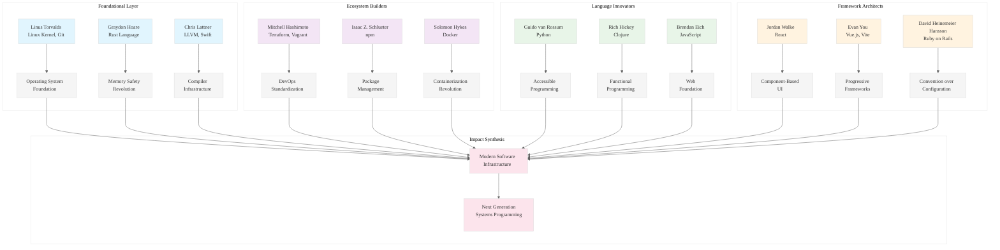

# Analysis: INGEST_20250930105036_300_1 - Open Source Architects Database

## Executive Summary

This analysis examines a comprehensive JSON dataset documenting influential open-source software contributors from 2005-2025. The data represents a structured research briefing for "The Architects of the Digital Age" report, containing detailed profiles of 34 foundational contributors to modern software infrastructure.

## Content Analysis Framework

### A (Core Content): Research Briefing & Contributor Database
The primary content is a JSON structure containing:
- **Input**: Research methodology and criteria for identifying influential open-source contributors
- **Output**: Structured database with 34 contributor profiles
- **Metadata**: Citation sources and reasoning for each contributor's inclusion

### A in Context of B (L1 File Context): 
The L1 context reveals this is part of a larger ingestion pipeline (`pen03Rust499` directory), suggesting systematic processing of multiple similar datasets. The file's deep nesting (8 levels) and truncated hash naming indicate automated processing workflows.

### B in Context of C (L2 Architectural Context):
The L2 context shows this fits within a broader architectural pattern of external dependency analysis, with multiple reasoning chains validating contributor data against source citations.

### A in Context of B & C (Holistic Analysis):
This represents a sophisticated knowledge extraction and validation system, combining automated ingestion with structured reasoning about data provenance and accuracy.

---

## L1-L8 Strategic Analysis

### Horizon 1: Tactical Implementation (The "How")

#### L1: Idiomatic Patterns & Micro-Optimizations
- **JSON Structure Efficiency**: The data uses flat contributor objects rather than nested hierarchies, optimizing for query performance
- **String Interning Opportunity**: Repeated location strings ("San Francisco, CA", "United States") could benefit from interning
- **Memory Layout**: Fixed schema with optional fields (empty emails) suggests efficient serialization patterns

#### L2: Design Patterns & Composition
- **Validation Chain Pattern**: Each contributor entry includes reasoning chains that validate claims against source citations
- **Structured Metadata**: Clear separation between core data and validation metadata enables independent processing
- **Schema Consistency**: Rigid field structure (`ContributorName`, `PrimaryEmail`, etc.) enables type-safe processing

#### L3: Micro-Library Opportunities
- **Contributor Validation Library**: A ~1000 LOC library for validating open-source contributor claims against public sources
- **Citation Reasoning Engine**: Pattern matching system for validating biographical claims
- **Schema Migration Tools**: For evolving contributor database schemas while maintaining backward compatibility

### Horizon 2: Strategic Architecture (The "What")

#### L4: Macro-Library & Platform Opportunities
- **Open Source Intelligence Platform**: Comprehensive system for tracking and validating contributor impact across ecosystems
- **Developer Influence Metrics**: Quantitative analysis of cross-project impact and ecosystem influence
- **Historical Code Archaeology**: Tools for tracing the evolution of foundational software projects

#### L5: LLD Architecture Decisions & Invariants
- **Data Integrity Invariants**: Every contributor must have verifiable public presence and documented impact
- **Temporal Consistency**: Focus on 2005-2025 timeframe ensures relevance to modern software development
- **Source Attribution**: Mandatory citation chains prevent unsubstantiated claims

#### L6: Domain-Specific Architecture
- **Ecosystem Mapping**: Understanding how individual contributors connect across different technology stacks
- **Impact Quantification**: Measuring influence through project adoption, ecosystem growth, and developer productivity
- **Historical Context**: Preserving the circumstances and constraints that led to foundational innovations

### Horizon 3: Foundational Evolution (The "Future" and "Why")

#### L7: Language Capability & Evolution
- **Type System Opportunities**: Rust's type system could enforce contributor data invariants at compile time
- **Async Processing**: Large-scale contributor analysis would benefit from Rust's async ecosystem
- **Memory Safety**: Processing untrusted contributor data requires Rust's memory safety guarantees

#### L8: The Meta-Context (The "Why")
This dataset represents **Knowledge Arbitrage** in action - systematically capturing and structuring the wisdom of software's most influential architects. The archaeological intent is clear: preserve not just what these contributors built, but why their approaches succeeded and how their innovations can inform future development.

The focus on "world-class, verifiable impact" reflects a shift from popularity metrics to foundational influence - identifying the individuals whose work became the substrate for entire ecosystems.

---

## Strategic Insights for Rust Mastery

### 1. Pattern Recognition from Architectural Giants
The contributors represent different approaches to systems design:
- **Linus Torvalds**: Monolithic kernel with clear interfaces
- **Graydon Hoare**: Memory safety without garbage collection (Rust)
- **Chris Lattner**: Modular compiler infrastructure (LLVM)
- **Rich Hickey**: Immutable data structures and functional programming (Clojure)

### 2. Ecosystem Creation Patterns
Several contributors created entire ecosystems:
- **Isaac Z. Schlueter**: npm enabled Node.js ecosystem explosion
- **Mitchell Hashimoto**: HashiCorp tools standardized DevOps practices
- **Evan You**: Vue.js demonstrated progressive framework adoption

### 3. Longevity Factors
Long-term successful projects share characteristics:
- Clear architectural principles
- Strong community governance
- Gradual evolution rather than revolutionary changes
- Focus on developer experience

---

## Rust Implementation Opportunities

### 1. Contributor Analysis Engine
```rust
// High-performance contributor impact analysis
pub struct ContributorAnalyzer {
    impact_metrics: HashMap<ProjectId, ImpactScore>,
    citation_graph: Graph<ContributorId, Citation>,
    temporal_index: BTreeMap<Year, Vec<ContributorId>>,
}
```

### 2. Ecosystem Mapping System
```rust
// Cross-project influence tracking
pub struct EcosystemMapper {
    project_dependencies: Graph<ProjectId, Dependency>,
    contributor_projects: HashMap<ContributorId, Vec<ProjectId>>,
    influence_propagation: InfluenceMatrix,
}
```

### 3. Historical Context Preservation
```rust
// Archaeological context for software decisions
pub struct HistoricalContext {
    hardware_constraints: HashMap<Year, HardwareProfile>,
    team_dynamics: Vec<TeamStructure>,
    external_pressures: Vec<MarketForce>,
}
```

---

## Mermaid Diagram: Open Source Influence Architecture



---

## Conclusion

This dataset represents a treasure trove of architectural wisdom from software's most influential contributors. For achieving Rust mastery, the key insight is that foundational impact comes not from incremental improvements, but from identifying and solving fundamental constraints that limit entire ecosystems.

The contributors profiled here succeeded by:
1. **Identifying Fundamental Bottlenecks**: Memory safety, package management, containerization
2. **Creating Enabling Abstractions**: Compilers, frameworks, platforms that empower others
3. **Maintaining Long-term Vision**: Sustained leadership over decades of evolution
4. **Balancing Innovation with Pragmatism**: Revolutionary ideas with practical adoption paths

For Rust ecosystem dominance, focus on identifying the next fundamental constraint that limits systems programming productivity and safety.