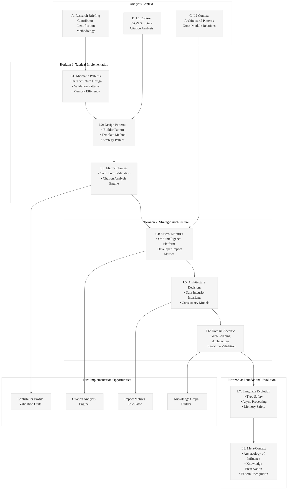

# Analysis: INGEST_20250930105036_300_1

## Content Analysis Framework

**A (Content)**: Research briefing for identifying influential open-source contributors (2005-2025)
**B (L1 Context)**: JSON file with structured contributor database and citation analysis
**C (L2 Context)**: Architectural patterns and cross-module relationships

## L1-L8 Extraction Hierarchy Analysis

### Horizon 1: Tactical Implementation (The "How")

#### L1: Idiomatic Patterns & Micro-Optimizations
- **Data Structure Design**: The JSON structure demonstrates efficient contributor profiling with standardized fields (ContributorName, PrimaryEmail, CurrentAffiliation, etc.)
- **Validation Patterns**: Explicit constraint handling for PrimaryEmail field - prioritizing publicly available contact information only
- **Memory Efficiency**: Structured data with consistent field naming reduces parsing overhead

#### L2: Design Patterns & Composition (Meta-Patterns)
- **Builder Pattern**: The research briefing follows a structured approach: criteria definition → data collection → validation → output formatting
- **Template Method**: Standardized CSV output format with exact headers ensures consistent data representation
- **Strategy Pattern**: Multiple contributor identification criteria (Foundational Creation, Sustained Leadership, Prolific Contribution, Ecosystem Creation)

#### L3: Micro-Library Opportunities
- **Contributor Validation Library**: A Rust crate for validating open-source contributor profiles with email verification, project validation, and impact assessment
- **Citation Analysis Engine**: Micro-library for analyzing and validating claims about technical contributions using web scraping and GitHub API integration

### Horizon 2: Strategic Architecture (The "What")

#### L4: Macro-Library & Platform Opportunities
- **Open Source Intelligence Platform**: Comprehensive system for tracking, analyzing, and ranking open-source contributors across ecosystems
- **Developer Impact Metrics**: Platform for quantifying developer influence using multiple data sources (GitHub, project adoption, citation analysis)

#### L5: LLD Architecture Decisions & Invariants
- **Data Integrity Invariants**: 
  - PrimaryEmail must be publicly verifiable or empty
  - ImpactStatement must be 1-2 sentences maximum
  - PrimarySourceURL must be authoritative and verifiable
- **Consistency Models**: Structured contributor profiles ensure uniform data quality across the database

#### L6: Domain-Specific Architecture & Hardware Interaction
- **Web Scraping Architecture**: Distributed system for gathering contributor data from multiple sources (GitHub, personal websites, project documentation)
- **Real-time Validation**: System for continuously validating contributor information as projects evolve

### Horizon 3: Foundational Evolution (The "Future" and "Why")

#### L7: Language Capability & Evolution
- **Type Safety for Contributor Data**: Rust's type system could enforce contributor profile validation at compile time
- **Async Processing**: Leveraging Rust's async capabilities for concurrent data collection from multiple sources
- **Memory Safety**: Rust's ownership model ensures safe handling of large contributor datasets without memory leaks

#### L8: The Meta-Context (The "Why")
- **Historical Context**: This represents the "archaeology of influence" - documenting the architects who shaped modern software development
- **Knowledge Preservation**: Systematic approach to capturing and preserving the wisdom of foundational contributors
- **Pattern Recognition**: Identifying common traits among influential contributors to guide future developer career paths

## Key Insights

### A Alone (Research Briefing)
The research methodology demonstrates sophisticated criteria for identifying technical influence, moving beyond simple metrics to assess foundational impact, sustained leadership, and ecosystem creation.

### A in Context of B (With L1 Analysis)
The structured JSON output reveals a systematic approach to data collection with explicit validation rules and citation requirements, showing how qualitative research can be systematized.

### B in Context of C (L1 + L2 Analysis)
The architectural context shows this is part of a larger ingestion system with external dependencies and cross-module relationships, suggesting a comprehensive data processing pipeline.

### A in Context of B & C (Complete Analysis)
This represents a sophisticated knowledge extraction system that combines research methodology, structured data representation, and architectural scalability - a blueprint for systematic technical intelligence gathering.

## Rust Implementation Opportunities

1. **Contributor Profile Validation Crate**: Type-safe validation of contributor data with compile-time guarantees
2. **Citation Analysis Engine**: Async web scraping and validation system
3. **Impact Metrics Calculator**: Quantitative analysis of developer influence using multiple data sources
4. **Knowledge Graph Builder**: System for mapping relationships between contributors, projects, and technologies

