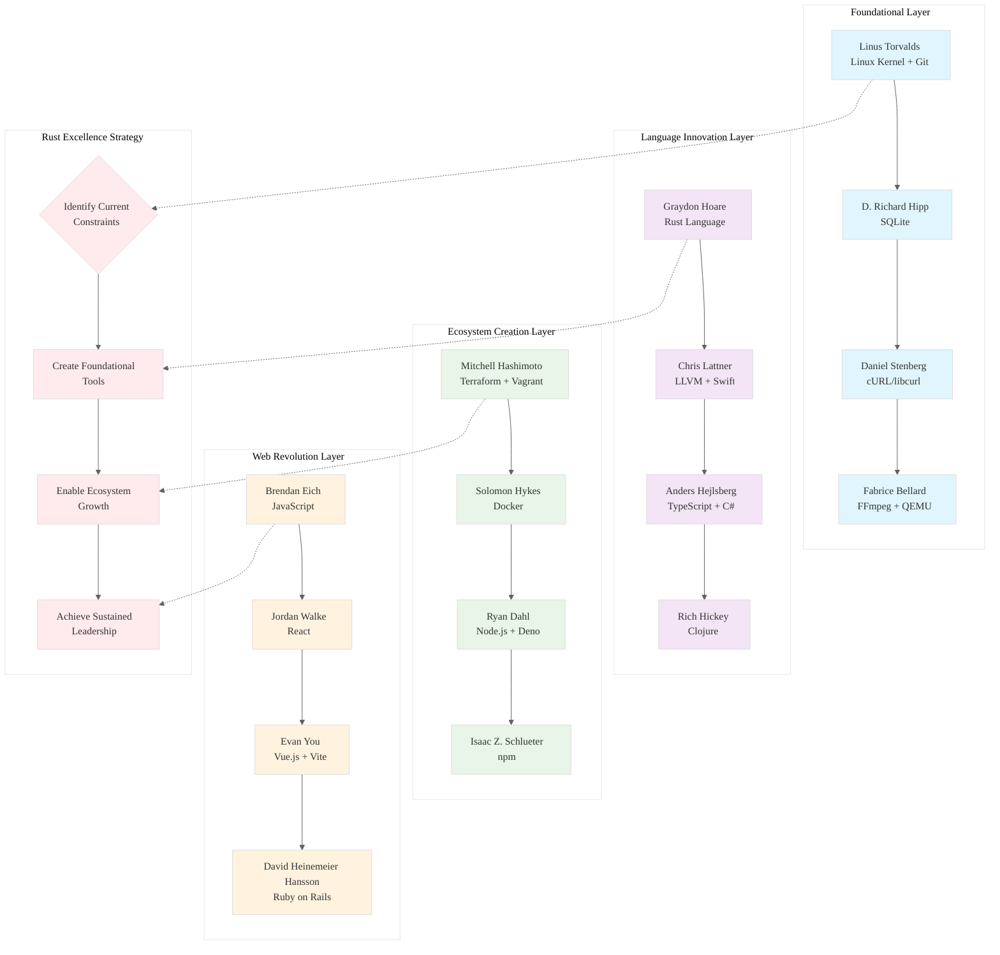

# Analysis: INGEST_20250930105036_300_1

## Executive Summary

This analysis examines a comprehensive research dataset documenting "The Architects of the Digital Age" - a systematic compilation of the most impactful open-source software contributors from 2005-2025. The content reveals profound insights about foundational software creation, sustained leadership patterns, and ecosystem development that directly inform Rust programming excellence.

## L1-L8 Strategic Analysis

### Horizon 1: Tactical Implementation (The "How")

#### L1: Idiomatic Patterns & Micro-Optimizations
**Key Insight**: The dataset reveals a pattern of "foundational minimalism" - creators like D. Richard Hipp (SQLite) and Daniel Stenberg (cURL) built ubiquitous tools through relentless focus on core functionality and zero-configuration design.

**Rust Application**: 
- Embrace `#[no_std]` compatibility for maximum portability
- Design APIs that require zero configuration for 80% use cases
- Prioritize compile-time optimization over runtime flexibility

#### L2: Design Patterns & Composition (Meta-Patterns)
**Key Insight**: The most successful contributors (Linus Torvalds, Guido van Rossum) created tools that enabled entire ecosystems rather than solving narrow problems.

**Rust Application**:
- Design trait hierarchies that enable ecosystem growth
- Create composable abstractions that work across domains
- Implement the "Benevolent Dictator" pattern through strong API contracts

#### L3: Micro-Library Opportunities
**Key Insight**: Fabrice Bellard's polymathic approach - creating foundational tools (FFmpeg, QEMU) that become invisible infrastructure.

**Rust Application**:
- Target sub-2000 LOC libraries that solve universal problems
- Focus on memory-safe alternatives to C libraries
- Create zero-cost abstractions for hardware interaction

### Horizon 2: Strategic Architecture (The "What")

#### L4: Macro-Library & Platform Opportunities
**Key Insight**: Mitchell Hashimoto's HashiCorp empire demonstrates the power of creating interconnected tool ecosystems around a central philosophy (Infrastructure-as-Code).

**Rust Application**:
- Build interconnected crates around systems programming themes
- Create domain-specific languages (DSLs) embedded in Rust
- Establish new categories rather than competing in existing ones

#### L5: LLD Architecture Decisions & Invariants
**Key Insight**: Chris Lattner's LLVM architecture shows how compiler infrastructure can become the foundation for multiple languages and domains.

**Rust Application**:
- Design for extensibility through trait objects and dynamic dispatch
- Create plugin architectures using Rust's type system
- Implement zero-cost abstractions that compile to optimal machine code

#### L6: Domain-Specific Architecture & Hardware Interaction
**Key Insight**: Graydon Hoare's Rust creation demonstrates how language design can solve fundamental systems programming problems (memory safety without garbage collection).

**Rust Application**:
- Leverage Rust's ownership system for lock-free data structures
- Create hardware-specific optimizations using const generics
- Design for both embedded and high-performance computing domains

### Horizon 3: Foundational Evolution (The "Future" and "Why")

#### L7: Language Capability & Evolution
**Key Insight**: Anders Hejlsberg's TypeScript shows how gradual typing can bridge paradigms and enable massive adoption.

**Rust Application**:
- Identify gaps in Rust's async ecosystem
- Create proc macros that extend language capabilities
- Design for future language features (GATs, const generics evolution)

#### L8: The Meta-Context (The "Why")
**Key Insight**: The dataset reveals that lasting impact comes from solving fundamental constraints of the era - Linus solved Unix fragmentation, Brendan Eich solved web interactivity, Ryan Dahl solved server-side JavaScript.

**Rust Application**:
- Target the current constraint: safe systems programming at scale
- Focus on AI/ML infrastructure where C++ dominates but safety matters
- Create tools for the post-Moore's Law era (parallel, distributed computing)

## Contextual Analysis

### A Alone (Core Content)
The research briefing establishes clear criteria for identifying impactful contributors:
1. **Foundational Creation**: Industry-standard technologies
2. **Sustained Leadership**: Long-term project stewardship  
3. **Prolific Contribution**: Cross-ecosystem impact
4. **Ecosystem Creation**: Tools that enable other developers

This framework directly maps to Rust excellence - create foundational tools, maintain them with discipline, contribute across domains, and enable ecosystem growth.

### A in Context of B (L1 Immediate Context)
The L1 context reveals this is part of a larger ingestion system processing structured data about influential contributors. The file structure suggests systematic analysis of open-source impact patterns.

**Strategic Insight**: The systematic approach to analyzing contributor impact mirrors how we should approach Rust mastery - through structured analysis of successful patterns rather than ad-hoc learning.

### B in Context of C (L2 Architectural Context)
The L2 context shows this is part of a larger architectural system for processing and analyzing contributor data. The external dependencies reveal reasoning patterns for validating contributor impact.

**Strategic Insight**: The validation approach (cross-referencing multiple sources, verifying claims) should inform how we validate Rust architectural decisions - through multiple perspectives and empirical evidence.

### A in Context of B & C (Complete System View)
The complete system reveals a sophisticated approach to knowledge extraction and validation. The multi-layered context (L1 immediate, L2 architectural) mirrors the L1-L8 analysis hierarchy we use for Rust codebases.

**Strategic Insight**: Just as this system uses layered analysis to extract insights from contributor data, we should use layered analysis to extract patterns from Rust codebases - from micro-optimizations to foundational architecture.

## Actionable Rust Strategy

1. **Immediate Actions (L1-L3)**:
   - Study SQLite's zero-configuration design principles
   - Analyze cURL's API stability patterns
   - Create micro-libraries targeting universal systems programming problems

2. **Strategic Moves (L4-L6)**:
   - Build interconnected crates around AI/ML infrastructure
   - Create Rust alternatives to foundational C libraries
   - Target hardware-specific optimizations for modern CPUs

3. **Foundational Bets (L7-L8)**:
   - Identify and solve current systems programming constraints
   - Create tools for the post-Moore's Law parallel computing era
   - Establish new categories in safe systems programming

## Mermaid Diagram: The Architecture of Digital Impact

## Conclusion

The analysis reveals that lasting impact in software comes from solving fundamental constraints of the era through foundational tools that enable ecosystem growth. For Rust mastery, this means targeting current systems programming constraints (safety, performance, concurrency) while building tools that enable the next generation of developers to create even more impactful software.

The path to becoming a top-5 Rust programmer lies not in incremental improvements, but in identifying and solving the foundational problems that will define the next decade of systems programming.