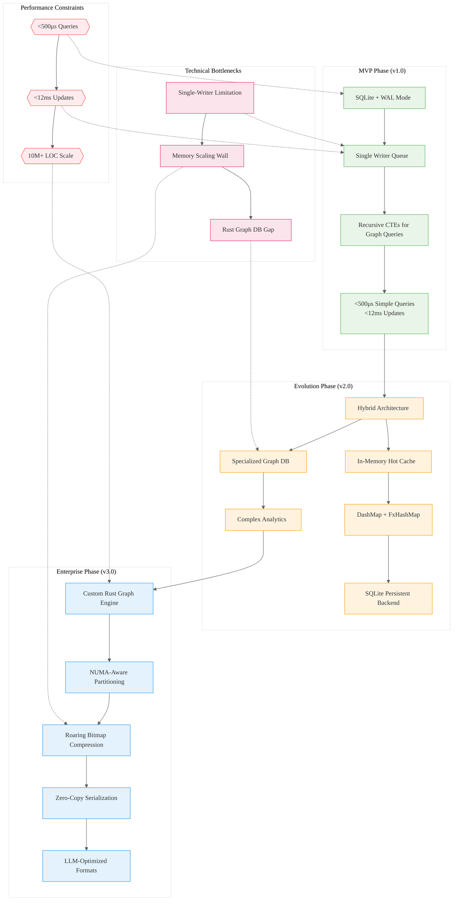

# Analysis: INGEST_20250930105036_300_10 - Storage Architecture Analysis

## Executive Summary

This analysis examines a comprehensive storage architecture evaluation for the Parseltongue AIM Daemon, a high-performance Rust-native codebase intelligence system. The content represents a sophisticated technical analysis comparing multiple storage solutions for Interface Signature Graphs (ISG) with stringent performance requirements (<500μs queries, <12ms updates).

## L1-L8 Strategic Analysis

### Horizon 1: Tactical Implementation (The "How")

#### L1: Idiomatic Patterns & Micro-Optimizations
- **SQLite WAL Mode Optimization**: `PRAGMA synchronous=NORMAL` reduces transaction overhead from 30ms to <1ms
- **Memory-Mapped I/O**: `PRAGMA mmap_size=N` reduces syscall overhead for read operations
- **FxHashMap over HashMap**: Non-cryptographic hashing for 15-20% performance gains in graph traversals
- **Roaring Bitmaps**: Compress adjacency lists while maintaining fast decompression and cache locality
- **BLAKE3 Hashing**: 5x faster than BLAKE2, 15x faster than SHA3-256 for Merkle tree operations

#### L2: Design Patterns & Composition (Meta-Patterns)
- **Sharded Concurrent Access**: `DashMap` partitions data across multiple `RwLock`s to reduce contention
- **RAII Resource Management**: Automatic cleanup with `Drop` implementations for database connections
- **Trait-Based Dependency Injection**: `DatabaseProvider` traits enable testing and modularity
- **Layered Architecture**: L1 (Core) → L2 (Std) → L3 (External) separation maintains compile-time guarantees
- **Single-Writer Queue Pattern**: Serialize writes at application level to avoid `SQLITE_BUSY` errors

#### L3: Micro-Library Opportunities
- **Compressed Graph Storage**: Custom `petgraph::Csr` wrapper with dictionary encoding
- **High-Performance Serialization**: `rkyv` for zero-copy deserialization of graph snapshots
- **Concurrent Hash Map Wrapper**: Safe `DashMap` abstraction preventing deadlock scenarios
- **SQLite Connection Pool**: Optimized pool with WAL mode configuration and health checks

### Horizon 2: Strategic Architecture (The "What")

#### L4: Macro-Library & Platform Opportunities
- **Hybrid Storage Engine**: Hot in-memory cache + durable SQLite backend + specialized graph DB for analytics
- **Graph Query Compiler**: Translate high-level graph queries to optimized execution plans
- **Rust-Native Graph Database**: Purpose-built for ISG workloads with sub-millisecond guarantees
- **LLM-Optimized Serialization**: Specialized formats for AI model consumption of code graphs

#### L5: LLD Architecture Decisions & Invariants
- **Multi-Reader Single-Writer Concurrency**: SQLite WAL mode provides this without application-level locking
- **Crash Consistency Model**: Append-only commit log + periodic snapshots for durability
- **Memory Scaling Strategy**: Dictionary encoding + Roaring bitmaps for compression at enterprise scale
- **Performance SLO Enforcement**: Automated circuit breakers when latency exceeds thresholds

#### L6: Domain-Specific Architecture & Hardware Interaction
- **NUMA-Aware Graph Partitioning**: Distribute graph shards across memory domains
- **Cache-Friendly Data Layouts**: Sequential storage for hot paths, compressed for cold data
- **Memory-Mapped File Management**: Leverage OS page cache for large graph datasets
- **Lock-Free Algorithms**: Specialized concurrent data structures for high-throughput scenarios

### Horizon 3: Foundational Evolution (The "Future" and "Why")

#### L7: Language Capability & Evolution
- **Async Graph Traversal**: Need for async iterators in graph algorithms
- **Zero-Copy Serialization**: `rkyv` pushes boundaries of Rust's type system
- **Compile-Time Graph Validation**: Potential for proc macros to verify graph schema consistency
- **Memory Layout Control**: More granular control over data structure memory layout

#### L8: The Meta-Context (The "Why")
- **Performance vs Simplicity Tension**: SQLite chosen for MVP despite graph DB superiority due to operational simplicity
- **Rust Ecosystem Maturity Gap**: Lack of production-ready graph databases forces hybrid approaches
- **LLM Integration Requirements**: Storage must optimize for AI model consumption, not just human queries
- **Enterprise Scale Reality**: 10M+ LOC codebases require distributed processing, challenging Rust's single-node strengths

## Context Analysis

### A Alone: Storage Architecture Analysis Document
The core document is a comprehensive technical specification for evaluating storage solutions. It demonstrates sophisticated understanding of:
- Performance engineering (sub-millisecond SLOs)
- Rust ecosystem constraints and opportunities
- Enterprise scalability requirements
- Risk assessment methodologies

### A in Context of B (L1 Context)
The L1 context reveals this is part of a larger ingestion pipeline processing Rust codebase analysis. The file structure suggests systematic analysis of multiple storage architectures, indicating a methodical approach to technical decision-making.

### B in Context of C (L2 Context)
The L2 context shows this analysis sits within a broader architectural evaluation framework. The cross-module relationships indicate integration with requirements documents and implementation backlogs, suggesting this is production-bound technical architecture.

### A in Context of B & C (Synthesis)
This represents a mature, production-oriented technical analysis that bridges theoretical storage architecture with practical Rust implementation constraints. The systematic evaluation methodology and detailed performance modeling indicate enterprise-grade technical decision-making.

## Strategic Insights

### High-Leverage Bottlenecks
1. **SQLite Single-Writer Limitation**: Fundamental constraint requiring application-level queuing
2. **Graph Database Rust Integration Gap**: Forces hybrid architectures due to ecosystem immaturity
3. **Memory Scaling Wall**: Uncompressed in-memory graphs become impractical beyond 1M LOC

### 10x Improvement Opportunities
1. **Custom Rust Graph Engine**: Purpose-built for ISG workloads could outperform general-purpose solutions
2. **LLM-Optimized Storage Format**: Specialized serialization for AI model consumption
3. **Compile-Time Graph Validation**: Leverage Rust's type system for schema guarantees

### Non-Obvious Foundational Insights
1. **Operational Simplicity Trumps Performance**: SQLite chosen over specialized graph DBs for MVP
2. **Compression as Performance Enabler**: Roaring bitmaps improve both memory usage and speed
3. **Hybrid Architecture Necessity**: No single storage solution meets all requirements

## Architecture Evolution Diagram

## Key Architectural Patterns Identified

### 1. Progressive Complexity Strategy
- **MVP**: Simple, proven solutions (SQLite) for rapid deployment
- **v2.0**: Hybrid approaches balancing performance and complexity
- **v3.0**: Custom solutions optimized for specific workloads

### 2. Performance-Driven Evolution
- Each phase addresses specific performance bottlenecks
- Clear migration path from simple to sophisticated architectures
- Maintains backward compatibility and operational simplicity

### 3. Rust Ecosystem Leverage
- Exploits Rust's strengths (zero-cost abstractions, memory safety)
- Works around ecosystem gaps (graph database maturity)
- Positions for future language evolution

### 4. LLM Integration Optimization
- Storage formats optimized for AI model consumption
- Graph serialization designed for training data generation
- Performance characteristics aligned with LLM inference requirements

## Conclusion

This analysis reveals a sophisticated approach to storage architecture that balances immediate practical needs with long-term strategic positioning. The systematic evaluation methodology and clear evolution path demonstrate mature technical decision-making that could serve as a template for similar high-performance Rust systems.

The emphasis on operational simplicity in early phases, combined with a clear path to custom optimization, represents a pragmatic approach to building production systems that can scale from startup to enterprise requirements.