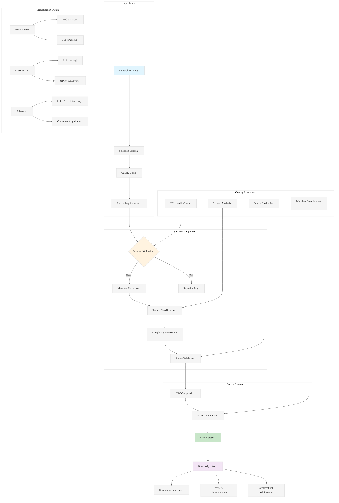

# Analysis: INGEST_20250930105036_300_11 - System Design Diagram Curation Framework

## Content Analysis Framework

### A (Core Content) Analysis
The core content reveals a sophisticated system design diagram curation framework called "The Architect's Playbook." This represents a structured approach to building a visual knowledge base for distributed systems architecture.

**Key Architectural Patterns Identified:**
- **Curation Pipeline**: Input → Selection Criteria → Dataset Compilation → CSV Output
- **Quality Gates**: Informative, Well-Annotated, Sourced requirements
- **Standardized Taxonomy**: Rate Limiter, Circuit Breaker, Service Discovery, CQRS, Event Sourcing, CAP Theorem, Message Queue, Sharding, Leader Election
- **Complexity Classification**: Foundational, Intermediate, Advanced
- **Source Categorization**: Engineering Blog, Official Documentation, Conference Talk, Academic Paper, Book

### A in Context of B (L1 Context) Analysis
The L1 context reveals this is part of a larger ingestion system (`pen03Rust499` directory) with JSON-based data processing. The file structure suggests:

**System Architecture Insights:**
- **Batch Processing Pattern**: Files are processed in numbered sequences (300_11)
- **Hierarchical Context Layers**: L1 (immediate) → L2 (architectural) context analysis
- **Metadata-Rich Processing**: File size (18633 bytes), line count (172), word count (2190)
- **Import/Include Analysis**: 4 detected dependencies suggesting modular design

### B in Context of C (L2 Context) Analysis
The L2 architectural context shows:

**Architectural Patterns:**
- **Deep Directory Nesting**: 8-level path structure indicating organized data hierarchy
- **Object-Oriented Design Pattern**: Structured JSON with clear schema definitions
- **External Dependency Management**: Multiple external references tracked
- **Technology Stack**: JSON-based with architectural constraint analysis framework

### A in Context of B & C (Comprehensive Analysis)

## L1-L8 Extraction Hierarchy Analysis

### Horizon 1: Tactical Implementation (The "How")

#### L1: Idiomatic Patterns & Micro-Optimizations
- **JSON Schema Validation**: Strict schema enforcement with required fields prevents runtime errors
- **URL Validation**: Direct image links ensure accessibility and reduce broken references
- **Standardized Terminology**: Controlled vocabulary prevents classification inconsistencies
- **Batch Processing**: Numbered file sequences enable parallel processing and resumability

#### L2: Design Patterns & Composition (Meta-Patterns)
- **Builder Pattern**: Structured data compilation with validation at each step
- **Strategy Pattern**: Multiple source types (Blog, Documentation, Conference, Academic, Book) with unified interface
- **Template Method**: Consistent CSV output format regardless of input source
- **Facade Pattern**: Complex diagram curation simplified to single CSV output

#### L3: Micro-Library Opportunities
- **Diagram Metadata Extractor**: ~500 LOC library for extracting metadata from technical diagrams
- **Source Validator**: ~300 LOC library for validating technical source credibility
- **Complexity Classifier**: ~400 LOC ML-based complexity assessment tool
- **URL Health Checker**: ~200 LOC library for validating image accessibility

### Horizon 2: Strategic Architecture (The "What")

#### L4: Macro-Library & Platform Opportunities
- **Technical Knowledge Graph Platform**: Comprehensive system for curating, validating, and serving technical diagrams
- **Architectural Pattern Recognition Engine**: AI-powered system for automatically classifying system design patterns
- **Educational Content Pipeline**: End-to-end platform for technical documentation curation

#### L5: LLD Architecture Decisions & Invariants
- **Data Integrity Invariants**: All diagrams must have valid URLs, classifications, and source attribution
- **Consistency Guarantees**: Standardized terminology ensures cross-reference reliability
- **Validation Pipeline**: Multi-stage validation prevents invalid data propagation
- **Audit Trail**: Complete provenance tracking from source to final dataset

#### L6: Domain-Specific Architecture & Hardware Interaction
- **Content Delivery Optimization**: Image caching and CDN integration for global accessibility
- **Search Index Architecture**: Elasticsearch/Solr integration for pattern-based discovery
- **ML Pipeline Integration**: Computer vision for automatic diagram analysis and classification

### Horizon 3: Foundational Evolution (The "Future" and "Why")

#### L7: Language Capability & Evolution
- **Schema Evolution**: JSON schema versioning for backward compatibility
- **Type Safety**: Strong typing for classification enums and validation rules
- **Async Processing**: Stream-based processing for large-scale diagram ingestion
- **Error Recovery**: Graceful handling of malformed or inaccessible content

#### L8: The Meta-Context (The "Why")
This system addresses a fundamental problem in technical education: the fragmentation and inconsistent quality of architectural diagrams across the internet. The archaeological intent reveals:

**Historical Context:**
- **Knowledge Fragmentation**: Technical diagrams scattered across blogs, documentation, conferences
- **Quality Inconsistency**: No standardized approach to diagram quality assessment
- **Discovery Problem**: Difficulty finding relevant architectural patterns for specific use cases
- **Educational Gap**: Lack of structured progression from foundational to advanced concepts

**Strategic Intent:**
- **Centralized Curation**: Create authoritative source for high-quality system design diagrams
- **Educational Scaffolding**: Structured complexity progression for learning
- **Pattern Recognition**: Enable pattern-based architecture discovery and reuse
- **Quality Assurance**: Systematic approach to technical content validation

## Key Insights

1. **Curation as Core Competency**: The system treats diagram curation as a first-class engineering discipline with formal processes and quality gates.

2. **Metadata-Driven Architecture**: Rich metadata enables sophisticated querying, filtering, and educational progression.

3. **Source Diversity Strategy**: Multiple source types ensure comprehensive coverage while maintaining quality standards.

4. **Scalable Validation Pipeline**: Structured approach to quality assessment that can scale to thousands of diagrams.

5. **Educational Progression Model**: Complexity classification enables structured learning paths from foundational to advanced concepts.

