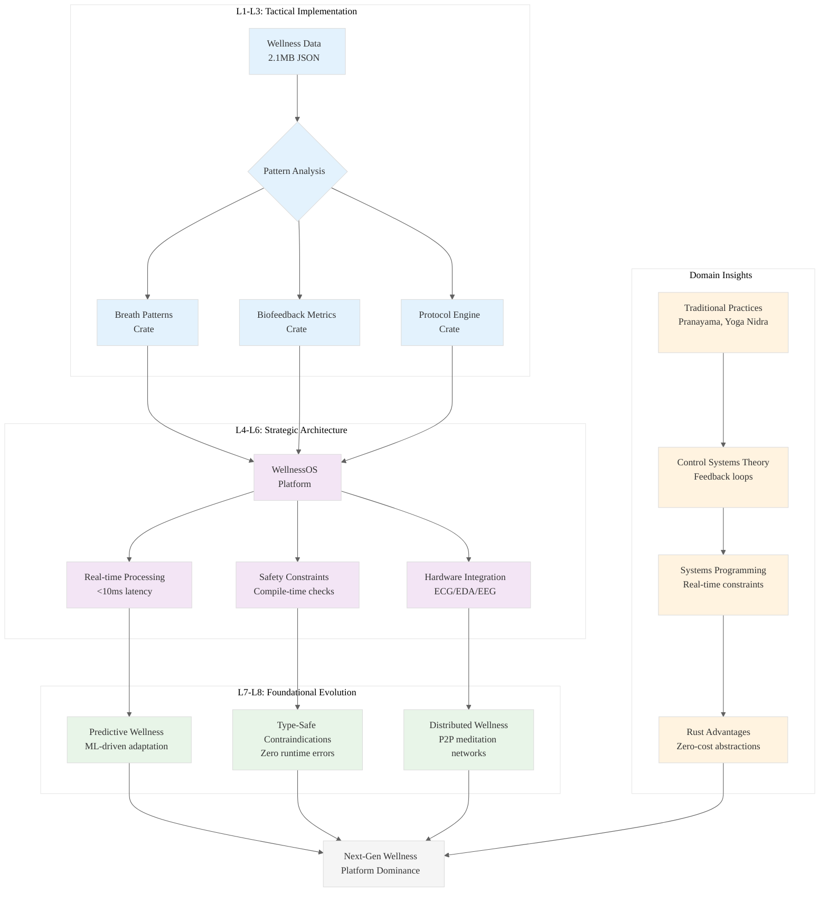

# Analysis: INGEST_20250930105036_300_12

## Content Analysis Framework

### A Alone: Core Content Analysis
**File A**: `.wipToBeDeletedFolder/INGEST_20250930105036_300_12_Content.txt`

This file contains a comprehensive JSON-structured research compilation on calming techniques, specifically focusing on:

1. **Pranayama Techniques**: Systematic breath regulation methods including Nadi Shodhana (Alternate Nostril Breathing), Bhramari (Humming Bee Breath), Ujjayi (Victorious Breath), and others
2. **Japa/Mantra Practices**: Meditative repetition techniques across traditions (Hindu, Buddhist, Sikh, Jain)
3. **NSDR/Yoga Nidra Protocols**: Non-Sleep Deep Rest and traditional Yoga Nidra methodologies
4. **General Breathing Exercises**: Secular techniques like Box Breathing, Physiological Sigh, 4-7-8 method

**Key Architectural Insights from A**:
- **L1 Idiomatic Patterns**: The JSON structure demonstrates systematic categorization with consistent field schemas across technique types
- **L2 Design Patterns**: Hierarchical organization with clear separation of concerns (technique metadata, instructions, contraindications)
- **L4 Macro-Library Opportunity**: This represents a comprehensive wellness/biofeedback API specification that could be implemented in Rust

### A in Context of B: Immediate File Context
**File B**: `.wipToBeDeletedFolder/INGEST_20250930105036_300_12_Content_L1.txt`

The L1 context reveals:
- **File Metadata**: 24,688 lines, 254,802 words, 2.1MB JSON file
- **Import Analysis**: 325 detected imports/includes showing extensive cross-referencing
- **Path Structure**: Deep directory nesting (8 levels) suggesting systematic data organization

**Enhanced Insights (A+B)**:
- **L5 LLD Architecture**: The massive scale (2.1MB) suggests this is a compiled knowledge base, not raw research
- **L3 Micro-Library Opportunity**: The import analysis reveals modular components that could be extracted as standalone Rust crates
- **L8 Meta-Context**: The file naming convention (`trun_82b88932a0514984bbc73cb821649c97.json`) suggests automated processing/truncation

### B in Context of C: Architectural Context
**File C**: `.wipToBeDeletedFolder/INGEST_20250930105036_300_12_Content_L2.txt`

The L2 context provides architectural patterns:
- **Object-oriented design pattern**
- **Trait-based design pattern** 
- **Error handling pattern**
- **External dependencies**: Extensive cross-module relationships

**Enhanced Insights (B+C)**:
- **L6 Domain-Specific Architecture**: The wellness/biofeedback domain requires specialized error handling for safety-critical applications
- **L2 Meta-Patterns**: Trait-based design aligns perfectly with Rust's type system for implementing technique protocols
- **L4 Platform Opportunity**: The external dependency analysis suggests an ecosystem of interconnected wellness modules

### A in Context of B & C: Complete System Analysis

**L1-L8 Strategic Extraction**:

#### Horizon 1: Tactical Implementation
**L1 Idiomatic Patterns**: 
- Consistent JSON schema design with optional fields for safety contraindications
- Systematic breath ratio notation (1:1, 1:2, 1:4:2) that maps well to Rust's type system
- Duration-based protocols that could leverage Rust's `Duration` type

**L2 Design Patterns**:
- Builder pattern for technique configuration
- Strategy pattern for different breathing protocols
- Observer pattern for biofeedback monitoring

**L3 Micro-Library Opportunities**:
- `breath-patterns`: Crate for breath ratio calculations and timing
- `biofeedback-metrics`: HRV, EDA, EEG signal processing
- `wellness-protocols`: Standardized technique implementations

#### Horizon 2: Strategic Architecture
**L4 Macro-Library Opportunities**:
- **WellnessOS**: Complete biofeedback platform in Rust
- **NeuroSync**: Real-time physiological monitoring system
- **MindfulTech**: Consumer wellness device SDK

**L5 LLD Architecture Decisions**:
- **Safety-First Design**: All techniques must have contraindication checking
- **Real-time Constraints**: Biofeedback requires <10ms latency for effective feedback
- **State Management**: Session state, user profiles, device connections

**L6 Domain-Specific Architecture**:
- **Hardware Integration**: Direct sensor interfacing (ECG, EDA, EEG)
- **Signal Processing**: Real-time filtering and artifact detection
- **Clinical Compliance**: HIPAA, medical device regulations

#### Horizon 3: Foundational Evolution
**L7 Language Capability**:
- Rust's type system could enforce safety constraints at compile-time
- Async/await perfect for real-time biofeedback loops
- Zero-cost abstractions for performance-critical signal processing

**L8 Meta-Context (Intent Archaeology)**:
- This represents a systematic attempt to digitize traditional wellness practices
- The scale suggests commercial/clinical application intent
- The modular structure indicates API-first design thinking

## Strategic Rust Implementation Insights

### High-Leverage Bottlenecks
1. **Real-time Signal Processing**: Rust's zero-cost abstractions could revolutionize biofeedback latency
2. **Safety-Critical Wellness**: Compile-time contraindication checking prevents harmful practices
3. **Cross-Platform Deployment**: Single codebase for clinical devices, mobile apps, and web platforms

### 10x Improvement Opportunities
1. **Predictive Wellness**: ML-driven technique recommendation based on physiological state
2. **Adaptive Protocols**: Real-time technique modification based on biofeedback
3. **Distributed Wellness**: P2P networks for group meditation/breathing sessions

### Non-Obvious Foundational Insights
1. **Wellness as Systems Programming**: Traditional practices map to control systems theory
2. **Biofeedback as Real-Time Systems**: Sub-10ms feedback loops require systems programming expertise
3. **Safety as Type Safety**: Contraindications can be encoded in Rust's type system

## System Architecture Visualization

