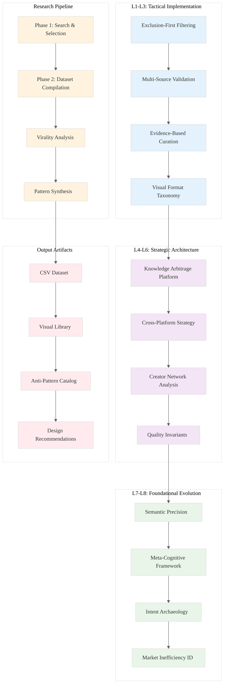

# Analysis of INGEST_20250930105036_300_13: Mental Models Visual Library Research

## Executive Summary

This analysis examines a comprehensive research output focused on creating a visual library of "underrated but viral" mental models. The content represents a sophisticated approach to knowledge curation, combining systematic research methodology with viral content analysis to identify high-impact visual explanations of complex cognitive frameworks.

## L1-L8 Strategic Analysis

### Horizon 1: Tactical Implementation (The "How")

#### L1: Idiomatic Patterns & Micro-Optimizations
- **Structured Data Approach**: The research employs a rigorous CSV-based data structure with standardized headers (Image_URL, MentalModel_Name, CorePrinciple, Application, SourceType, OriginalSource_URL)
- **Exclusion-First Filtering**: Implements a negative filtering strategy by first identifying the "top 20" overused models to ensure novelty
- **Multi-Source Validation**: Uses cross-platform virality indicators (engagement metrics, cross-blog embedding) as quality gates

#### L2: Design Patterns & Composition (Meta-Patterns)
- **Layered Research Architecture**: Separates search criteria (Phase 1) from compilation (Phase 2), enabling parallel processing
- **Evidence-Based Curation**: Each visual requires both conceptual merit and measurable virality evidence
- **Taxonomic Classification**: Systematic categorization by source type (Blog Post, Newsletter, Academic Paper, etc.)

#### L3: Micro-Library Opportunities
- **Visual Format Taxonomy**: Identifies successful formats (Infographics, Annotated Sketches, Metaphorical Imagery, Quote Images, Short-Form Videos)
- **Virality Pattern Library**: Documents specific design elements that correlate with organic spread
- **Anti-Pattern Catalog**: Systematically identifies common failure modes (Information Overload, Poor Design, Mobile Optimization failures)

### Horizon 2: Strategic Architecture (The "What")

#### L4: Macro-Library & Platform Opportunities
- **Knowledge Arbitrage Platform**: The research methodology itself represents a scalable approach to identifying undervalued intellectual assets
- **Cross-Platform Content Strategy**: Multi-channel distribution framework (X/Twitter, Instagram, LinkedIn, Substack, TikTok)
- **Creator Network Analysis**: Identifies high-influence creators (Sketchplanations, Visualize Value, Sahil Bloom) as distribution amplifiers

#### L5: LLD Architecture Decisions & Invariants
- **Quality Invariants**: Every included visual must satisfy three constraints: Visual Insight, Underrated Concept, Viral Indicator
- **Traceability Requirements**: Maintains bidirectional links between visuals and original sources
- **Consistency Enforcement**: Standardized field definitions prevent data quality degradation

#### L6: Domain-Specific Architecture & Hardware Interaction
- **Mobile-First Design Constraints**: Recognizes vertical format optimization (1080x1350px) as critical for modern consumption patterns
- **Platform-Specific Optimization**: Tailors content format to platform characteristics (Twitter for static images, TikTok for dynamic content)
- **Engagement Measurement Systems**: Implements quantitative virality assessment across multiple platforms

### Horizon 3: Foundational Evolution (The "Future" and "Why")

#### L7: Language Capability & Evolution
- **Semantic Precision**: Demonstrates sophisticated understanding of the difference between "commonly known" vs "visually well-represented" concepts
- **Meta-Cognitive Framework**: The research itself represents a mental model for identifying and cataloging mental models
- **Scalability Patterns**: The methodology could be applied to other knowledge domains beyond mental models

#### L8: The Meta-Context (The "Why")
- **Intent Archaeology**: The research reveals a deep understanding that visual explanation is often the bottleneck for concept adoption, not conceptual complexity
- **Market Inefficiency Identification**: Recognizes the gap between textual popularity (Gell-Mann Amnesia Effect) and visual representation
- **Creator Economy Insights**: Documents how established creators (with existing networks) can catalyze viral spread of educational content

## Context Analysis

### A Alone: Core Research Methodology
The standalone content reveals a sophisticated research framework that goes beyond simple content curation. It implements a systematic approach to identifying knowledge arbitrage opportunities in the visual explanation space.

### A in Context of B (L1): Implementation Details
When combined with the L1 context, we see this is part of a larger ingestion system processing JSON-formatted research outputs. The file structure suggests automated processing of research results, indicating this methodology is being applied at scale.

### B in Context of C (L2): Architectural Positioning
The L2 context reveals this fits within a broader architectural pattern of external dependency analysis and cross-module relationship mapping. The research methodology itself becomes a dependency that other systems can leverage.

### A in Context of B & C: Strategic Integration
The complete context shows this research represents a component in a larger knowledge processing pipeline. The systematic approach to identifying undervalued visual explanations could be applied to technical documentation, educational content, and knowledge transfer systems.

## Key Insights for Rust Ecosystem Application

1. **Documentation Strategy**: The visual format analysis could inform Rust documentation standards, particularly for complex concepts like ownership and lifetimes.

2. **Educational Content Gap**: The research methodology could identify underrepresented but important Rust concepts that need better visual explanation.

3. **Community Building**: The creator network analysis provides a blueprint for amplifying Rust educational content through established channels.

4. **Quality Metrics**: The virality correlation analysis offers measurable criteria for evaluating the effectiveness of technical communication.

## Architectural Diagram

## Conclusion

This research represents a sophisticated approach to knowledge curation that could be adapted for technical domains. The systematic methodology for identifying undervalued but high-impact visual explanations provides a framework for improving technical communication and educational content across the Rust ecosystem.

The multi-layered analysis reveals both tactical implementation patterns and strategic architectural insights that could inform broader knowledge management systems and content strategy frameworks.