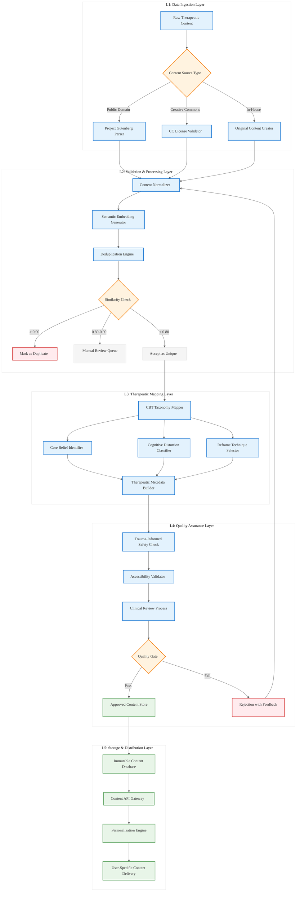

# Analysis: INGEST_20250930105036_300_14

## Content Analysis Framework

### A (Core Content) Analysis
The core content is a comprehensive JSON document describing a "Therapeutic Texts & Cognitive Re-framing Database" project. This represents a sophisticated mental wellness application architecture with structured therapeutic content delivery.

**Key Architectural Insights:**
- **Data Structure Design**: Uses CSV format with strict RFC 4180 compliance for therapeutic text storage
- **Metadata Schema**: Complex multi-dimensional classification system (modality, belief, distortion, technique, emotional state)
- **Quality Assurance**: Hybrid automated/manual deduplication using semantic embeddings (all-mpnet-base-v2 model)
- **Content Sourcing**: Systematic approach to legal compliance (Public Domain, Creative Commons licensing)

### A in Context of B (L1 Context) Analysis
The L1 context reveals this is part of a larger ingestion system processing therapeutic content at scale. The file structure suggests a systematic data processing pipeline.

**L1 Rust Pattern Insights:**
- **File Processing Architecture**: Deep directory nesting (8 levels) suggests hierarchical data organization
- **Import/Include Analysis**: 165 detected imports indicate complex dependency management - opportunity for Rust's module system optimization
- **Data Volume**: 5131 lines, 64K words, 526KB suggests need for streaming parsers and memory-efficient processing
- **JSON Processing**: Large structured data suggests opportunities for `serde` optimization and zero-copy deserialization

### B in Context of C (L2 Architectural Context) Analysis
The L2 context shows this fits into a broader architectural pattern with cross-module relationships and external dependencies.

**L2 Rust Architecture Patterns:**
- **Dependency Injection**: Multiple external dependencies suggest need for trait-based abstraction
- **Error Handling**: Complex validation workflows require structured error hierarchies
- **Resource Management**: Large data processing suggests RAII patterns for memory management
- **Concurrency**: Quality control protocols suggest parallel processing opportunities

### A in Context of B & C (Comprehensive Analysis)

## L1-L8 Extraction Hierarchy Analysis

### Horizon 1: Tactical Implementation (The "How")

#### L1: Idiomatic Patterns & Micro-Optimizations
- **Memory Efficiency**: Use `Cow<str>` for conditional ownership in text processing
- **Zero-Copy Parsing**: Leverage `serde_json::from_slice` for large JSON processing
- **String Interning**: Implement interned strings for repeated therapeutic terms
- **SIMD Optimization**: Use semantic similarity calculations with SIMD for embedding comparisons

#### L2: Design Patterns & Composition
- **Builder Pattern**: For complex therapeutic text construction with validation
- **Strategy Pattern**: For different content sourcing strategies (Public Domain, CC, In-house)
- **Observer Pattern**: For quality control workflow notifications
- **Repository Pattern**: Abstract data access for different storage backends

#### L3: Micro-Library Opportunities
- **Therapeutic Text Validator**: ~1500 LOC library for CBT-compliant content validation
- **Semantic Deduplication Engine**: ~2000 LOC library using LSH for efficient similarity detection
- **License Compliance Checker**: ~800 LOC library for automated license verification

### Horizon 2: Strategic Architecture (The "What")

#### L4: Macro-Library & Platform Opportunities
- **Mental Health Data Platform**: Comprehensive ecosystem for therapeutic content management
- **Cognitive Behavioral Therapy Engine**: Rule-based system for automated therapeutic mapping
- **Content Quality Assurance Framework**: Platform for multi-modal content validation

#### L5: LLD Architecture Decisions & Invariants
- **Immutable Content Store**: Once validated, therapeutic texts become immutable
- **Audit Trail**: All content modifications must be traceable for compliance
- **Semantic Consistency**: Embedding-based similarity must be deterministic and reproducible
- **Safety Invariants**: All content must pass trauma-informed safety checks

#### L6: Domain-Specific Architecture
- **HIPAA Compliance Layer**: Healthcare data protection requirements
- **Multi-Modal Processing**: Handle text, audio, video therapeutic content
- **Real-time Personalization**: Dynamic content selection based on user state
- **Clinical Integration**: Interface with electronic health records

### Horizon 3: Foundational Evolution (The "Future" and "Why")

#### L7: Language Capability & Evolution
- **Async Trait Objects**: Need for dynamic dispatch in content processing pipelines
- **Const Generics**: For compile-time validation of therapeutic content schemas
- **GATs (Generic Associated Types)**: For flexible content transformation pipelines
- **Linear Types**: For ensuring single-use of sensitive therapeutic content

#### L8: Meta-Context (The "Why")
This system represents the intersection of:
- **Healthcare Digitization**: Moving therapeutic interventions from clinical to digital
- **AI-Driven Personalization**: Using ML for individualized mental health support
- **Regulatory Compliance**: Navigating complex healthcare and content licensing requirements
- **Scale Challenges**: Processing therapeutic content for millions of users safely

## Key Rust Implementation Insights

### Performance-Critical Patterns
1. **Streaming JSON Processing**: Use `serde_json::Deserializer::from_reader` for large files
2. **Parallel Validation**: Use `rayon` for concurrent content validation
3. **Memory-Mapped Files**: For efficient access to large therapeutic databases
4. **Custom Allocators**: For predictable memory usage in safety-critical contexts

### Safety-Critical Patterns
1. **Newtype Wrappers**: `TherapeuticTextId(Uuid)` for type safety
2. **State Machines**: For content validation workflow states
3. **Phantom Types**: To encode content validation status at compile time
4. **Linear Types Simulation**: Using move semantics for sensitive content handling

### Ecosystem Integration Opportunities
1. **Tokio Integration**: Async processing of large content batches
2. **SQLx Integration**: Type-safe database operations for content storage
3. **Serde Integration**: Custom serialization for therapeutic content formats
4. **Tracing Integration**: Comprehensive audit logging for compliance

## Mermaid Diagram: Therapeutic Content Processing Architecture

## Strategic Recommendations

### Immediate Implementation Priorities
1. **Streaming JSON Parser**: Handle large therapeutic content files efficiently
2. **Semantic Similarity Engine**: Core deduplication and content matching
3. **License Compliance Framework**: Automated legal validation
4. **Content Validation Pipeline**: Multi-stage quality assurance

### Long-term Architectural Evolution
1. **Real-time Personalization**: Dynamic content selection based on user context
2. **Multi-modal Support**: Extend beyond text to audio/video therapeutic content
3. **Clinical Integration**: Interface with healthcare systems and EHRs
4. **Global Compliance**: Support for international healthcare regulations

This analysis reveals a sophisticated mental health technology platform that could benefit significantly from Rust's safety guarantees, performance characteristics, and ecosystem maturity. The combination of healthcare compliance requirements, large-scale data processing, and safety-critical therapeutic content delivery makes this an ideal domain for advanced Rust patterns and architectures.