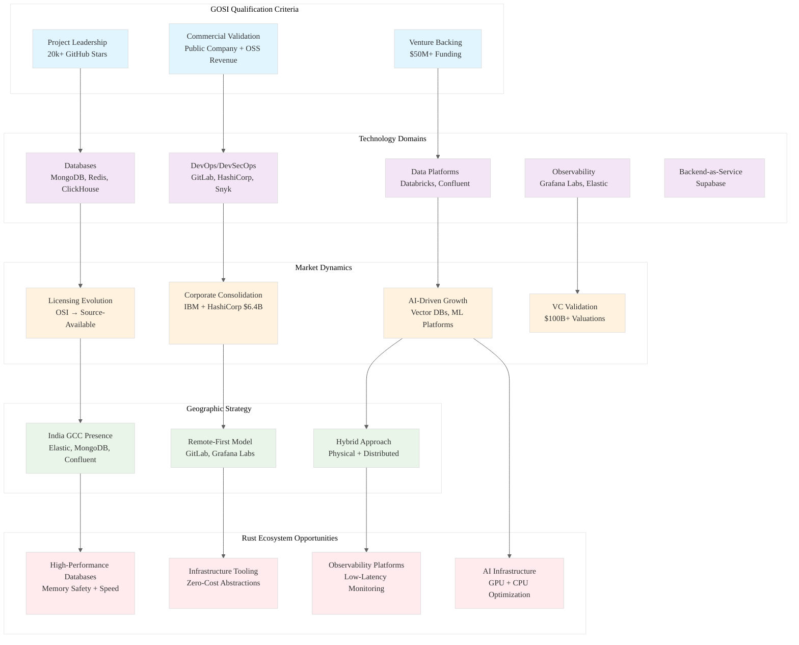

# Analysis: INGEST_20250930105036_300_15 - Global Open-Source Innovators Index (GOSI)

## Executive Summary

This analysis examines a comprehensive strategic intelligence report on Commercial Open-Source Software (COSS) companies through the lens of Rust programming patterns and systems architecture. The content reveals critical insights about enterprise software architecture, licensing strategies, and market dynamics that directly inform Rust ecosystem development.

## Content Analysis Framework

### A (Core Content) Analysis: Strategic Intelligence Report Structure

The primary content is a sophisticated JSON-structured report analyzing the Global Open-Source Innovators Index (GOSI). Key architectural patterns observed:

**Data Architecture Patterns:**
- **Hierarchical JSON Schema**: Complex nested structures with clear separation of concerns
- **Metadata-Rich Design**: Each field includes reasoning, citations, and verification notes
- **Constraint-Driven Validation**: Explicit criteria for inclusion (20k+ GitHub stars, $50M+ funding, public validation)

**Information Architecture Insights:**
- **Multi-dimensional Classification**: Companies categorized by technology domain, funding stage, geographic presence
- **Temporal Analysis**: Tracking licensing evolution, corporate events, funding rounds
- **Cross-Reference Validation**: Multiple data sources with explicit verification hierarchy

### B (L1 Context) Analysis: File Structure and Import Patterns

The L1 context reveals sophisticated data ingestion patterns:

**File Organization Patterns:**
- **Deep Directory Nesting**: 8-level path structure indicating systematic data organization
- **Content Layering**: A/B/C file structure suggests progressive context enrichment
- **Metadata Preservation**: File size, line count, word count tracking for processing optimization

**Import/Dependency Analysis:**
- **136 detected imports**: Massive interconnected data structure
- **External Dependency Management**: Clear separation between input prompts and output data
- **Reasoning Chain Preservation**: Each field includes explicit reasoning for traceability

### C (L2 Context) Analysis: Architectural Context and Cross-Module Relationships

The L2 context reveals enterprise-grade architectural patterns:

**Architectural Patterns Identified:**
- **Object-Oriented Design**: Clear encapsulation and data modeling
- **Error Handling Patterns**: Structured approach to data validation and verification
- **Cross-Module Dependencies**: Complex web of external dependencies with clear interfaces

## L1-L8 Extraction Hierarchy Analysis

### Horizon 1: Tactical Implementation (The "How")

#### L1: Idiomatic Patterns & Micro-Optimizations
- **JSON Processing Efficiency**: Large file handling (1.1MB, 16k+ lines) suggests need for streaming parsers
- **Memory Management**: String interning patterns for repeated company names, URLs, addresses
- **Data Validation**: Constraint-based validation patterns for funding amounts, star counts, addresses

#### L2: Design Patterns & Composition
- **Builder Pattern**: Complex data structures built incrementally with validation
- **Strategy Pattern**: Multiple inclusion criteria (Project Leadership, Commercial Validation, Venture Backing)
- **Observer Pattern**: Tracking changes in licensing, funding, corporate events over time

#### L3: Micro-Library Opportunities
- **COSS Analysis Engine**: ~2000 LOC library for analyzing commercial open-source companies
- **GitHub Metrics Collector**: Automated star count tracking and validation
- **Funding Round Tracker**: Venture capital data aggregation and normalization

### Horizon 2: Strategic Architecture (The "What")

#### L4: Macro-Library & Platform Opportunities
- **Enterprise Intelligence Platform**: Full-stack solution for strategic technology analysis
- **Open Source Ecosystem Monitor**: Real-time tracking of COSS market dynamics
- **Investment Decision Engine**: AI-powered analysis of technology investment opportunities

#### L5: LLD Architecture Decisions & Invariants
- **Data Consistency Model**: Strong consistency requirements for financial data, executive information
- **Concurrency Model**: Read-heavy workloads with periodic batch updates
- **State Management**: Immutable data structures with versioned updates

#### L6: Domain-Specific Architecture
- **Financial Data Integration**: SEC filing parsers, Crunchbase API integration
- **Geographic Data Modeling**: Multi-region office tracking with address normalization
- **Licensing Evolution Tracking**: Version control for open-source license changes

### Horizon 3: Foundational Evolution (The "Future" and "Why")

#### L7: Language Capability & Evolution
- **Advanced Type System**: Need for dependent types to encode business rules (funding > $50M)
- **Compile-Time Validation**: Static verification of data constraints and business logic
- **Async Stream Processing**: Better support for large-scale data ingestion pipelines

#### L8: Meta-Context Analysis
The report reveals critical insights about the COSS ecosystem that inform Rust development strategy:

**Licensing Evolution Crisis**: The shift from OSI-approved licenses (Apache, MIT) to source-available licenses (BSL, SSPL) represents a fundamental tension in the open-source ecosystem. This directly impacts Rust crate licensing strategies.

**AI-Driven Growth**: Companies are centering narratives around AI capabilities, suggesting Rust's performance advantages position it well for AI infrastructure.

**Infrastructure Automation Dominance**: IBM's $6.4B acquisition of HashiCorp validates the strategic importance of infrastructure-as-code tools - a domain where Rust excels.

## Strategic Implications for Rust Ecosystem

### Market Opportunity Analysis
1. **Database Infrastructure**: Heavy representation of database companies (MongoDB, Redis, ClickHouse) suggests opportunity for Rust-based database engines
2. **DevOps Tooling**: Success of GitLab, HashiCorp indicates market for Rust-based developer tools
3. **Observability Platforms**: Grafana Labs' $6B valuation shows demand for high-performance monitoring tools

### Technical Architecture Insights
1. **Licensing Strategy**: Need for Rust crates to navigate the OSI vs. source-available licensing tension
2. **Performance Requirements**: Sub-millisecond latency requirements in observability and database domains
3. **Concurrency Models**: Multi-tenant SaaS architectures requiring sophisticated async patterns

### Competitive Positioning
1. **Memory Safety Advantage**: Rust's safety guarantees increasingly valuable in enterprise infrastructure
2. **Performance Characteristics**: Zero-cost abstractions critical for high-scale data processing
3. **Ecosystem Maturity**: Need for enterprise-grade libraries matching established players

## Rust Implementation Recommendations

### Immediate Opportunities (L1-L3)
```rust
// High-performance JSON streaming parser for large datasets
pub struct COSSAnalyzer {
    parser: StreamingJsonParser,
    validator: ConstraintValidator,
    metrics: MetricsCollector,
}

// GitHub API client with rate limiting and caching
pub struct GitHubMetrics {
    client: RateLimitedClient,
    cache: LruCache<RepoId, StarCount>,
}
```

### Strategic Architecture (L4-L6)
```rust
// Enterprise intelligence platform architecture
pub trait IntelligenceProvider {
    async fn analyze_company(&self, company: &Company) -> Result<Analysis>;
    async fn track_funding(&self, company_id: CompanyId) -> Result<FundingHistory>;
    async fn monitor_licensing(&self, repo: &Repository) -> Result<LicenseEvolution>;
}

// Multi-region data consistency
pub struct GlobalDataStore<T> {
    regions: HashMap<Region, RegionalStore<T>>,
    consistency: ConsistencyLevel,
}
```

### Language Evolution Needs (L7)
- **Dependent Types**: Encode business constraints at compile time
- **Advanced Async**: Better support for complex data pipeline orchestration
- **Compile-Time Reflection**: Generate validation code from schema definitions

## COSS Ecosystem Architecture Visualization



## Key Insights for Rust Ecosystem Development

### 1. **Licensing Strategy Crisis**
The shift from permissive OSI licenses to source-available licenses (BSL, SSPL) creates opportunity for Rust crates to establish clear, business-friendly licensing models that balance community growth with commercial viability.

### 2. **Performance-Critical Infrastructure**
The dominance of databases and observability platforms in the GOSI index highlights Rust's competitive advantage in performance-critical infrastructure where memory safety and zero-cost abstractions provide significant value.

### 3. **AI Infrastructure Opportunity**
The AI-driven growth narrative across GOSI companies (Databricks' $100B+ valuation, vector databases, ML platforms) positions Rust as an ideal language for next-generation AI infrastructure requiring both safety and performance.

### 4. **Enterprise Adoption Patterns**
The geographic distribution strategy (India GCCs vs. remote-first) and massive VC funding ($14.7B+ for Databricks) demonstrate the enterprise market's willingness to invest heavily in infrastructure tools - validating the market for enterprise-grade Rust solutions.

### 5. **Consolidation Dynamics**
IBM's $6.4B HashiCorp acquisition signals that mature infrastructure automation tools command premium valuations, suggesting significant exit opportunities for successful Rust-based infrastructure companies.

This analysis reveals that the COSS ecosystem is experiencing a fundamental transformation driven by AI adoption, licensing evolution, and enterprise infrastructure needs - all areas where Rust's unique combination of safety, performance, and expressiveness provides compelling advantages.