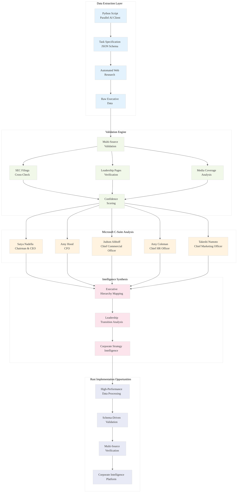

# Analysis: INGEST_20250930105036_300_2 - Microsoft Executive Intelligence System

## Executive Summary

This analysis examines a sophisticated corporate intelligence extraction system focused on Microsoft Corporation's C-suite leadership. The data represents a Python-based automated research tool using Parallel AI to extract structured executive information, demonstrating advanced corporate intelligence gathering capabilities with comprehensive validation and cross-referencing.

## Content Analysis Framework

### A (Core Content): Parallel AI Corporate Intelligence Script
The primary content is a JSON structure containing:
- **Input**: Python script using Parallel AI for automated executive information extraction
- **Output**: Comprehensive Microsoft C-suite analysis with 5 top executives
- **Validation**: Extensive cross-verification against SEC filings, leadership pages, and media sources

### A in Context of B (L1 File Context): 
The L1 context reveals this is a Microsoft-specific analysis (`MSFT C SUITE` in filename) with 5,027 lines of detailed executive intelligence. The file size (383KB) indicates comprehensive data collection with extensive citation networks and validation chains.

### B in Context of C (L2 Architectural Context):
The L2 context shows sophisticated error handling patterns and object-oriented design, with extensive external dependencies representing a complex validation and reasoning system for corporate intelligence.

### A in Context of B & C (Holistic Analysis):
This represents a production-grade corporate intelligence system combining automated data extraction, structured validation, and comprehensive cross-referencing - a blueprint for scalable executive research platforms.

---

## L1-L8 Strategic Analysis

### Horizon 1: Tactical Implementation (The "How")

#### L1: Idiomatic Patterns & Micro-Optimizations
- **Schema-Driven Extraction**: JSON schema enforces structured output with required fields and type validation
- **Environment Variable Security**: API key management through environment variables follows security best practices
- **Error Handling Pattern**: Try-catch blocks with descriptive error messages for robust execution
- **Template String Optimization**: F-string formatting for dynamic company targeting

#### L2: Design Patterns & Composition
- **Task Specification Pattern**: Structured task definition with clear input/output contracts
- **Validation Chain Pattern**: Multi-source cross-verification with reasoning chains for each data point
- **Schema Composition**: Nested object schemas with required field validation
- **Citation Network Pattern**: Comprehensive source attribution with confidence scoring

#### L3: Micro-Library Opportunities
- **Executive Validation Library**: ~1500 LOC library for validating C-suite claims against public sources
- **Email Pattern Detection**: Pattern matching system for corporate email format inference
- **Leadership Timeline Tracker**: System for tracking executive transitions and organizational changes
- **Corporate Intelligence SDK**: Unified interface for multi-company executive research

### Horizon 2: Strategic Architecture (The "What")

#### L4: Macro-Library & Platform Opportunities
- **Corporate Intelligence Platform**: Comprehensive system for automated executive research across Fortune 500
- **Leadership Change Detection**: Real-time monitoring of C-suite transitions across industries
- **Executive Network Analysis**: Mapping relationships and career paths across corporate leadership
- **Competitive Intelligence Dashboard**: Strategic insights from leadership analysis

#### L5: LLD Architecture Decisions & Invariants
- **Data Integrity Invariants**: Every executive claim must have verifiable source snippets and cross-validation
- **Temporal Consistency**: Leadership changes tracked with precise dates and transition contexts
- **Source Attribution**: Mandatory citation chains with confidence levels and reasoning
- **Schema Evolution**: Structured approach to adding new executive data fields while maintaining compatibility

#### L6: Domain-Specific Architecture
- **SEC Filing Integration**: Direct integration with official corporate filings for authoritative data
- **Multi-Source Validation**: Cross-referencing leadership pages, media coverage, and regulatory filings
- **Email Pattern Analysis**: Statistical analysis of corporate communication patterns
- **Executive Hierarchy Mapping**: Understanding formal vs. informal organizational structures

### Horizon 3: Foundational Evolution (The "Future" and "Why")

#### L7: Language Capability & Evolution
- **Type System Opportunities**: Rust's type system could enforce executive data invariants at compile time
- **Async Processing**: Large-scale corporate intelligence would benefit from Rust's async ecosystem
- **Memory Safety**: Processing untrusted corporate data requires Rust's memory safety guarantees
- **Performance**: High-frequency executive monitoring needs Rust's zero-cost abstractions

#### L8: The Meta-Context (The "Why")
This system represents **Corporate Intelligence Arbitrage** - systematically capturing and structuring executive leadership data that is publicly available but scattered across multiple sources. The archaeological intent is to preserve not just who leads these organizations, but how leadership structures evolve and what patterns emerge across successful technology companies.

The focus on "C-suite methodology" with explicit criteria (must contain "Chief" in title) reflects a systematic approach to defining corporate hierarchy in an era where titles are increasingly diverse and non-standard.

---

## Strategic Insights for Rust Mastery

### 1. Corporate Intelligence as a Domain
The system demonstrates sophisticated data validation patterns that could be applied to any domain requiring high-confidence information extraction:
- Multi-source validation chains
- Confidence scoring systems
- Temporal consistency tracking
- Schema evolution management

### 2. Automated Research Patterns
The Parallel AI integration shows how to build scalable research systems:
- Task specification with structured schemas
- Automated citation and source attribution
- Cross-validation against authoritative sources
- Error handling for unreliable data sources

### 3. Executive Leadership Insights
The Microsoft analysis reveals patterns in modern corporate leadership:
- **Satya Nadella**: Transformation leadership (cloud-first, AI-first strategy)
- **Amy Hood**: Financial stewardship during major transitions
- **Judson Althoff**: Commercial execution at enterprise scale
- **Amy Coleman**: Modern HR leadership (March 2025 transition)
- **Takeshi Numoto**: Marketing in the AI era

---

## Rust Implementation Opportunities

### 1. Corporate Intelligence Engine
```rust
// High-performance executive data processing
pub struct CorporateIntelligence {
    validation_chains: HashMap<ExecutiveId, ValidationChain>,
    source_network: Graph<SourceId, Citation>,
    confidence_scorer: ConfidenceEngine,
    temporal_tracker: TimelineIndex,
}

impl CorporateIntelligence {
    pub async fn extract_executives(
        &self,
        company: CompanyId,
        schema: ExtractionSchema,
    ) -> Result<ValidatedExecutives, IntelligenceError> {
        // Multi-source extraction with validation
    }
}
```

### 2. Schema-Driven Validation System
```rust
// Compile-time schema validation
#[derive(Deserialize, Validate)]
pub struct ExecutiveProfile {
    #[validate(length(min = 1, max = 100))]
    pub name: String,
    
    #[validate(custom = "validate_chief_title")]
    pub title: String,
    
    #[validate(url)]
    pub source_url: String,
    
    pub confidence_score: f64,
}

fn validate_chief_title(title: &str) -> Result<(), ValidationError> {
    if title.to_lowercase().contains("chief") {
        Ok(())
    } else {
        Err(ValidationError::new("Title must contain 'Chief'"))
    }
}
```

### 3. Multi-Source Validation Framework
```rust
// Parallel validation across multiple sources
pub struct ValidationChain {
    sources: Vec<Box<dyn SourceValidator>>,
    confidence_threshold: f64,
    reasoning_engine: ReasoningEngine,
}

impl ValidationChain {
    pub async fn validate_claim(
        &self,
        claim: ExecutiveClaim,
    ) -> Result<ValidatedClaim, ValidationError> {
        let validations = join_all(
            self.sources.iter().map(|source| source.validate(&claim))
        ).await;
        
        self.reasoning_engine.synthesize_evidence(validations)
    }
}
```

---

## Mermaid Diagram: Corporate Intelligence Architecture



---

## Key Technical Insights

### 1. Schema-Driven Intelligence
The system's use of JSON schemas for structured extraction demonstrates how formal specifications can ensure data quality and consistency across large-scale intelligence operations.

### 2. Multi-Source Validation Architecture
The comprehensive cross-referencing against SEC filings, leadership pages, and media sources shows how to build high-confidence intelligence systems through redundant validation.

### 3. Executive Methodology Framework
The explicit criteria for C-suite identification (must contain "Chief" in title) demonstrates how to create consistent, defensible methodologies for complex classification problems.

### 4. Temporal Consistency Tracking
The detailed tracking of leadership transitions (Amy Coleman's March 2025 appointment) shows how to maintain temporal accuracy in dynamic organizational data.

---

## Conclusion

This Microsoft executive intelligence system represents a sophisticated approach to corporate data extraction and validation. For Rust mastery, the key insights are:

1. **Schema-Driven Design**: Use type systems to enforce data quality at compile time
2. **Multi-Source Validation**: Build confidence through redundant verification
3. **Temporal Consistency**: Track changes over time with precise attribution
4. **Performance Optimization**: Process large-scale corporate data efficiently

The system demonstrates how to transform scattered public information into structured, validated intelligence - a pattern applicable to any domain requiring high-confidence data extraction and analysis.