# Analysis: INGEST_20250930105036_300_5

## Content Analysis Framework

**File A**: `.wipToBeDeletedFolder/INGEST_20250930105036_300_5_Content.txt` - Comprehensive storage architecture analysis for Parseltongue AIM Daemon, evaluating SQLite, in-memory structures, graph databases, and hybrid architectures

**File B**: `.wipToBeDeletedFolder/INGEST_20250930105036_300_5_Content_L1.txt` - L1 immediate file context with 154 detected imports/dependencies

**File C**: `.wipToBeDeletedFolder/INGEST_20250930105036_300_5_Content_L2.txt` - L2 architectural context showing object-oriented, trait-based, async, and error handling patterns

## L1-L8 Strategic Analysis

### L1: Idiomatic Patterns & Micro-Optimizations

**A alone**: The document demonstrates sophisticated performance engineering with specific micro-optimizations like `PRAGMA synchronous=NORMAL` for SQLite, `FxHashMap` over standard `HashMap` for faster hashing, and BLAKE3 for high-performance cryptographic operations.

**A in context of B**: The L1 context reveals this is a massive 6768-line analysis with 154 dependencies, indicating comprehensive research depth. The file size (754KB) suggests extensive benchmarking data and performance measurements.

**B in context of C**: The L2 context shows this fits into a broader architectural pattern analysis system, with trait-based design patterns and async programming patterns being key architectural concerns.

**A in context B & C**: This represents a **Performance-First Architecture Decision Framework** - a systematic approach to evaluating storage solutions with quantified performance targets (<500μs queries, <12ms updates) and specific Rust ecosystem constraints.

### L2: Design Patterns & Composition (Meta-Patterns)

The analysis reveals several critical **Rust Systems Architecture Patterns**:

1. **Layered Performance Architecture**: SQLite (embedded) → In-Memory (performance) → Specialized DBs (scale) → Hybrid (optimization)
2. **Constraint-Driven Design**: All solutions evaluated against non-negotiable performance SLOs
3. **Ecosystem Integration Pattern**: Rust-first approach with careful evaluation of FFI costs
4. **Evolutionary Architecture**: MVP → v2.0 → v3.0 migration paths with clear upgrade strategies

### L3: Micro-Library Opportunities

**High-Value Rust Libraries Identified**:
- **`graph-storage-benchmarks`**: Comprehensive benchmarking suite for graph storage solutions
- **`isg-optimizer`**: Interface Signature Graph optimization with compression strategies (Roaring bitmaps, dictionary encoding)
- **`hybrid-cache-coordinator`**: Manages consistency between hot cache and persistent storage
- **`performance-slo-validator`**: Automated SLO breach detection and alerting

### L4: Macro-Library & Platform Opportunities

**Parseltongue AIM Daemon Architecture**: This represents a **Real-Time Codebase Intelligence Platform** that could dominate the developer tooling space. Key opportunities:

1. **Graph Database Abstraction Layer**: Unified API across SQLite, SurrealDB, Memgraph, TigerGraph
2. **Performance-Aware Storage Router**: Automatically selects optimal storage based on workload characteristics
3. **LLM-Optimized Query Engine**: Specialized for AI tool consumption with sub-millisecond response times

### L5: LLD Architecture Decisions & Invariants

**Critical System Invariants**:
1. **Single-Writer Concurrency Model**: SQLite WAL mode with application-level write serialization
2. **Memory Scaling Boundaries**: 73% HashMap overhead becomes critical at 1M+ LOC scale
3. **Durability vs Performance Trade-offs**: `synchronous=NORMAL` vs `synchronous=FULL` impacts
4. **Cache Coherency Protocols**: Hot cache invalidation strategies in hybrid architectures

**Rust-Specific Implementation Requirements**:
- Use `DashMap` with careful deadlock avoidance patterns
- Implement `Send + Sync` for concurrent graph access
- Leverage `Arc<str>` for string interning in large graphs
- Apply `#[repr(C)]` for SIMD-optimized graph traversals

### L6: Domain-Specific Architecture & Hardware Interaction

**Performance Engineering Insights**:
- **Memory Layout Optimization**: `petgraph::Csr` for compressed sparse graphs
- **Cache-Friendly Traversals**: Sequential data layouts for BFS/DFS operations
- **SIMD Acceleration**: Vectorized graph operations for blast-radius calculations
- **Storage Hierarchy**: Hot/warm/cold data tiering based on access patterns

**Hardware-Specific Optimizations**:
- Memory-mapped files (`mmap_size`) for large datasets
- NVMe-optimized WAL checkpointing strategies
- NUMA-aware memory allocation for multi-socket systems

### L7: Language Capability & Evolution

**Rust Language Limitations Identified**:
1. **Async Graph Traversals**: Current async/await model not optimal for recursive graph algorithms
2. **Zero-Copy Deserialization**: `rkyv` shows promise but ecosystem maturity concerns
3. **Concurrent Data Structure Gaps**: `DashMap` deadlock issues highlight need for better concurrent collections
4. **Type-Level Performance Guarantees**: Need for compile-time SLO validation

**Future Language Features Needed**:
- Async recursion without heap allocation
- Better support for lock-free data structures
- Compile-time memory layout optimization
- Performance-aware type system

### L8: The Meta-Context (Intent Archaeology)

**Historical Context**: This analysis represents the evolution from simple database selection to **Performance-Driven Architecture Design**. The systematic evaluation of 6 different storage approaches with quantified trade-offs shows mature systems thinking.

**Strategic Intent**: The real goal isn't just storage selection - it's building a **Knowledge Arbitrage Platform** that can process and understand codebases at unprecedented scale and speed. The <500μs query requirement suggests real-time developer assistance capabilities.

**Future Implications**: This methodology could be applied to:
- Real-time code analysis for AI pair programming
- Instant codebase understanding for LLM training
- Performance-critical developer tooling infrastructure
- Large-scale software engineering analytics

## Mermaid Diagram: High-Performance Storage Architecture Evolution

```mermaid
%%{init: {
  "theme": "base",
  "themeVariables": {
    "primaryColor": "#F5F5F5",
    "secondaryColor": "#E0E0E0",
    "lineColor": "#616161",
    "textColor": "#212121",
    "fontSize": "16px",
    "fontFamily": "Helvetica, Arial, sans-serif"
  },
  "flowchart": {
    "nodeSpacing": 70,
    "rankSpacing": 80,
    "wrappingWidth": 160,
    "curve": "basis"
  },
  "useMaxWidth": false
}}%%

flowchart TD
    subgraph "Performance Requirements"
        direction TB
        A[Sub-millisecond Queries<br/>&lt;500μs simple, &lt;1ms complex] --> B[High-Speed Updates<br/>&lt;12ms pipeline latency]
        B --> C[Rust-Only Ecosystem<br/>Zero FFI overhead]
        C --> D[Scale Requirements<br/>10K LOC → 10M+ LOC]
    end
    
    subgraph "MVP Phase: SQLite Foundation"
        direction TB
        D --> E[SQLite + WAL Mode<br/>PRAGMA synchronous=NORMAL]
        E --> F[Single-Writer Queue<br/>Avoid SQLITE_BUSY]
        F --> G[Recursive CTEs<br/>Graph traversals]
    end
    
    subgraph "v2.0 Phase: Hybrid Architecture"
        direction TB
        G --> H[Hot Cache Layer<br/>DashMap&lt;SigHash, Node&gt;]
        H --> I[Persistence Layer<br/>SQLite backend]
        I --> J[Sync Coordinator<br/>Cache coherency]
    end
    
    subgraph "v3.0 Phase: Custom Optimization"
        direction TB
        J --> K[Compressed Storage<br/>Roaring bitmaps + Dictionary]
        K --> L[SIMD Traversals<br/>Cache-friendly layouts]
        L --> M[Zero-Copy Queries<br/>rkyv serialization]
    end
    
    subgraph "Performance Optimizations"
        direction TB
        N[FxHashMap<br/>Fast hashing]
        O[BLAKE3<br/>5x faster crypto]
        P[Memory Interning<br/>Arc&lt;str&gt; sharing]
        Q[Batch Transactions<br/>2x-20x throughput]
    end
    
    M --> N
    N --> O
    O --> P
    P --> Q
    
    subgraph "Risk Mitigation"
        direction TB
        R[Checkpoint Starvation<br/>WAL file growth]
        S[DashMap Deadlocks<br/>Reference management]
        T[Memory Scaling<br/>73% HashMap overhead]
        U[SLO Breach Detection<br/>Automated monitoring]
    end
    
    Q --> R
    R --> S
    S --> T
    T --> U
    
    classDef requirementNode fill:#E8F5E8,stroke:#4CAF50,stroke-width:2px
    classDef mvpNode fill:#E3F2FD,stroke:#2196F3,stroke-width:2px
    classDef hybridNode fill:#FFF3E0,stroke:#FF9800,stroke-width:2px
    classDef customNode fill:#F3E5F5,stroke:#9C27B0,stroke-width:2px
    classDef optimizationNode fill:#FFEBEE,stroke:#F44336,stroke-width:2px
    classDef riskNode fill:#FFF8E1,stroke:#FFC107,stroke-width:2px
    
    class A,B,C,D requirementNode
    class E,F,G mvpNode
    class H,I,J hybridNode
    class K,L,M customNode
    class N,O,P,Q optimizationNode
    class R,S,T,U riskNode
```

## Strategic Recommendations

1. **Immediate Action**: Implement SQLite WAL mode with performance tuning as MVP foundation
2. **Medium-term**: Build hybrid architecture with hot cache layer for performance scaling
3. **Long-term**: Develop custom Rust graph storage with SIMD optimizations for ultimate performance

This analysis reveals a sophisticated approach to performance-driven architecture design that could revolutionize real-time developer tooling and codebase intelligence systems.