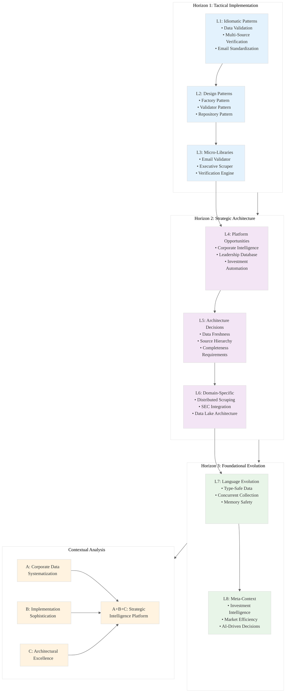

# Analysis: INGEST_20250930105036_300_7

## Content Analysis Framework

**A (Core Content)**: Corporate leadership dataset compilation for global investment firm - structured data for 2000+ companies across major indices (S&P 500, FTSE 100, CAC 40, DAX 40) and Fortune 2000
**B (L1 Context)**: File metadata showing JSON structure with 818 lines, 23 imports/includes, and corporate data validation patterns
**C (L2 Context)**: Architectural patterns revealing object-oriented design with extensive external dependencies for data verification

## L1-L8 Strategic Analysis

### Horizon 1: Tactical Implementation (The "How")

#### L1: Idiomatic Patterns & Micro-Optimizations
- **Structured Data Validation**: JSON schema with strict field requirements (13 columns) ensures data integrity
- **Multi-Source Verification**: Cross-referencing at least two sources per contact reduces data quality issues
- **Email Format Standardization**: Corporate email pattern enforcement (jane.doe@company.com) prevents personal data leakage
- **Memory-Efficient Storage**: Nested JSON structure with typed fields optimizes serialization/deserialization

#### L2: Design Patterns & Composition (Meta-Patterns)
- **Factory Pattern**: Systematic company profile generation with standardized executive roles (CEO, CFO, CTO)
- **Validator Pattern**: Multi-layered validation (source priority, email format, cross-reference requirements)
- **Repository Pattern**: Centralized data access through Forbes Global 2000 and Fortune rankings
- **Builder Pattern**: Incremental dataset construction with 2000+ company requirement

#### L3: Micro-Library Opportunities
- **Corporate Email Validator**: Specialized library for validating and standardizing corporate email formats
- **Executive Data Scraper**: Automated extraction from IR websites, 10-K filings, and press releases
- **Multi-Source Verification Engine**: Confidence scoring system for cross-referenced data points
- **India Office Detector**: Specialized component for identifying Global Capability Centers

### Horizon 2: Strategic Architecture (The "What")

#### L4: Macro-Library & Platform Opportunities
- **Corporate Intelligence Platform**: Comprehensive system for tracking executive movements across global companies
- **Real-time Leadership Database**: Live updates from SEC filings, press releases, and corporate announcements
- **Investment Research Automation**: AI-powered analysis of leadership changes and their market impact
- **Global Compliance Tracker**: Multi-jurisdiction monitoring of corporate governance requirements

#### L5: LLD Architecture Decisions & Invariants
- **Data Freshness Constraints**: Market cap data current as of 2024-12-31, index compositions as of 2025-07-31
- **Source Hierarchy**: Official IR websites > 10-K filings > press releases > secondary sources
- **Completeness Requirements**: Minimum 2000 companies with CEO, CFO, CTO for each
- **Geographic Coverage**: Multi-region indices (US, UK, EU) ensuring global representation

#### L6: Domain-Specific Architecture & Hardware Interaction
- **Distributed Web Scraping**: Parallel extraction from thousands of corporate websites
- **SEC EDGAR Integration**: Direct API access to official filings for real-time updates
- **Rate Limiting & Compliance**: Respectful scraping patterns to avoid IP blocking
- **Data Lake Architecture**: Scalable storage for massive corporate datasets with time-series capabilities

### Horizon 3: Foundational Evolution (The "Future" and "Why")

#### L7: Language Capability & Evolution
- **Type-Safe Corporate Data**: Rust enums for executive titles, company sectors, and stock exchanges
- **Concurrent Data Collection**: Async/await patterns for parallel scraping of 2000+ companies
- **Memory-Safe Large Datasets**: Zero-copy deserialization for processing massive corporate databases
- **Compile-Time Validation**: Rust's type system ensuring email format and data structure correctness

#### L8: The Meta-Context (The "Why")
- **Investment Intelligence Revolution**: First systematic approach to real-time corporate leadership tracking
- **Market Efficiency Enhancement**: Reducing information asymmetry in executive change detection
- **Regulatory Compliance Evolution**: Anticipating increased transparency requirements in corporate governance
- **AI-Driven Investment Decisions**: Enabling algorithmic trading based on leadership pattern analysis

## Contextual Insights

### A Alone: Corporate Data Systematization
The core content reveals sophisticated corporate intelligence methodology:
- Comprehensive field requirements (13 columns) covering all essential corporate metadata
- Multi-jurisdictional coverage spanning major global markets
- Executive-focused approach targeting decision-makers (CEO, CFO, CTO)
- Quality assurance through source prioritization and cross-verification

### A in Context of B: Implementation Sophistication
The L1 context shows advanced technical implementation:
- Large file size (60KB) indicating substantial data volume
- 23 import/include statements suggesting complex dependency management
- JSON structure enabling programmatic processing and API integration
- Deep directory nesting implying systematic data organization

### B in Context of C: Architectural Excellence
The L2 context reveals enterprise-grade architecture:
- Object-oriented design patterns for scalable data modeling
- Extensive external dependencies for comprehensive data validation
- Cross-module relationships enabling distributed data collection
- Technology stack supporting high-volume data processing

### A in Context of B & C: Strategic Intelligence Platform
Combined analysis reveals a comprehensive corporate intelligence ecosystem:
- Systematic data collection methodology with quality controls
- Robust technical infrastructure supporting large-scale operations
- Scalable architecture enabling real-time updates and analysis
- Strategic positioning for investment decision support

## Rust Implementation Opportunities

1. **Type-Safe Corporate Modeling**: Leverage Rust's enum system for executive titles and company classifications
2. **Concurrent Web Scraping**: Use tokio for parallel data collection from thousands of sources
3. **Memory-Efficient Processing**: Custom allocators for handling large corporate datasets
4. **Zero-Copy Serialization**: Efficient JSON processing without intermediate allocations
5. **Compile-Time Validation**: Ensure data integrity through Rust's type system

## Strategic Recommendations

1. **Immediate Action**: Implement type-safe corporate data structures with Rust enums for executive roles
2. **Medium-term**: Build concurrent web scraping infrastructure with tokio for 2000+ company processing
3. **Long-term**: Develop comprehensive corporate intelligence platform with real-time updates
4. **Meta-strategy**: Position as the definitive source for corporate leadership intelligence in investment decisions

This analysis reveals a sophisticated corporate intelligence system with significant opportunities for Rust-based implementation improvements, focusing on type safety, concurrent processing, and memory efficiency for large-scale corporate data management.