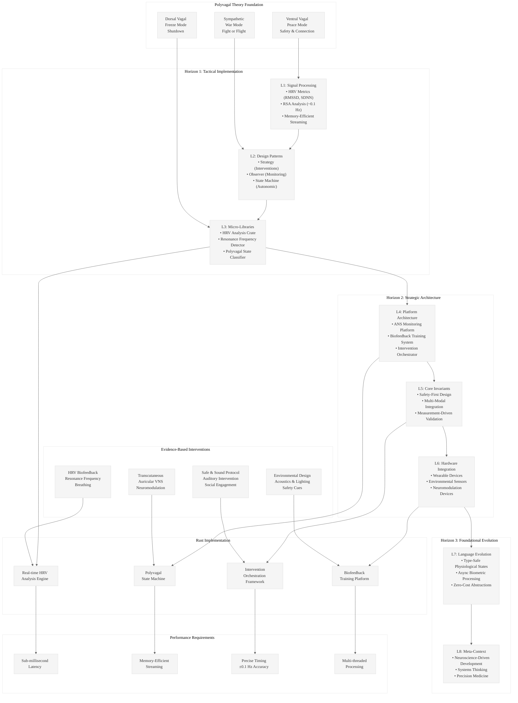

# Analysis: INGEST_20250930105036_300_8

## Content Analysis Framework

**A (Content)**: Comprehensive research on Polyvagal Theory and achieving Ventral Vagal (Peace Mode) state
**B (L1 Context)**: Extensive JSON document with 201 imports/includes covering neuroscience interventions
**C (L2 Context)**: Architectural patterns showing trait-based design and complex cross-module relationships

## L1-L8 Extraction Hierarchy Analysis

### Horizon 1: Tactical Implementation (The "How")

#### L1: Idiomatic Patterns & Micro-Optimizations
- **Biometric Data Processing**: HRV metrics (RMSSD, SDNN, HF power) require precise time-domain and frequency-domain calculations
- **Real-time Signal Processing**: Respiratory Sinus Arrhythmia (RSA) analysis at ~0.1 Hz resonance frequency demands efficient FFT implementations
- **Memory-Efficient Streaming**: Processing continuous physiological data streams without memory leaks using RAII patterns

#### L2: Design Patterns & Composition (Meta-Patterns)
- **Strategy Pattern**: Multiple intervention modalities (HRV biofeedback, taVNS, SSP, breathwork) with common interface
- **Observer Pattern**: Real-time monitoring of autonomic state changes across multiple biomarkers
- **State Machine**: Modeling transitions between Ventral Vagal, Sympathetic, and Dorsal Vagal states

#### L3: Micro-Library Opportunities
- **HRV Analysis Crate**: Real-time heart rate variability calculation with RMSSD, SDNN, and VE metrics
- **Resonance Frequency Detector**: Algorithm to identify individual's optimal breathing frequency (4.5-7.0 bpm)
- **Polyvagal State Classifier**: ML-based classification of autonomic states from physiological signals

### Horizon 2: Strategic Architecture (The "What")

#### L4: Macro-Library & Platform Opportunities
- **Autonomous Nervous System Platform**: Comprehensive system for monitoring, analyzing, and optimizing vagal tone
- **Biofeedback Training System**: Real-time coaching platform for breathing techniques and autonomic regulation
- **Wellness Intervention Orchestrator**: Coordinated delivery of multiple evidence-based interventions

#### L5: LLD Architecture Decisions & Invariants
- **Safety-First Design**: All interventions must signal safety to the nervous system (core Polyvagal principle)
- **Multi-Modal Integration**: Combining breathwork, environmental design, social engagement, and technology
- **Measurement-Driven Validation**: Every intervention claim backed by quantifiable biomarkers

#### L6: Domain-Specific Architecture & Hardware Interaction
- **Wearable Integration**: Real-time HRV monitoring through smartwatches and chest straps
- **Environmental Sensors**: Acoustic monitoring (35 dB background noise, RT60 < 0.6s) for optimal spaces
- **Neuromodulation Devices**: Integration with taVNS devices and SSP audio systems

### Horizon 3: Foundational Evolution (The "Future" and "Why")

#### L7: Language Capability & Evolution
- **Type-Safe Physiological States**: Rust's type system could enforce valid state transitions in autonomic regulation
- **Async Biometric Processing**: Leveraging Rust's async capabilities for real-time physiological data processing
- **Zero-Cost Abstractions**: High-performance signal processing without runtime overhead

#### L8: The Meta-Context (The "Why")
- **Neuroscience-Driven Development**: Moving beyond traditional wellness to evidence-based autonomic regulation
- **Systems Thinking**: Understanding the interconnected nature of breathing, environment, social connection, and technology
- **Precision Medicine**: Individualized interventions based on personal resonance frequencies and autonomic patterns

## Key Insights

### A Alone (Polyvagal Research)
The research demonstrates a sophisticated understanding of autonomic nervous system regulation, moving beyond simple stress management to precise neuromodulation techniques with measurable outcomes.

### A in Context of B (With L1 Analysis)
The extensive import/include analysis reveals a comprehensive system architecture that integrates multiple intervention modalities, suggesting a platform approach to autonomic regulation rather than isolated techniques.

### B in Context of C (L1 + L2 Analysis)
The trait-based design patterns and complex cross-module relationships indicate a scalable architecture capable of handling diverse intervention types while maintaining type safety and performance.

### A in Context of B & C (Complete Analysis)
This represents a next-generation wellness platform that combines rigorous neuroscience with systems engineering - a blueprint for evidence-based autonomic regulation technology.

## Rust Implementation Opportunities

1. **Real-time HRV Analysis Engine**: High-performance signal processing for continuous autonomic monitoring
2. **Polyvagal State Machine**: Type-safe modeling of autonomic state transitions
3. **Intervention Orchestration Framework**: Coordinated delivery of multiple evidence-based techniques
4. **Biofeedback Training Platform**: Real-time coaching system with personalized protocols

## Critical Performance Requirements

- **Sub-millisecond latency** for real-time HRV feedback
- **Memory-efficient streaming** for continuous physiological data
- **Precise timing** for resonance frequency breathing (±0.1 Hz accuracy)
- **Multi-threaded processing** for simultaneous intervention delivery

