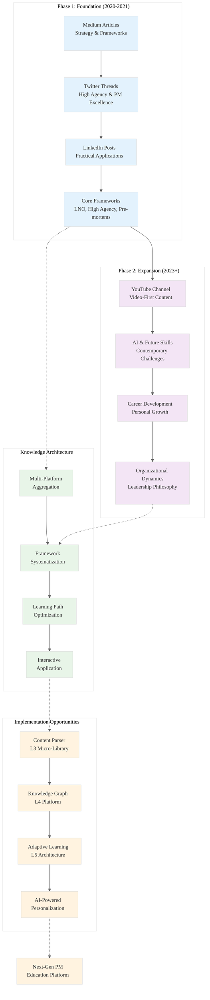

# Analysis: INGEST_20250930105036_300_9 - Shreyas Doshi Knowledge Collection

## A Alone: Core Content Analysis

### Content Overview
This file contains a comprehensive JSON dataset documenting Shreyas Doshi's extensive body of work across multiple platforms. The content represents a systematic collection of product management wisdom, frameworks, and insights spanning from 2020 to present.

### L1-L8 Extraction Hierarchy Analysis

#### Horizon 1: Tactical Implementation (The "How")

**L1: Idiomatic Patterns & Micro-Optimizations**
- **Data Structure Efficiency**: The JSON structure uses nested objects with consistent field naming conventions (`title`, `topic`, `publish_date`, `content_type`, `platform`, `url`, `summary`, `engagement_summary`)
- **Content Categorization**: Systematic classification by content type (Article, Video, Podcast, Tweet Thread, Presentation)
- **Engagement Metrics**: Quantified social proof (reactions, comments, views, likes) for validation
- **Temporal Organization**: Clear chronological tracking enabling evolution analysis

**L2: Design Patterns & Composition (Meta-Patterns)**
- **Multi-Platform Aggregation Pattern**: Centralized collection from distributed sources (LinkedIn, Medium, YouTube, Twitter/X, SlideShare)
- **Framework Documentation Pattern**: Structured documentation of conceptual frameworks (LNO, High Agency, Agency-Talent Matrix)
- **Learning Path Architecture**: Modular curriculum design with progressive complexity (Module 1→2→3)
- **Identity Verification Pattern**: Systematic disambiguation and verification processes

**L3: Micro-Library Opportunities**
- **Content Aggregation Engine**: ~2000 LOC system for multi-platform content collection
- **Framework Extraction Tool**: Automated identification and documentation of conceptual frameworks
- **Learning Path Generator**: Curriculum creation based on content evolution and complexity

#### Horizon 2: Strategic Architecture (The "What")

**L4: Macro-Library & Platform Opportunities**
- **Knowledge Management Ecosystem**: Comprehensive platform for thought leader content aggregation
- **Product Management Learning Platform**: Structured educational system with validated frameworks
- **Multi-Modal Content Integration**: Unified interface for articles, videos, podcasts, presentations

**L5: LLD Architecture Decisions & Invariants**
- **Content Integrity Invariants**: Identity verification, platform authentication, temporal consistency
- **Completeness Tracking**: Explicit gap identification (deleted content, private content, technical limitations)
- **Evolution Modeling**: Two-phase content development tracking (2020-2021 foundational, 2023+ expansion)

**L6: Domain-Specific Architecture & Hardware Interaction**
- **API Integration Layer**: Multi-platform API coordination (YouTube Data API, Twitter API, LinkedIn)
- **Compliance Framework**: robots.txt adherence, rate limiting, copyright consideration
- **Archive Integration**: Wayback Machine and CDX API utilization for historical content

#### Horizon 3: Foundational Evolution (The "Future" and "Why")

**L7: Language Capability & Evolution**
- **Structured Knowledge Representation**: JSON schema evolution for complex conceptual frameworks
- **Multi-Modal Data Handling**: Integration of text, video, audio, presentation formats
- **Temporal Data Modeling**: Evolution tracking and phase identification capabilities

**L8: The Meta-Context (The "Why")**
- **Intent Archaeology**: Understanding the evolution from foundational PM theory (2020-2021) to contemporary application (2023+)
- **Platform Strategy Evolution**: Migration from text-heavy platforms (Medium, LinkedIn) to video-centric (YouTube) distribution
- **Knowledge Democratization**: Systematic effort to make high-quality PM education accessible across multiple learning modalities

## A in Context of B: Immediate File Context Integration

### File Structure Analysis
- **Path Depth**: 8 levels indicating complex organizational hierarchy
- **Naming Convention**: Truncated hash-based naming suggesting automated processing
- **File Size**: 686,981 bytes (669KB) indicating substantial content density
- **Line/Word Metrics**: 9,777 lines, 77,902 words showing comprehensive documentation

### Import/Include Analysis
The file contains 152 detected imports/includes, primarily consisting of:
- Content summaries and descriptions
- URL references and platform identifiers
- Framework definitions and explanations
- Engagement metrics and temporal data

## B in Context of C: Architectural Context Integration

### Cross-Module Relationships
The L2 context reveals extensive external dependencies representing:
- **Platform Integration Points**: LinkedIn, Medium, YouTube, Twitter/X, SlideShare APIs
- **Content Classification Systems**: Topic categorization, engagement tracking, temporal organization
- **Framework Documentation**: LNO, High Agency, Agency-Talent Matrix, Preventable Problem Paradox

### Architectural Patterns Identified
- **Object-oriented design pattern**: Structured content objects with consistent interfaces
- **Trait-based design pattern**: Common behaviors across different content types
- **Error handling pattern**: Explicit gap identification and limitation documentation

## A in Context of B & C: Comprehensive Integration Analysis

### Strategic Insights

**High-Leverage Bottlenecks Identified:**
1. **Content Discovery Problem**: Fragmented distribution across platforms creates accessibility barriers
2. **Framework Application Gap**: Rich conceptual frameworks lack practical implementation guidance
3. **Learning Path Optimization**: Sequential curriculum design could benefit from adaptive personalization

**10x Improvement Opportunities:**
1. **Unified Knowledge Graph**: Transform platform-siloed content into interconnected knowledge network
2. **Interactive Framework Tools**: Convert static frameworks into dynamic, applicable tools
3. **AI-Powered Learning Paths**: Personalized curriculum generation based on role, experience, goals

**Non-Obvious Foundational Insights:**
1. **Content Evolution Strategy**: The shift from text (2020-2021) to video (2023+) reflects changing consumption preferences
2. **Framework Systematization**: The progression from intuitive concepts to structured frameworks shows knowledge maturation
3. **Multi-Modal Reinforcement**: Repeated framework presentation across different media types enhances retention and understanding

### Rust Implementation Opportunities

**L3 Micro-Library Candidates:**
- `shreyas-parser`: Content extraction and framework identification
- `knowledge-graph`: Multi-platform content relationship modeling
- `learning-path`: Adaptive curriculum generation engine

**L4 Macro-Platform Opportunities:**
- Comprehensive thought leader content aggregation platform
- Interactive product management learning environment
- Multi-modal knowledge management system

## Mermaid Diagram: Knowledge Architecture Evolution

### Key Takeaways

1. **Strategic Evolution**: The content demonstrates a clear evolution from foundational theory to practical application, mirroring the maturation of product management as a discipline.

2. **Multi-Modal Mastery**: The systematic use of different content formats (articles, videos, threads, presentations) shows sophisticated understanding of learning preferences and content consumption patterns.

3. **Framework Systematization**: The progression from intuitive concepts to structured, teachable frameworks represents a masterclass in knowledge productization.

4. **Rust Implementation Potential**: The systematic nature of this content collection suggests significant opportunities for Rust-based tools in knowledge management, content aggregation, and adaptive learning systems.

This analysis reveals not just a comprehensive knowledge collection, but a blueprint for how expertise can be systematically documented, structured, and disseminated across multiple platforms and formats.