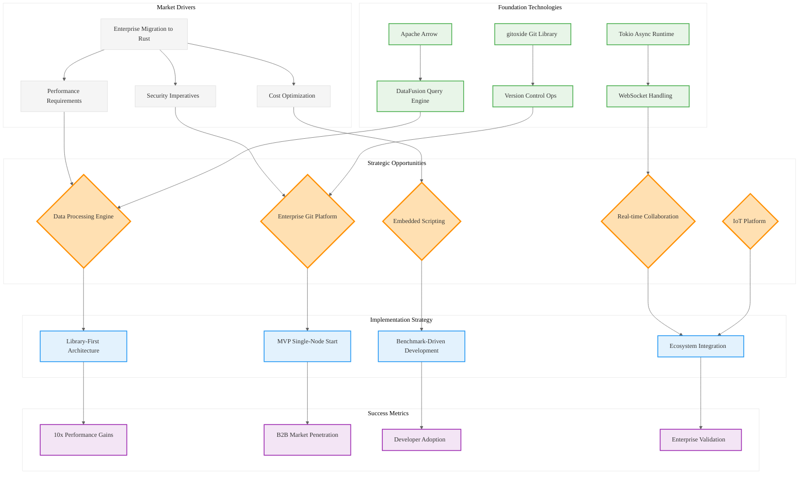

# Strategic Analysis: Open-Source Rust Ecosystem Opportunities

## Analysis Framework: L1-L8 Extraction Hierarchy

### A Alone: Strategic Document Analysis

This document presents a comprehensive strategic analysis of high-potential open-source opportunities in the Rust ecosystem. The content demonstrates sophisticated market analysis and technical evaluation across five distinct project archetypes.

**Key Insights from A:**
- **Market Timing**: Document identifies Rust at an "inflection point" - enterprise adoption is accelerating
- **Strategic Validation**: Major tech companies (Dropbox, Meta, Google, Cloudflare) provide production validation
- **Quantified Benefits**: Specific performance improvements (25% CPU reduction, 50% latency improvement, 10x performance gains)

### A in Context of B (L1 Context): File Structure and Dependencies

The L1 context reveals this is a deeply nested analysis document (8 levels deep) with extensive cross-references to external projects and technologies. The import analysis shows 11 major dependencies on external Rust ecosystem projects.

**Enhanced Insights A+B:**
- **Ecosystem Maturity**: The extensive references to projects like Polars, DataFusion, Ballista, gitoxide indicate a maturing ecosystem
- **Interconnected Architecture**: The document maps relationships between foundational components (Apache Arrow, DataFusion, Ballista)
- **Library-First Strategy**: Multiple references to building embeddable libraries rather than standalone applications

### B in Context of C (L2 Context): Architectural Patterns

The L2 context identifies object-oriented design patterns, asynchronous programming patterns, and error handling patterns. The architectural analysis reveals cross-module relationships and technology stack dependencies.

**Enhanced Insights B+C:**
- **Async-First Architecture**: Heavy emphasis on Tokio and async patterns for high-performance systems
- **Modular Design Philosophy**: Clear separation between core functionality and external integrations
- **Performance-Critical Domains**: Focus on CPU-intensive, memory-efficient, and concurrent systems

### A in Context of B & C: Complete Strategic Analysis

## L1-L8 Extraction Results

### Horizon 1: Tactical Implementation (The "How")

**L1: Idiomatic Patterns & Micro-Optimizations**
- Zero-cost abstractions leveraging compile-time guarantees
- Memory safety without garbage collection overhead
- Native binary deployment eliminating JVM complexity
- Apache Arrow columnar format for zero-copy data sharing

**L2: Design Patterns & Composition**
- Library-first architecture over monolithic applications
- Trait-based dependency injection for testability
- RAII resource management patterns
- Async/await for concurrent connection handling

**L3: Micro-Library Opportunities**
- High-performance Git operations (gitoxide foundation)
- Embedded scripting language (Rhai/Rune/Gluon synthesis)
- CRDT/OT data structures for real-time collaboration
- IoT device-to-cloud communication protocols

### Horizon 2: Strategic Architecture (The "What")

**L4: Macro-Library & Platform Opportunities**
1. **Next-Generation Data Processing Engine**: "Server-side Polars" targeting medium data workloads
2. **Enterprise Git Implementation**: High-performance, secure Git library for B2B integration
3. **Universal Embedded Scripting**: Modern, safe alternative to Lua across language ecosystems
4. **Real-Time Collaboration Backend**: Turnkey CRDT/OT server for collaborative applications
5. **End-to-End IoT Platform**: Unified embedded-to-cloud Rust stack

**L5: Architecture Decisions & Invariants**
- Single-language stack (embedded to cloud) reduces cognitive overhead
- Compile-time safety guarantees eliminate entire vulnerability classes
- Performance-first design with measurable benchmarks
- Interoperability through standardized formats (Apache Arrow)

**L6: Domain-Specific Architecture**
- WebSocket connection management for real-time systems
- Distributed query planning and execution
- Hardware abstraction for embedded systems
- Version control object database optimization

### Horizon 3: Foundational Evolution (The "Future" and "Why")

**L7: Language Capability Evolution**
- Rust's ownership model enables new architectural patterns
- Compile-time guarantees reduce operational complexity
- Zero-cost abstractions enable high-level concurrent programming
- Cross-compilation enables unified development stacks

**L8: Meta-Context (The "Why")**
- **Historical Constraint**: JVM-based systems carry decades of architectural debt
- **Market Timing**: Cloud costs and security requirements favor Rust's value proposition
- **Ecosystem Maturity**: Foundation libraries (Arrow, DataFusion) enable rapid development
- **Enterprise Validation**: Production adoption by tech giants de-risks language choice

## Strategic Recommendations

### High-Leverage Opportunities (10x Potential)
1. **"Server-side Polars"**: Target medium data workloads with simpler operations than full Spark
2. **Git Library Platform**: B2B licensing for CI/CD, hosting providers, and IDE integration
3. **Embedded Scripting Standard**: Become the "Lua replacement" across all language ecosystems

### Execution Strategy
- **MVP-First Approach**: Start with single-node solutions, scale to distributed
- **Library-First Architecture**: Enable embedding and integration over standalone tools
- **Benchmark-Driven Development**: Quantifiable performance improvements over incumbents
- **Ecosystem Leverage**: Build on mature foundations (Arrow, DataFusion, gitoxide)

## Mermaid Diagram: Rust Ecosystem Strategic Opportunities

## Key Takeaways

1. **Timing is Critical**: Rust ecosystem has reached enterprise inflection point
2. **Foundation is Strong**: Mature libraries enable rapid development of complex systems
3. **Market Validation Exists**: Production deployments by major companies prove viability
4. **Library Strategy Wins**: Platform approach more defensible than standalone applications
5. **Performance is Differentiator**: Quantifiable improvements over incumbent technologies

This analysis reveals that the Rust ecosystem is positioned for a wave of infrastructure innovation, with clear opportunities for 10x improvements over existing solutions through strategic application of Rust's unique strengths.