# High-PMF Rust Library Opportunities Analysis

## Analysis Framework: L1-L8 Extraction Hierarchy

### A Alone: Comprehensive Library Scoring Matrix

This document presents a comprehensive scoring matrix of 284 Use Cases (UC) and 48 additional Analyzed Ideas (A) for Rust library development opportunities. Each entry includes ease of implementation, product-market fit impact, LLM development prompts, and creative Harry Potter-themed names.

**Key Insights from A:**
- **Systematic Evaluation**: Quantified scoring system (Combined Score = Ease + Impact) enables data-driven prioritization
- **Implementation Guidance**: Each entry includes specific LLM prompts for rapid development initiation
- **Creative Branding**: Harry Potter theme names provide memorable project identities
- **High-Value Targets**: Top entries score 90+ points, indicating exceptional opportunities

### A in Context of B (L1 Context): File Structure and Metadata

The L1 context reveals this is a high-value strategic document (75KB, 12,214 words) with 4 key import references to top-tier projects. The document represents a comprehensive analysis of the Rust ecosystem's most promising opportunities.

**Enhanced Insights A+B:**
- **Strategic Document**: Large file size indicates comprehensive analysis depth
- **Curated Selection**: Only 4 imports suggest highly selective, high-quality references
- **Systematic Approach**: Structured table format enables rapid opportunity assessment
- **Actionable Intelligence**: LLM prompts transform ideas into executable development plans

### B in Context of C (L2 Context): Architectural Patterns

The L2 context identifies trait-based design patterns, async programming patterns, and error handling patterns as core architectural themes. The technology stack analysis confirms Tokio async runtime focus.

**Enhanced Insights B+C:**
- **Pattern-Driven Development**: Emphasis on established Rust architectural patterns
- **Async-First Approach**: Tokio runtime indicates focus on high-performance concurrent systems
- **Type Safety Focus**: Trait-based patterns emphasize compile-time guarantees
- **Error Handling Excellence**: Structured error patterns align with Rust best practices

### A in Context of B & C: Complete Strategic Analysis

## L1-L8 Extraction Results

### Horizon 1: Tactical Implementation (The "How")

**L1: Idiomatic Patterns & Micro-Optimizations**
- **Derive Macros**: Geminio numeric operations macro (97.5 score) - automatic trait implementation
- **no_std Compatibility**: Mathematical functions, DSP windowing, SIMD operations
- **Zero-Copy Operations**: WebAssembly parsing, Apache Arrow integration
- **SIMD Acceleration**: Byte processing, matrix operations, integer compression

**L2: Design Patterns & Composition**
- **Trait-Based Architecture**: Static analysis tools using trait bounds for type safety
- **Builder Patterns**: Configuration generators with compile-time validation
- **Iterator Patterns**: ETW event consumption, dependency analysis
- **Error Handling**: Advanced diagnostics framework with span tracking

**L3: Micro-Library Opportunities**
- **High-Impact, Low-Complexity**: Mathematical special functions (95.0 score)
- **Performance Primitives**: Morton encoding, SIMD kernels, compression algorithms
- **Developer Tools**: Metaprogramming toolkit, trait system analyzer
- **Domain-Specific**: DSP windowing, cryptographic signatures, Windows ETW

### Horizon 2: Strategic Architecture (The "What")

**L4: Macro-Library & Platform Opportunities**
1. **AIM Daemon**: Real-time code intelligence engine (92.5 score)
2. **Interface Signature Graph**: Codebase compression library (92.5 score)
3. **WebAssembly Tooling**: Binary parser and runtime optimization (92.5 score)
4. **React Analysis Suite**: Static analysis for modern web development (90.0 scores)
5. **WASM Performance Stack**: Runtime profiling and optimization tools (90.0 scores)

**L5: Architecture Decisions & Invariants**
- **Deterministic Processing**: Stable hashing for reproducible builds
- **Sub-millisecond Latency**: Real-time code intelligence with Tokio
- **Memory Safety**: FFI boundary analysis and unsafe code validation
- **Concurrency Correctness**: Send/Sync validation and deadlock detection

**L6: Domain-Specific Architecture**
- **Code Intelligence**: Tree-sitter parsing with incremental updates
- **Web Performance**: React component analysis and optimization
- **Systems Programming**: Linux jitter reduction, WASM runtime optimization
- **Security**: XSS prevention, post-quantum cryptography

### Horizon 3: Foundational Evolution (The "Future" and "Why")

**L7: Language Capability Evolution**
- **Metaprogramming**: Advanced macro tooling for code generation
- **Type System**: Trait relationship visualization and coherence checking
- **Async Runtime**: Performance profiling across different executors
- **FFI Safety**: Memory layout compatibility and ABI stability

**L8: Meta-Context (The "Why")**
- **Developer Experience**: Focus on tooling that improves Rust development workflow
- **Performance Culture**: Emphasis on measurable performance improvements
- **Safety First**: Memory safety and security as primary differentiators
- **Ecosystem Maturity**: Building on established foundations (Tree-sitter, Tokio, Arrow)

## Strategic Recommendations

### Tier 1: Immediate High-Impact Opportunities (95+ Score)
1. **Geminio Numeric Derive Macro** (97.5): Automatic trait implementation for newtype structs
2. **Mathematical Special Functions** (95.0): no_std scientific computing primitives
3. **DSP Windowing Functions** (95.0): Zero-dependency signal processing library

### Tier 2: Strategic Platform Plays (90-95 Score)
1. **AIM Daemon** (92.5): Real-time code intelligence engine
2. **ISG Compression** (92.5): Codebase architecture analysis
3. **WebAssembly Parser** (92.5): High-performance WASM tooling
4. **React Analysis Tools** (90.0): Modern web development static analysis

### Tier 3: Specialized High-Value Niches (85-90 Score)
1. **FFI Safety Analyzer** (87.5): Memory safety for unsafe code
2. **Async Runtime Profiler** (87.5): Performance analysis for concurrent systems
3. **SIMD Primitives** (87.5): Hardware-accelerated processing kernels
4. **Post-Quantum Crypto** (87.5): Future-proof cryptographic implementations

## Implementation Strategy

### MVP-First Development
- Start with highest-scoring, lowest-complexity opportunities
- Focus on no_std compatibility for maximum reusability
- Provide comprehensive LLM prompts for rapid prototyping
- Use creative naming for memorable project branding

### Ecosystem Integration
- Build on established foundations (Tree-sitter, Tokio, syn/quote)
- Ensure compatibility with existing toolchains
- Focus on developer experience and ease of adoption
- Provide clear migration paths from existing solutions

## Mermaid Diagram: Rust Library Opportunity Landscape

```mermaid
%%{init: {
  "theme": "base",
  "themeVariables": {
    "primaryColor": "#F5F5F5",
    "secondaryColor": "#E0E0E0",
    "lineColor": "#616161",
    "textColor": "#212121",
    "fontSize": "16px",
    "fontFamily": "Helvetica, Arial, sans-serif"
  },
  "flowchart": {
    "nodeSpacing": 70,
    "rankSpacing": 80,
    "wrappingWidth": 160,
    "curve": "basis"
  },
  "useMaxWidth": false
}}%%

flowchart TD
    subgraph "Tier 1: Immediate Impact (95+)"
        A[Geminio Derive Macro<br/>97.5 Score]
        B[Mathematical Functions<br/>95.0 Score]
        C[DSP Windowing<br/>95.0 Score]
    end
    
    subgraph "Tier 2: Strategic Platforms (90-95)"
        D[AIM Daemon<br/>92.5 Score]
        E[ISG Compression<br/>92.5 Score]
        F[WebAssembly Parser<br/>92.5 Score]
        G[React Analysis<br/>90.0 Score]
    end
    
    subgraph "Tier 3: Specialized Niches (85-90)"
        H[FFI Safety Analyzer<br/>87.5 Score]
        I[Async Profiler<br/>87.5 Score]
        J[SIMD Primitives<br/>87.5 Score]
        K[Post-Quantum Crypto<br/>87.5 Score]
    end
    
    subgraph "Core Technologies"
        L[Tree-sitter Parsing]
        M[Tokio Async Runtime]
        N[syn/quote Macros]
        O[no_std Compatibility]
    end
    
    subgraph "Success Metrics"
        P[Developer Adoption]
        Q[Performance Gains]
        R[Ecosystem Integration]
        S[Market Validation]
    end
    
    A --> N
    B --> O
    C --> O
    
    D --> L
    D --> M
    E --> L
    F --> O
    G --> N
    
    H --> N
    I --> M
    J --> O
    K --> O
    
    A --> P
    B --> Q
    C --> Q
    D --> R
    E --> R
    F --> S
    G --> S
    H --> S
    I --> Q
    J --> Q
    K --> S
    
    classDef tier1 fill:#FFE0B2,stroke:#FF8F00,stroke-width:3px
    classDef tier2 fill:#E8F5E8,stroke:#4CAF50,stroke-width:2px
    classDef tier3 fill:#E3F2FD,stroke:#2196F3,stroke-width:2px
    classDef tech fill:#F3E5F5,stroke:#9C27B0,stroke-width:2px
    classDef metric fill:#FFF3E0,stroke:#FF9800,stroke-width:2px
    
    class A,B,C tier1
    class D,E,F,G tier2
    class H,I,J,K tier3
    class L,M,N,O tech
    class P,Q,R,S metric
```

## Key Takeaways

1. **Quantified Opportunities**: Systematic scoring enables data-driven prioritization
2. **Implementation Ready**: LLM prompts provide immediate development starting points
3. **Diverse Portfolio**: Opportunities span from simple macros to complex systems
4. **Ecosystem Focus**: Strong emphasis on developer tooling and performance optimization
5. **Creative Branding**: Harry Potter themes create memorable project identities

This analysis reveals a rich landscape of Rust library opportunities, with clear pathways from high-impact, low-complexity wins to strategic platform plays that could define the future of the Rust ecosystem.