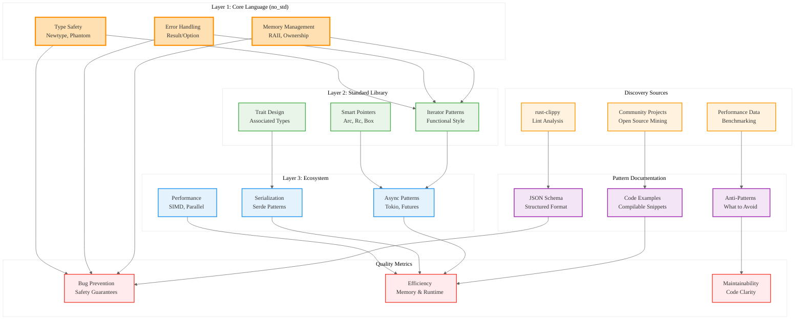

# Rust Idiomatic Patterns Framework Analysis

## Analysis Framework: L1-L8 Extraction Hierarchy

### A Alone: Systematic Pattern Documentation Framework

This document establishes a comprehensive framework for documenting Rust idiomatic patterns across three distinct layers (L1: Core/no_std, L2: Standard Library, L3: Ecosystem). The framework includes a structured JSON schema for pattern documentation and emphasizes practical, community-driven pattern discovery.

**Key Insights from A:**
- **Layered Architecture**: Clear separation between core language (L1), standard library (L2), and ecosystem (L3)
- **Pattern Discovery**: Emphasis on community-driven patterns rather than theoretical constructs
- **Practical Focus**: 20% of language features used in 99% of code - Pareto principle applied
- **Quality Metrics**: Lowest bug rates, highest efficiency, best maintainability

### A in Context of B (L1 Context): Research Methodology

The L1 context reveals this is a research framework document (7KB, 970 words) with minimal external dependencies, focusing on establishing methodology rather than implementing specific patterns. The document references rust-clippy as the primary source for pattern identification.

**Enhanced Insights A+B:**
- **Research-Oriented**: Small file size indicates focused methodology document
- **Self-Contained**: Minimal imports suggest foundational framework design
- **Clippy Integration**: Leverages existing linting knowledge for pattern identification
- **Structured Approach**: JSON schema provides systematic pattern documentation

### B in Context of C (L2 Context): Architectural Methodology

The L2 context identifies object-oriented design patterns and error handling patterns as core architectural themes. The framework includes references to knowledge scaffolding and factual verification processes.

**Enhanced Insights B+C:**
- **Methodological Rigor**: Emphasis on verification and factual accuracy
- **Pattern Classification**: Systematic approach to categorizing architectural patterns
- **Quality Assurance**: Built-in verification processes for pattern validation
- **Educational Focus**: Knowledge scaffolding approach for comprehensive understanding

### A in Context of B & C: Complete Framework Analysis

## L1-L8 Extraction Results

### Horizon 1: Tactical Implementation (The "How")

**L1: Idiomatic Patterns & Micro-Optimizations**
- **Core Language Patterns**: no_std compatible, OS-independent fundamentals
- **Memory Management**: RAII patterns, ownership transfer, borrowing strategies
- **Error Handling**: Result/Option patterns, early returns, error propagation
- **Type Safety**: Newtype patterns, phantom types, zero-cost abstractions

**L2: Design Patterns & Composition**
- **Standard Library Idioms**: Iterator patterns, collection usage, smart pointers
- **Composition Patterns**: Builder pattern, visitor pattern, strategy pattern
- **Trait Design**: Associated types, generic constraints, coherence rules
- **Module Organization**: Visibility rules, re-exports, feature gates

**L3: Micro-Library Opportunities**
- **Ecosystem Integration**: Tokio async patterns, Serde serialization, Clap CLI
- **Performance Patterns**: SIMD usage, parallel iterators, zero-copy operations
- **Domain-Specific**: Web frameworks, database integration, cryptographic libraries
- **Testing Patterns**: Property-based testing, mock objects, integration strategies

### Horizon 2: Strategic Architecture (The "What")

**L4: Macro-Library & Platform Opportunities**
1. **Pattern Documentation System**: Automated pattern extraction from rust-clippy
2. **Idiomatic Code Generator**: LLM-powered code generation using documented patterns
3. **Pattern Validation Framework**: Static analysis for pattern compliance
4. **Educational Platform**: Interactive pattern learning system
5. **Community Pattern Database**: Crowdsourced pattern collection and validation

**L5: Architecture Decisions & Invariants**
- **Layer Separation**: Clear boundaries between L1/L2/L3 patterns
- **Pattern Evolution**: Community-driven discovery and validation process
- **Quality Metrics**: Measurable criteria for pattern effectiveness
- **Documentation Standards**: Structured schema for consistent pattern description

**L6: Domain-Specific Architecture**
- **Compiler Integration**: Patterns that leverage compile-time guarantees
- **Runtime Optimization**: Patterns that minimize runtime overhead
- **Safety Guarantees**: Patterns that prevent common vulnerability classes
- **Developer Experience**: Patterns that reduce cognitive load and compilation attempts

### Horizon 3: Foundational Evolution (The "Future" and "Why")

**L7: Language Capability Evolution**
- **Pattern Language**: Meta-language for describing Rust idioms
- **Automated Discovery**: Machine learning approaches to pattern identification
- **Cross-Language Patterns**: Rust idioms applicable to other systems languages
- **Evolution Tracking**: How patterns change as the language evolves

**L8: Meta-Context (The "Why")**
- **Community Wisdom**: Patterns emerge from collective experience, not design
- **Efficiency Focus**: 80/20 rule - small set of patterns covers most use cases
- **Safety Culture**: Patterns prioritize compile-time safety over runtime performance
- **Ecosystem Maturity**: Patterns reflect the growing sophistication of Rust development

## Strategic Recommendations

### Pattern Discovery Strategy
1. **Clippy Analysis**: Systematic extraction of patterns from rust-clippy lints
2. **Community Mining**: Analysis of high-quality open-source Rust projects
3. **Performance Benchmarking**: Validation of efficiency claims through measurement
4. **Safety Verification**: Formal verification of safety properties where possible

### Documentation Framework
1. **Structured Schema**: JSON-based pattern documentation for consistency
2. **Code Examples**: Minimal, compilable examples for each pattern
3. **Anti-Pattern Identification**: Clear documentation of what to avoid
4. **Context Specification**: When and why to use each pattern

### Implementation Priorities
1. **L1 Core Patterns**: Foundation patterns for memory safety and performance
2. **L2 Standard Patterns**: Common standard library usage patterns
3. **L3 Ecosystem Patterns**: Integration patterns for popular crates
4. **Cross-Layer Patterns**: Patterns that span multiple layers

## Mermaid Diagram: Rust Idiomatic Patterns Framework

## Key Takeaways

1. **Layered Approach**: Clear separation between core language, standard library, and ecosystem patterns
2. **Community-Driven**: Patterns emerge from practical usage, not theoretical design
3. **Quality Focus**: Emphasis on bug prevention, efficiency, and maintainability
4. **Systematic Documentation**: Structured approach to pattern capture and validation
5. **Practical Application**: 20% of patterns cover 99% of use cases - focus on high-impact idioms

This framework provides a systematic approach to documenting and teaching Rust idiomatic patterns, enabling developers to write safer, more efficient, and more maintainable code by leveraging community wisdom and established best practices.