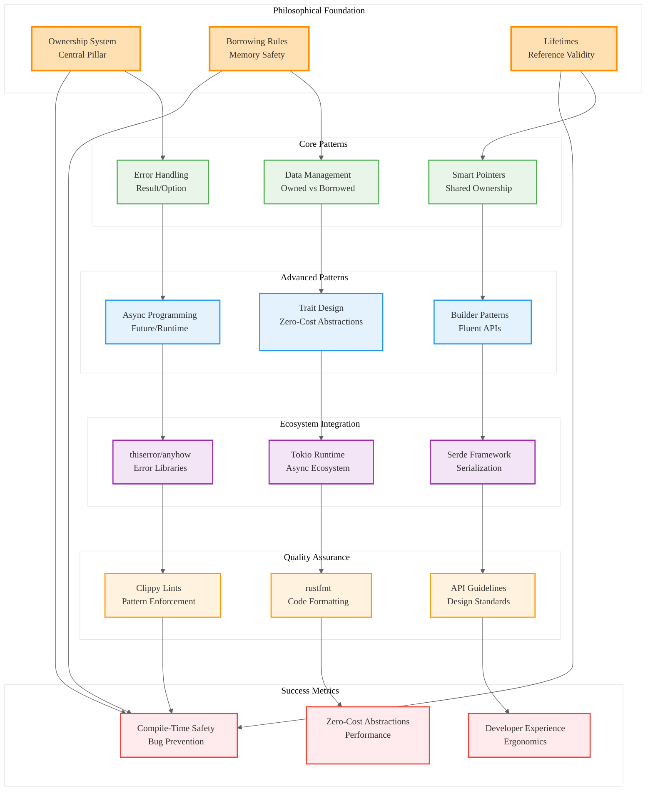

# Comprehensive Rust Idiomatic Patterns Deep Dive

## Analysis Framework: L1-L8 Extraction Hierarchy

### A Alone: Comprehensive Idiomatic Patterns Guide

This document provides an exhaustive guide to idiomatic Rust programming patterns, covering the philosophical foundations through practical implementation strategies. It emphasizes the triad of safety, performance, and concurrency as mutually reinforcing goals rather than competing concerns.

**Key Insights from A:**
- **Philosophical Foundation**: Ownership system as the bedrock from which all other patterns emerge
- **Zero-Cost Abstractions**: High-level features that compile to efficient machine code
- **Fearless Concurrency**: Compile-time guarantees enable confident parallel programming
- **Comprehensive Coverage**: From ownership to project structure, covering all aspects of idiomatic Rust

### A in Context of B (L1 Context): Extensive Technical Documentation

The L1 context reveals this is a substantial technical document (68KB, 10,353 words) with 14 detailed import references covering ownership, error handling, smart pointers, async programming, and API design. This represents a comprehensive reference work.

**Enhanced Insights A+B:**
- **Reference Quality**: Large file size indicates comprehensive, reference-level documentation
- **Technical Depth**: Extensive imports show detailed coverage of advanced topics
- **Practical Focus**: Emphasis on real-world patterns and anti-patterns
- **Educational Structure**: Systematic progression from fundamentals to advanced concepts

### B in Context of C (L2 Context): Multi-Paradigm Architecture

The L2 context identifies trait-based design patterns, async programming patterns, and error handling patterns as core architectural themes. The technology stack includes Tokio async runtime and Serde serialization.

**Enhanced Insights B+C:**
- **Multi-Paradigm Approach**: Combines functional, object-oriented, and systems programming patterns
- **Ecosystem Integration**: Deep integration with core Rust ecosystem (Tokio, Serde)
- **Pattern Relationships**: Shows how different patterns interconnect and reinforce each other
- **Production Focus**: Emphasis on patterns used in real-world, production systems

### A in Context of B & C: Complete Idiomatic Patterns Analysis

## L1-L8 Extraction Results

### Horizon 1: Tactical Implementation (The "How")

**L1: Idiomatic Patterns & Micro-Optimizations**
- **Ownership Patterns**: Move semantics, borrowing rules, lifetime management
- **Memory Management**: Stack vs heap allocation, RAII patterns, deterministic cleanup
- **Error Propagation**: `?` operator for ergonomic error handling
- **Type Safety**: Newtype patterns, phantom types, compile-time guarantees

**L2: Design Patterns & Composition**
- **Smart Pointer Patterns**: `Box<T>`, `Rc<T>`, `Arc<T>`, interior mutability
- **Iterator Patterns**: Functional-style data processing, lazy evaluation
- **Builder Patterns**: Fluent APIs, method chaining, configuration objects
- **Trait Design**: Associated types, generic constraints, coherence rules

**L3: Micro-Library Opportunities**
- **Error Handling Libraries**: `thiserror` for structured errors, `anyhow` for dynamic errors
- **Async Patterns**: Future trait implementation, runtime integration
- **Serialization**: Serde patterns for data transformation
- **Testing Patterns**: Unit testing, integration testing, property-based testing

### Horizon 2: Strategic Architecture (The "What")

**L4: Macro-Library & Platform Opportunities**
1. **Idiomatic Pattern Analyzer**: Static analysis tool for pattern compliance
2. **Code Generation Framework**: Automated implementation of common patterns
3. **Performance Profiler**: Pattern-aware performance analysis
4. **Educational Platform**: Interactive pattern learning system
5. **Migration Assistant**: Tool for converting non-idiomatic code to idiomatic patterns

**L5: Architecture Decisions & Invariants**
- **Safety First**: Compile-time guarantees over runtime checks
- **Zero-Cost Abstractions**: High-level patterns with no runtime overhead
- **Explicit Control Flow**: Visible error handling and resource management
- **Composition Over Inheritance**: Trait-based design over class hierarchies

**L6: Domain-Specific Architecture**
- **Concurrent Programming**: Arc/Mutex patterns, message passing, async/await
- **Systems Programming**: Unsafe code patterns, FFI boundaries, low-level optimization
- **Web Development**: Async web frameworks, serialization patterns, middleware
- **CLI Applications**: Argument parsing, configuration management, error reporting

### Horizon 3: Foundational Evolution (The "Future" and "Why")

**L7: Language Capability Evolution**
- **Ownership Innovation**: Patterns that push the boundaries of the borrow checker
- **Async Evolution**: Advanced async patterns and runtime optimization
- **Type System**: Advanced trait usage, associated types, higher-kinded types
- **Metaprogramming**: Procedural macros, code generation, compile-time computation

**L8: Meta-Context (The "Why")**
- **Safety Culture**: Patterns emerge from the need to prevent entire bug classes
- **Performance Culture**: Zero-cost abstractions enable high-level thinking with low-level performance
- **Community Consensus**: Patterns codified through RFC process and community practice
- **Ecosystem Evolution**: Patterns evolve as the ecosystem matures and best practices emerge

## Strategic Recommendations

### Pattern Mastery Progression
1. **Foundation**: Ownership, borrowing, lifetimes - the philosophical bedrock
2. **Error Handling**: Result/Option patterns, `?` operator, structured vs dynamic errors
3. **Data Management**: Owned vs borrowed types, smart pointers, interior mutability
4. **Concurrency**: Arc/Mutex patterns, async/await, message passing
5. **API Design**: Trait design, builder patterns, ergonomic interfaces

### Anti-Pattern Avoidance
1. **Ownership Violations**: Fighting the borrow checker instead of working with it
2. **Error Handling**: Using `unwrap()` in production code, ignoring error context
3. **Memory Management**: Unnecessary allocations, lifetime complexity in structs
4. **Concurrency**: Shared mutable state without proper synchronization
5. **API Design**: Inflexible interfaces, poor error reporting, inconsistent naming

### Implementation Strategy
1. **Learn by Example**: Study high-quality Rust codebases for pattern usage
2. **Practice Incrementally**: Start with simple patterns, build to complex compositions
3. **Use Tooling**: Leverage Clippy, rustfmt, and other tools for pattern enforcement
4. **Community Engagement**: Participate in code reviews, RFC discussions, ecosystem development

## Mermaid Diagram: Rust Idiomatic Patterns Ecosystem

## Key Takeaways

1. **Ownership as Foundation**: All idiomatic patterns emerge from the ownership system
2. **Safety-Performance Synergy**: Safety and performance are mutually reinforcing, not competing
3. **Explicit Over Implicit**: Rust favors explicit control flow and error handling
4. **Zero-Cost Abstractions**: High-level patterns compile to efficient machine code
5. **Community-Driven Evolution**: Patterns emerge from collective experience and are codified through tooling

This comprehensive analysis reveals that idiomatic Rust is not just about syntax, but about embracing a fundamentally different approach to systems programming where safety, performance, and concurrency work together rather than against each other. The patterns documented here represent the collective wisdom of the Rust community in building reliable, efficient software systems.