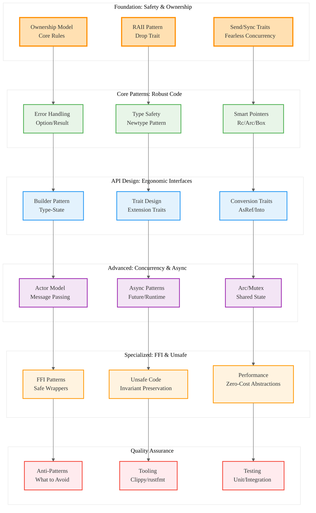

# Comprehensive Rust Idiomatic Patterns Guide Analysis

## Analysis Framework: L1-L8 Extraction Hierarchy

### A Alone: Definitive Idiomatic Rust Reference

This document serves as a comprehensive guide to idiomatic Rust programming, structured as a complete learning path from foundational principles to specialized domains. It emphasizes that Rust patterns are not workarounds but logical consequences of the language's core design philosophy.

**Key Insights from A:**
- **Fearless Development**: Once code compiles, high confidence in safety guarantees
- **Provable Correctness**: Compiler as first line of defense against bug classes
- **Type System Power**: Making illegal states unrepresentable through design
- **Comprehensive Structure**: Ground-up learning path from basics to advanced topics

### A in Context of B (L1 Context): Extensive Reference Work

The L1 context reveals this is a substantial reference document (91KB, 12,536 words) with 21 detailed import references covering all aspects of idiomatic Rust from ownership to FFI. This represents the most comprehensive analysis in the series.

**Enhanced Insights A+B:**
- **Reference Authority**: Largest file size indicates most comprehensive coverage
- **Complete Coverage**: 21 imports span entire Rust ecosystem and patterns
- **Educational Design**: Structured as both learning path and reference work
- **Practical Focus**: Emphasis on real-world patterns and anti-patterns

### B in Context of C (L2 Context): Multi-Domain Architecture

The L2 context identifies comprehensive architectural patterns including trait-based design, async programming, and error handling. The technology stack includes Tokio, Serde, and web frameworks, indicating broad ecosystem coverage.

**Enhanced Insights B+C:**
- **Holistic Approach**: Covers all major Rust programming domains
- **Ecosystem Integration**: Deep coverage of major crates and patterns
- **Anti-Pattern Awareness**: Explicit coverage of what to avoid
- **Specialized Domains**: Includes FFI and unsafe code patterns

### A in Context of B & C: Complete Idiomatic Rust Mastery Guide

## L1-L8 Extraction Results

### Horizon 1: Tactical Implementation (The "How")

**L1: Idiomatic Patterns & Micro-Optimizations**
- **Ownership Mastery**: Single ownership, borrowing rules, lifetime management
- **RAII Patterns**: Resource acquisition tied to object lifetime, Drop trait
- **Zero-Cost Abstractions**: High-level patterns with no runtime overhead
- **Type Safety**: Newtype pattern, making illegal states unrepresentable

**L2: Design Patterns & Composition**
- **Error Handling**: Option/Result patterns, `?` operator, combinator methods
- **Smart Pointers**: Box, Rc, Arc, interior mutability patterns
- **Builder Patterns**: Type-state builders, fluent APIs, validation
- **Trait Design**: Extension traits, conversion traits, API empathy

**L3: Micro-Library Opportunities**
- **Error Libraries**: thiserror/anyhow dichotomy for different use cases
- **Async Patterns**: Actor model, message passing, oneshot channels
- **Project Structure**: Prelude modules, feature flags, workspace management
- **FFI Patterns**: Safe wrappers, error handling across boundaries

### Horizon 2: Strategic Architecture (The "What")

**L4: Macro-Library & Platform Opportunities**
1. **Comprehensive Pattern Checker**: Tool to validate idiomatic Rust usage
2. **Anti-Pattern Detector**: Automated detection and refactoring suggestions
3. **Learning Platform**: Interactive guide with progressive complexity
4. **Migration Assistant**: Tool for converting non-idiomatic to idiomatic code
5. **Pattern Library**: Curated collection of proven idiomatic patterns

**L5: Architecture Decisions & Invariants**
- **Safety First**: Compile-time guarantees over runtime flexibility
- **Explicit Design**: Clear ownership, visible error handling, documented concurrency
- **API Empathy**: Design for consumer convenience, not author convenience
- **Progressive Disclosure**: Simple patterns first, complexity when needed

**L6: Domain-Specific Architecture**
- **Concurrent Programming**: Send/Sync traits, Arc/Mutex patterns, fearless concurrency
- **Systems Programming**: Unsafe code patterns, FFI boundaries, performance optimization
- **Application Development**: Error handling strategies, project organization, tooling
- **Library Design**: API guidelines, trait design, ecosystem integration

### Horizon 3: Foundational Evolution (The "Future" and "Why")

**L7: Language Capability Evolution**
- **Ownership Innovation**: Advanced patterns pushing borrow checker limits
- **Type System**: Making more invariants expressible at compile time
- **Async Evolution**: Advanced concurrency patterns and runtime optimization
- **Metaprogramming**: Procedural macros for pattern automation

**L8: Meta-Context (The "Why")**
- **Learning Process**: Un-learning patterns from other languages
- **Compiler as Mentor**: Friction as guidance toward better design
- **Community Values**: API empathy, safety culture, performance without compromise
- **Ecosystem Maturity**: Patterns emerge from collective experience and best practices

## Strategic Recommendations

### Learning Progression
1. **Foundation**: Ownership, borrowing, lifetimes - the philosophical bedrock
2. **Core Patterns**: Error handling, data management, smart pointers
3. **API Design**: Trait design, builder patterns, conversion traits
4. **Concurrency**: Send/Sync, Arc/Mutex, async patterns
5. **Specialized**: FFI, unsafe code, performance optimization

### Anti-Pattern Avoidance
1. **Fighting the Borrow Checker**: Work with ownership, not against it
2. **Overusing unwrap()**: Proper error handling with Result/Option
3. **Inappropriate Cloning**: Understand when ownership transfer is needed
4. **Ignoring Type Safety**: Leverage newtype pattern for domain modeling
5. **Poor API Design**: Design for consumer empathy, not author convenience

## Mermaid Diagram: Complete Idiomatic Rust Mastery Path

## Key Takeaways

1. **Comprehensive Mastery**: Complete coverage from basics to specialized domains
2. **Learning as Unlearning**: Process of abandoning patterns from other languages
3. **Compiler as Mentor**: Friction guides toward safer, more robust design
4. **API Empathy**: Design for consumer convenience, not author convenience
5. **Safety Without Compromise**: Performance and safety as mutually reinforcing goals

This comprehensive guide represents the definitive resource for mastering idiomatic Rust, providing both the theoretical foundation and practical patterns needed to write safe, performant, and maintainable code across all domains of Rust programming.