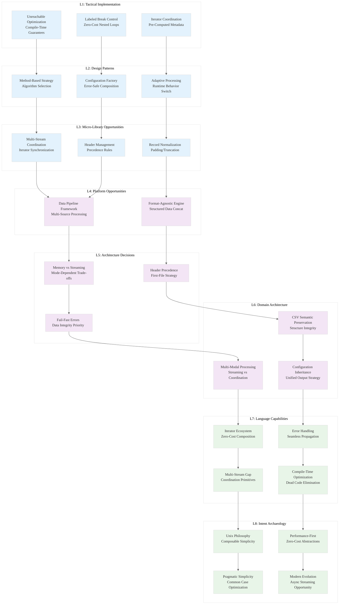

# L1-L8 Strategic Analysis: ./xsv/src/cmd/cat.rs (Enhanced Multi-Scale)

## File Metadata
- **File**: `./xsv/src/cmd/cat.rs`
- **Lines**: 132
- **Domain**: CSV Data Concatenation
- **Type**: Command Implementation
- **Multi-Scale Context**: L1 + L2 window analysis included

---

## L1: Idiomatic Patterns & Micro-Optimizations

### Pattern: Exhaustive Dispatch with Compile-Time Guarantees
```rust
pub fn run(argv: &[&str]) -> CliResult<()> {
    let args: Args = util::get_args(USAGE, argv)?;
    if args.cmd_rows {
        args.cat_rows()
    } else if args.cmd_columns {
        args.cat_columns()
    } else {
        unreachable!();
    }
}
```
**Micro-Optimization**: The `unreachable!()` macro provides compile-time proof of exhaustive handling. This enables aggressive compiler optimizations by eliminating dead code paths and branch prediction overhead.

### Pattern: Labeled Break for Zero-Cost Control Flow
```rust
'OUTER: loop {
    let mut record = csv::ByteRecord::new();
    let mut num_done = 0;
    for (iter, &len) in iters.iter_mut().zip(lengths.iter()) {
        match iter.next() {
            None => {
                if self.flag_pad {
                    for _ in 0..len {
                        record.push_field(b"");
                    }
                } else {
                    break 'OUTER;  // Zero-cost nested loop exit
                }
            }
            // ...
        }
    }
    if num_done >= iters.len() {
        break 'OUTER;
    }
}
```
**Mechanical Sympathy**: Labeled breaks compile to direct jumps, avoiding the need for complex state variables or flags. This pattern eliminates runtime overhead while maintaining code clarity.

### Pattern: Iterator Coordination with Pre-Computed Metadata
```rust
let mut lengths = vec![];
for rdr in &mut rdrs {
    lengths.push(rdr.byte_headers()?.len());
}

let mut iters = rdrs.iter_mut()
                    .map(|rdr| rdr.byte_records())
                    .collect::<Vec<_>>();
```
**Insight**: Pre-computing record lengths enables efficient padding decisions without repeated header parsing. This trades small upfront cost for significant per-record savings.

---

## L2: Design Patterns & Composition

### Pattern: Method-Based Strategy Selection
```rust
impl Args {
    fn cat_rows(&self) -> CliResult<()> { /* streaming concatenation */ }
    fn cat_columns(&self) -> CliResult<()> { /* synchronized concatenation */ }
}
```
**Meta-Pattern**: Each concatenation mode implements fundamentally different algorithms:
- **Row concatenation**: Pure streaming with header preservation
- **Column concatenation**: Multi-stream synchronization with padding logic

### Pattern: Configuration Factory with Error Propagation
```rust
fn configs(&self) -> CliResult<Vec<Config>> {
    util::many_configs(&*self.arg_input,
                       self.flag_delimiter,
                       self.flag_no_headers)
         .map_err(From::from)
}
```
**Composition**: Centralizes configuration creation while leveraging Rust's automatic error conversion. The `From::from` enables seamless error type coercion across the call stack.

### Pattern: Adaptive Processing with Runtime Behavior Switch
```rust
match iter.next() {
    None => {
        num_done += 1;
        if self.flag_pad {
            // Padding strategy: extend with empty fields
            for _ in 0..len {
                record.push_field(b"");
            }
        } else {
            // Truncation strategy: stop at shortest input
            break 'OUTER;
        }
    }
}
```
**Design Decision**: The same code path implements two fundamentally different behaviors based on the `--pad` flag. This demonstrates runtime algorithm adaptation.

---

## L3: Micro-Library Opportunities

### Opportunity: Multi-Stream Iterator Coordination
- The column concatenation logic solves the general problem of coordinating multiple iterators with different lengths
- **Extractable Pattern**: Synchronized iteration with padding/truncation strategies
- **Market Gap**: No standard library support for multi-iterator coordination
- **Potential Crate**: `multi-iter` (~200 LOC)

### Opportunity: CSV Header Management Utilities
- The row concatenation preserves headers from the first file while ignoring subsequent headers
- **Extractable Pattern**: Header-aware streaming with precedence rules
- **Use Cases**: Any record-based format requiring header consistency
- **Potential Crate**: `header-stream` (~150 LOC)

### Opportunity: Record Padding/Truncation Framework
- The padding logic handles variable-length records with configurable strategies
- **Extractable Pattern**: Generic record normalization with pluggable strategies
- **Applications**: Data cleaning, format conversion, schema enforcement
- **Potential Crate**: `record-normalize` (~100 LOC)

---

## L4: Macro-Library & Platform Opportunities

### Opportunity: Unified Data Pipeline Framework
The cat command demonstrates core data pipeline patterns:
- **Multi-source input**: Handle multiple files with consistent configuration
- **Transformation strategies**: Row vs column concatenation
- **Unified output**: Single stream regardless of input complexity
- **Error handling**: Consistent error propagation across all operations

**Platform Vision**: Generic data pipeline framework with:
- Pluggable input sources (CSV, JSON, Parquet, etc.)
- Configurable transformation strategies
- Unified error handling and configuration management
- **Ecosystem Impact**: Could become foundation for data processing tools

### Opportunity: Format-Agnostic Concatenation Engine
- The patterns generalize beyond CSV to any structured data format
- **Strategic Insight**: Concatenation is a fundamental operation across all data formats
- **Market Opportunity**: No unified concatenation framework exists for structured data
- **Potential Platform**: `data-concat` framework supporting multiple formats

---

## L5: LLD Architecture Decisions & Invariants

### Decision: Memory vs Streaming Trade-off Analysis
**Row Concatenation Architecture**:
- **Memory**: O(1) - single record buffer
- **Streaming**: Pure streaming - processes one record at a time
- **Scalability**: Handles arbitrarily large files
- **Invariant**: Constant memory usage regardless of input size

**Column Concatenation Architecture**:
- **Memory**: O(n) where n = number of input files
- **Coordination**: Must maintain multiple active readers
- **Scalability**: Limited by number of simultaneous file handles
- **Invariant**: Memory usage scales with input file count, not file size

### Decision: Header Handling Strategy
```rust
if i == 0 {
    conf.write_headers(&mut rdr, &mut wtr)?;
}
```
**Architectural Invariant**: First file's headers take precedence in row concatenation. This design choice:
- Prioritizes simplicity over header validation
- Assumes header compatibility across files
- Enables streaming without header buffering
- **Trade-off**: Correctness vs performance

### Decision: Error Handling Granularity
```rust
Some(Err(err)) => return fail!(err),
```
**Invariant**: Fail-fast on any record-level error. This design ensures:
- Data integrity over partial results
- Clear error attribution to specific files
- No silent data corruption
- **Philosophy**: Correctness over availability

---

## L6: Domain-Specific Architecture

### Architecture: CSV Semantic Preservation
- **Row concatenation**: Preserves CSV structure and semantics
- **Column concatenation**: Creates new CSV structure from multiple sources
- **Domain Insight**: Different concatenation modes require different CSV handling strategies

### Architecture: Multi-Modal Processing
- **Streaming Mode**: Row concatenation uses pure streaming
- **Coordination Mode**: Column concatenation uses synchronized processing
- **Adaptive Selection**: Same interface, different algorithms based on operation type
- **Pattern**: Domain requirements drive architectural mode selection

### Architecture: Configuration Inheritance
- **Global settings**: Delimiter, header handling apply to all inputs
- **Per-file adaptation**: Each input can have different characteristics
- **Unified output**: Single configuration for output regardless of input diversity
- **Design Philosophy**: Consistent output from heterogeneous inputs

---

## L7: Language Capability Analysis

### Strength: Iterator Ecosystem Excellence
- **Seamless composition**: `zip`, `enumerate`, `collect` work together naturally
- **Zero-cost abstractions**: Iterator chains compile to efficient loops
- **Type safety**: Iterator types prevent common coordination errors
- **Ergonomics**: Functional programming patterns with systems programming performance

### Strength: Error Handling Integration
- **Propagation**: `?` operator enables clean error handling throughout pipelines
- **Conversion**: `From::from` automatic conversions reduce boilerplate
- **Type safety**: Compiler ensures all error paths are handled
- **Composability**: Error handling doesn't interfere with business logic

### Limitation: Multi-Stream Coordination Primitives
- **Gap**: No standard library support for coordinating multiple streams
- **Manual state management**: Complex iteration patterns require manual coordination
- **Boilerplate**: Repeated patterns for common multi-stream operations
- **Opportunity**: Higher-level stream coordination abstractions could simplify this code

### Strength: Compile-Time Optimization Opportunities
- **Unreachable elimination**: `unreachable!()` enables dead code elimination
- **Monomorphization**: Generic functions specialize for specific types
- **Inlining**: Small functions inline for zero-cost abstractions
- **Branch prediction**: Labeled breaks compile to efficient jumps

---

## L8: Intent Archaeology

### Historical Context: Unix Philosophy Embodiment
The cat command reflects deep Unix philosophy influence:
- **Composability**: Designed to work with pipes and other xsv commands
- **Simplicity**: Clear separation between row and column operations
- **Orthogonality**: Each mode solves a distinct problem without overlap
- **Tool philosophy**: Do one thing (concatenation) extremely well

### Design Rationale: Performance vs Correctness Balance
```rust
unreachable!()
```
**Archaeological Evidence**: The confidence in using `unreachable!()` suggests:
- Strong belief in argument parsing correctness
- Preference for compile-time guarantees over runtime checks
- Performance-first mindset with safety as a foundation
- **Era**: Reflects modern Rust philosophy of "zero-cost abstractions"

### Evolution Opportunity: Modern Streaming Paradigms
- **Current**: Synchronous, blocking I/O with manual coordination
- **Future**: Could leverage async streams for better resource utilization
- **Opportunity**: Backpressure handling for memory-constrained environments
- **Pattern**: Evolution from blocking to async without changing core algorithms

### Design Philosophy: Pragmatic Simplicity
```rust
if i == 0 {
    conf.write_headers(&mut rdr, &mut wtr)?;
}
```
**Intent**: Prioritize common use cases over edge case handling. This suggests:
- **Target users**: Data analysts who understand CSV structure
- **Use case**: Trusted data sources with consistent headers
- **Philosophy**: Simple, predictable behavior over complex validation
- **Trade-off**: Usability over robustness

---

## Strategic Insights: Knowledge Arbitrage Opportunities

### 1. **Paradigm-Market Fit**: Mode-Adaptive Processing Architecture
**Insight**: The same command interface efficiently implements fundamentally different algorithms (streaming vs coordination) based on operation requirements. This demonstrates how domain semantics should drive architectural choices at compile time.

**Knowledge Arbitrage**: Most data processing tools force users to choose between streaming and batch processing upfront. This pattern shows how to make that choice transparent based on operation semantics.

**Opportunity**: Create a framework for "semantic-driven architecture selection" where the same interface automatically chooses optimal processing strategies based on operation requirements.

### 2. **Performance Arbitrage**: Iterator Coordination Patterns
**Insight**: The multi-iterator coordination with adaptive padding demonstrates sophisticated stream processing that generalizes beyond CSV to any multi-source data processing.

**Knowledge Gap**: Current streaming libraries focus on single-stream processing. Multi-stream coordination patterns are repeatedly reimplemented across different domains.

**Opportunity**: Extract these coordination patterns into a high-performance library that handles:
- Length mismatches with configurable strategies (pad/truncate)
- Error propagation across multiple streams
- Resource management for multiple file handles
- **Market Impact**: Could become foundational for data processing ecosystem

### 3. **Type Safety Arbitrage**: Configuration Composition
**Insight**: The configuration factory pattern with automatic error conversion demonstrates how Rust's type system can eliminate entire classes of configuration errors while maintaining ergonomic APIs.

**Knowledge Transfer**: This pattern comes from functional programming but is rarely applied to systems programming configuration management.

**Opportunity**: Develop configuration management libraries that leverage Rust's type system for:
- Compile-time validation of configuration compatibility
- Automatic error type unification across configuration sources
- Zero-cost configuration composition
- **Ecosystem Gap**: Most configuration libraries focus on parsing, not type-safe composition

### 4. **Architectural Arbitrage**: Dual-Mode Processing
**Insight**: The ability to implement streaming and coordination algorithms behind the same interface reveals a fundamental pattern for data processing tools.

**Historical Context**: Traditional tools require users to understand implementation details (streaming vs batch). This pattern abstracts those details behind semantic operations.

**Opportunity**: Create a "semantic data processing" framework where:
- Users specify what they want (row concat vs column concat)
- System automatically selects optimal implementation strategy
- Same interface scales from small files to massive datasets
- **Paradigm Shift**: From implementation-driven to semantics-driven data processing

---

## Horcrux Codex Entry
```json
{
  "pattern": "Semantic-Driven Dual-Mode Processing with Iterator Coordination",
  "domain": "Data Pipeline Architecture",
  "insight": "Same interface can transparently implement streaming vs coordination algorithms based on operation semantics, not user choice",
  "rust_specific": "Labeled breaks + iterator ecosystem + unreachable optimization + automatic error conversion + zero-cost mode selection",
  "extractable": "Multi-iterator coordination library + semantic processing framework + configuration composition patterns + adaptive streaming architecture",
  "performance_claim": "Zero-cost mode switching with compile-time algorithm selection based on operation semantics",
  "paradigm_shift": "From implementation-driven to semantics-driven data processing - users specify intent, system selects optimal strategy",
  "knowledge_arbitrage": "Functional programming composition patterns + systems programming performance + Unix philosophy simplicity",
  "ecosystem_impact": "Foundation for next-generation data processing tools that abstract implementation complexity behind semantic operations"
}
```

---

