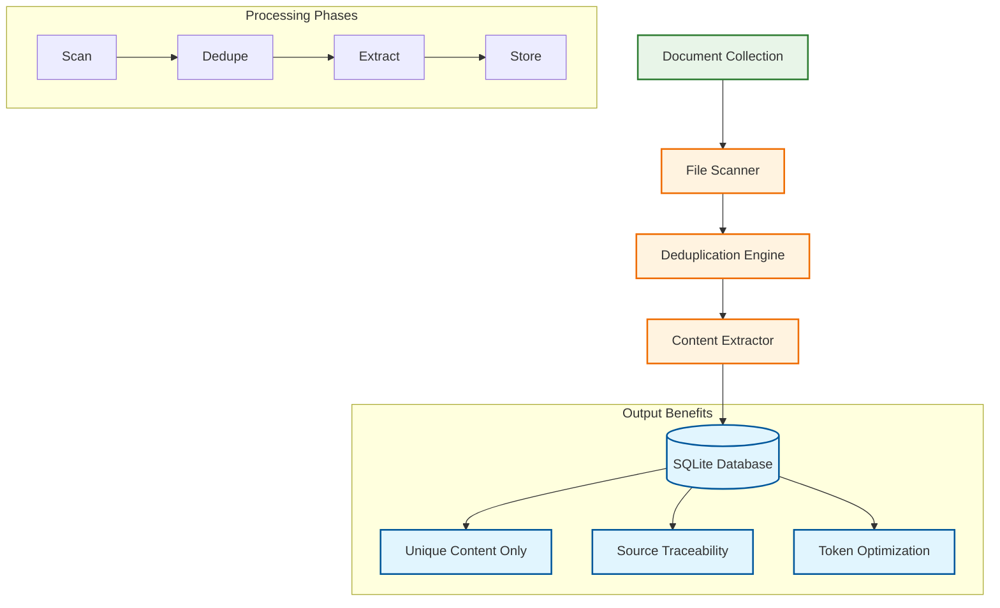
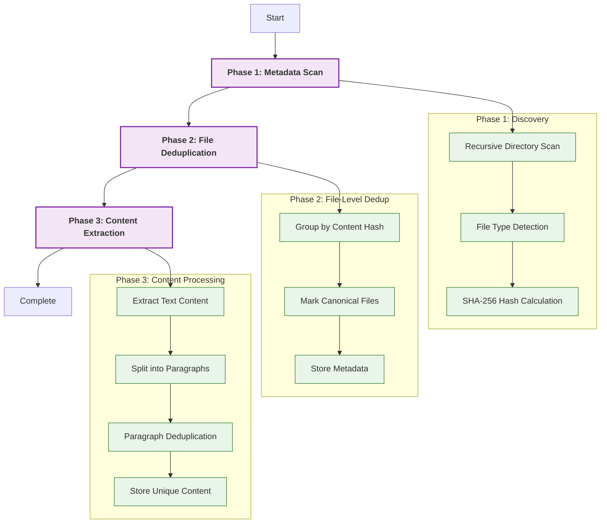
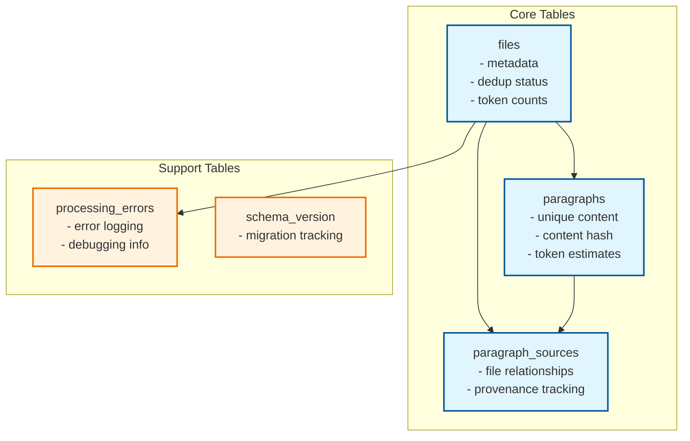

# Pensieve

**Transform document collections into LLM-ready knowledge bases with intelligent deduplication.**

A high-performance Rust CLI tool that ingests text files, eliminates duplicates at file and paragraph levels, and creates optimized databases for AI processing.

## Quick Start

```bash
# Process documents into database
pensieve --input ~/Documents --database knowledge.db

# View results
pensieve stats --database knowledge.db
```

## Core Value

Pensieve solves the token waste problem in LLM workflows by:
- **Eliminating redundancy**: File and paragraph-level deduplication
- **Maximizing signal**: Only unique content reaches your LLM
- **Preserving provenance**: Track content back to source files

## Architecture Overview



## Processing Workflow



## Installation

```bash
# Build from source
git clone <repository-url>
cd pensieve
cargo build --release

# Binary available at target/release/pensieve
```

## Usage

### Basic Commands
```bash
# Initialize database
pensieve init --database my.db

# Process documents
pensieve --input /path/to/docs --database my.db

# View statistics
pensieve stats --database my.db

# Check dependencies
pensieve check-deps
```

### Example Output
```
Phase 1: Scanning files... 15,432 files found
Phase 2: Deduplication... 3,421 duplicates (22.2% savings)
Phase 3: Content processing... 95,847 unique paragraphs stored
Phase 4: Complete! 2,847,392 tokens ready for LLM processing
```

## Supported Formats

**Text & Documentation**: `.txt`, `.md`, `.rst`, `.org`, `.adoc`, `.wiki`, `.tex`, `.bib`

**Source Code**: `.rs`, `.py`, `.js`, `.ts`, `.java`, `.go`, `.c`, `.cpp`, `.php`, `.rb`, `.swift`

**Web & Markup**: `.html`, `.css`, `.xml`

**Configuration**: `.json`, `.yaml`, `.toml`, `.ini`, `.cfg`, `.env`

**Documents**: `.pdf`, `.docx` (basic text extraction)

**Data**: `.csv`, `.log`, `.sql`

## Database Schema



## Performance

- **File Scanning**: 10,000+ files/sec
- **Hash Calculation**: 500+ MB/sec  
- **Database Writes**: 50,000+ records/sec
- **Memory Usage**: <16GB for 500GB corpus
- **Scalability**: Tested with 500GB+ collections

## Configuration

Generate default config:
```bash
pensieve config --output pensieve.toml
```

Key settings:
- Thread count for parallel processing
- Batch sizes for database operations
- File type inclusion/exclusion rules
- Deduplication parameters

## Troubleshooting

**Database locked**: Ensure no other Pensieve processes running
**Permission denied**: Check file/directory permissions
**Slow processing**: Increase thread count, use SSD storage
**High memory**: Reduce batch sizes, process smaller chunks

## Development

```bash
# Run tests
cargo test

# Build debug version
cargo build

# Run with sample data
cargo run -- --input test_data --database test.db --verbose
```

### Project Structure
- `src/cli.rs` - Command-line interface
- `src/scanner.rs` - File system scanning
- `src/extractor.rs` - Content extraction
- `src/database.rs` - Database operations
- `src/deduplication.rs` - Duplicate detection

---

**Pensieve** - Efficiently transform document collections into LLM-ready knowledge bases with intelligent deduplication and optimized token usage.